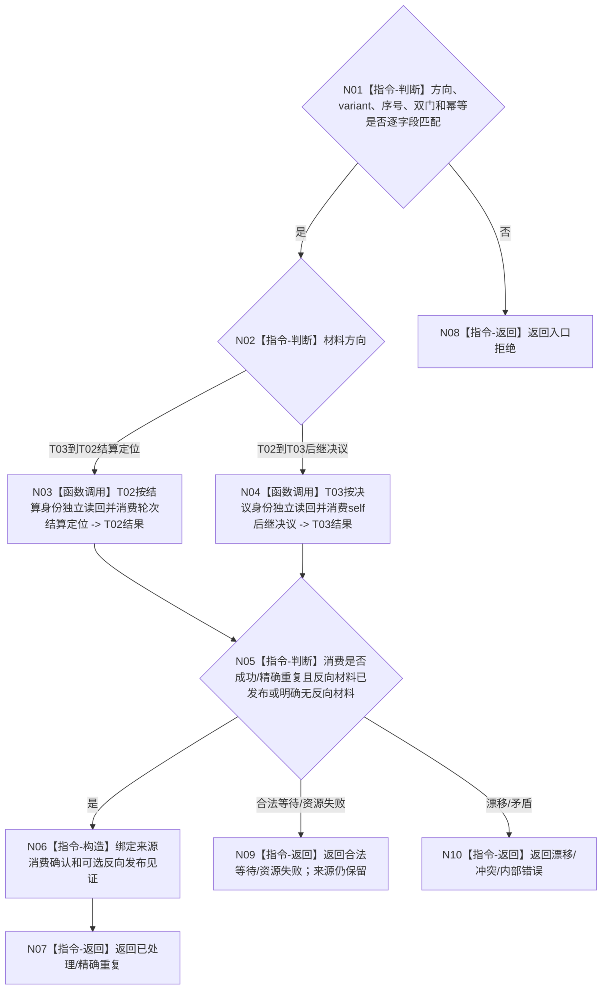

# BIZ-L4-001-14-03-03 按方向处理一项治理材料并保留反向材料目标函数流程图 v0.1

更新时间：2026-08-26

## 依据

```text
0050、8100 v0.8；BIZ-L3-001-14-03、BIZ-L4-001-14-03-01—02
```

## 身份与边界

正式目标函数设计图。消费一项强类型双向治理定位：T03→T02 时由 T02 独立读回任务轮次结算并形成允许的 self 后继决议；T02→T03 时由 T03 独立读回后继决议并按停机策略处理。函数不合并两类身份，不丢弃可能形成的反向材料。

## 函数合同

```text
根函数：按方向处理一项治理材料并保留反向材料
归属模块 / 文件 / 目标分解深度：治理双向收口适配 / 海中鱼巣/启动.治理共同排空.ixx / BIZ-L4
现有或待新增：待新增
完整签名：单项治理材料处理结果 按方向处理一项治理材料并保留反向材料(const 单项治理材料处理请求& 请求) noexcept
参数：请求含运行代次、方向、结算定位或后继决议定位variant、来源序号、双门见证、停止策略和处理幂等身份
返回结果：不可变值式结果；含已处理、精确重复、合法等待、来源漂移、冲突、资源失败或内部错误，以及消费确认和可选反向材料发布见证
被调函数流程图：复用 T02/T03 既有正式定位消费入口；其内部领域读回不在本图重复展开
父图：BIZ-L3-001-14-03
```

## 流程图



## 关键边界

来源项只有在正式消费确认成立且反向材料已经发布或被证明不适用后才可移出在途集合；日志、回调返回或线程局部缓存不能替代该见证。
