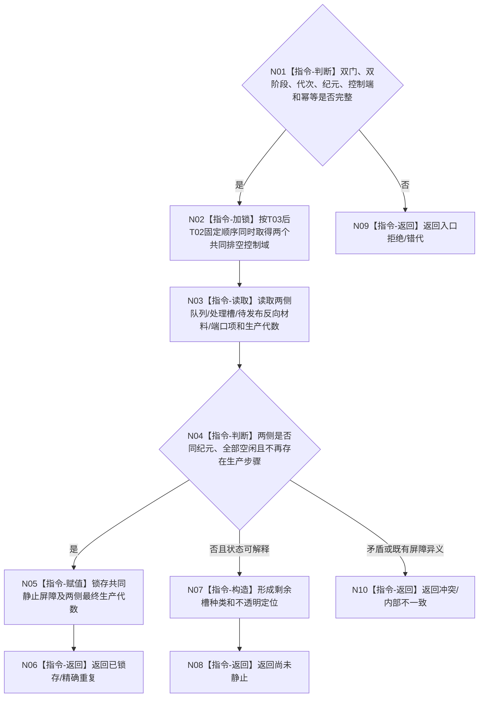

# BIZ-L4-001-14-03-03 读取并锁存双向治理共同静止屏障目标函数流程图 v0.1

更新时间：2026-08-27

## 依据

```text
0050、8100、8110；BIZ-L3-001-14-03、BIZ-L4-001-14-03-01—02
```

## 身份与边界

正式目标函数设计图。按固定锁序同时取得 T03/T02 共同排空控制域，核对两线程的全部已接受输入、处理槽、待发布反向材料、端口未消费项和生产代数，并在条件成立时锁存共同静止屏障。该屏障只属于当前进程线程协调，不是业务事实、持久 owner 或 L1/L2 当前性截止。

## 函数合同

```text
根函数：读取并锁存双向治理共同静止屏障
归属模块 / 文件 / 目标分解深度：治理线程共同收口控制 / 海中鱼巣/启动.治理共同排空.ixx / BIZ-L4
现有或待新增：待新增
完整签名：治理共同静止屏障结果 读取并锁存双向治理共同静止屏障(const 治理共同静止屏障请求& 请求) noexcept
参数：请求含运行代次、T03/T02线程身份和控制端、双门见证、两线程同纪元阶段见证、共同排空纪元和屏障幂等身份
返回结果：不可变值式结果；含已锁存、精确重复、尚未静止、入口拒绝、错代、冲突或内部不一致；尚未静止时携带各线程剩余槽种类和不透明定位，不携带业务正文
被调函数流程图：无；稳定锁序、控制态读取、代数比较和屏障锁存均为本函数内指令
父图：BIZ-L3-001-14-03
```

## 流程图



## 完整静止集合

| 线程 | 必须为空或不活跃的控制项 |
| --- | --- |
| T03 | 已接受管理输入、当前输入处理槽、主阶段治理槽、工作结果定位槽、未完成工作槽、待提交T02材料、T03→T02端口未消费项 |
| T02 | 已接受邮箱批次、当前批次私有处理槽、已接受结算定位、待提交T03材料、T02→T03端口未消费项 |

## 关键边界

- 不得先读 T03 空、释放锁后再读 T02 空并拼成共同空槽；最后一项反向发布会使这种快照失真。
- 锁只保护进程内控制项，锁内不得调用领域 provider、持久化、日志、窗口或阻塞等待。
- “尚未静止”不移动、复制或接管业务材料；屏障结果只携带种类与不透明定位，业务正文仍由原线程私有槽拥有。
