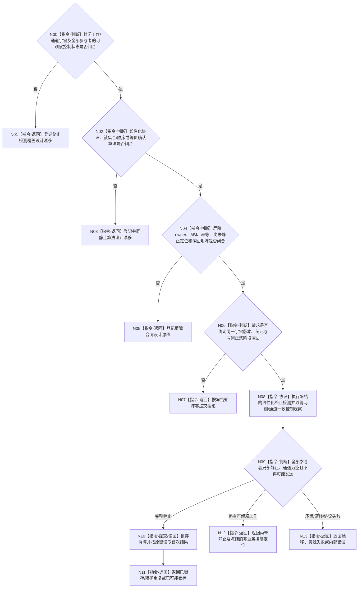

# BIZ-L4-001-14-03-03 读取并锁存双向治理共同静止屏障目标函数流程图 v0.2

更新时间：2026-08-28

## 依据

```text
0050、8100 v0.7、8110 v0.3；BIZ-L3-001-14-03 v0.2、BIZ-L4-001-14-03-01—02 v0.2；
BIZ-L1-T02 v0.6、BIZ-L1-T03 v0.5；HEAD两根循环与线程控制代码。
```

## 身份与边界

正式目标治理图。本叶目标是证明T03/T02组成的封闭工作系统已经终止，并在进程控制域锁存一个不可被后续合法反向交付打破的共同静止结果。屏障只属于本次进程运行与停止协调，不是业务事实、DATA-L1/ARCH-L1事实截止、持久恢复记录或跨进程见证。

旧v0.1直接指定“先T03后T02”固定锁序，并假定可同时读取全部队列、私有槽、端口项和生产代数。HEAD没有覆盖这些对象的共同控制接口：T03跨多个锁，T02处理槽为线程私有，跨向消息producer也未闭合。未经正式锁集合/顺序、令牌确认或其它等价终止检测协议，外部协调器既不能合法取得所有锁，也不能证明读取后不会发生最后一次发送。

## 函数合同

```text
根函数候选：读取并锁存双向治理共同静止屏障
归属模块 / 文件 / 目标分解深度：治理双线程终止检测 / 物理文件待静止协议owner裁决 / BIZ-L4
现有或待新增：HEAD无终止检测协议、屏障owner或正式读回
完整签名：未冻结；旧治理共同静止屏障请求/结果不构成ABI
参数：未冻结；必须绑定封闭工作宇宙版本、两侧正式排空阶段读回、所有参与者/通道身份、共同纪元和屏障幂等身份
返回结果：未冻结；必须分账已锁存、精确重复、尚未静止、入口拒绝、版本/当前性漂移、幂等冲突、资源失败、内部错误、已可能锁存及正式读回；非成功不得携带业务正文
被调函数流程图：无；锁序、令牌/确认或等价协议由后继正式设计选择
父图：BIZ-L3-001-14-03 v0.2
```

## 设计门禁与目标骨架



## 节点合同

| 节点 | 当前可确认合同 | 仍待冻结 | 验证边界 |
| --- | --- | --- | --- |
| N00/N01 | 工作、槽、通道和producer必须全覆盖；漏项时不能形成合法空集 | 宇宙版本、参与者集合、通道、在途所有权与覆盖见证 | 0/N、漏/多/重参与者、隐藏私有槽和未知producer |
| N02/N03 | 协议必须排除“先看A空、再看B空、期间A发送给B”的假静止 | 锁序/令牌/确认/代数算法、内存序、死锁与恢复 | 最后发送、交叉唤醒、锁反转、伪唤醒和线程故障 |
| N04/N05 | 尚未静止定位只引用控制项；屏障首次/重复/未知须正式读回 | 请求/结果、状态、幂等、定位类型、已可能锁存和读回 | 同键异义、读回失败、资源失败和屏障恢复 |
| N06—N13 | 屏障只在线程控制域成立；不调用业务provider、不移动材料 | 阶段读回、成功公式、提交点和异常收束 | 错代、错纪元、版本漂移、尚未静止和完整成功 |

## 当前代码对应（HEAD `7883bf24`）

- T03控制状态分布在强类型请求锁、结果上行锁及多个容器；T02邮箱与处理槽没有共同对外锁接口。
- HEAD没有通道全集、生产代数、终止检测令牌/确认、固定合法锁序、屏障owner、幂等账或读回。
- 8110生命周期投影、线程等待态、队列计数和顺序空快照都不能替代共同静止。

## 具名偏差

1. `DRIFT-BIZ-T03-T02-GOVERNANCE-DRAIN-CLOSED-WORK-UNIVERSE-CHANNELS-SLOTS-AND-PRODUCER-CONSUMER-BIJECTION-UNFROZEN`
2. `DRIFT-BIZ-T03-T02-COMMON-QUIESCENCE-LINEARIZATION-PROTOCOL-LOCK-ORDER-GENERATION-AND-BARRIER-READBACK-MATRIX-UNFROZEN`

## v0.2校正记录

- 撤销固定锁序、完整静止集合、生产代数、剩余槽定位和屏障ABI已经冻结的旧声明。
- 将固定锁序降为候选，允许正式设计选择令牌/确认或其它等价线性化终止检测协议。
- 明确合法成功必须同时证明局部静止、通道为空和不再可能发送；任何非成功都不移动业务材料。
