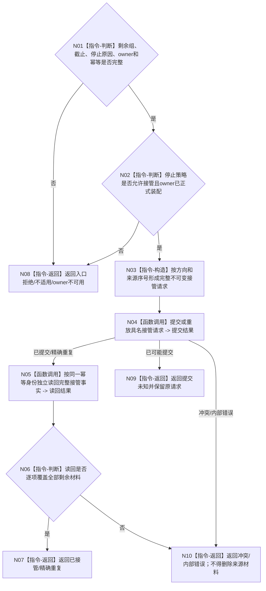

# BIZ-L4-001-14-03-04 具名接管本次无法完成的治理材料目标函数流程图 v0.1

更新时间：2026-08-26

## 依据

```text
0050、8100 v0.8；BIZ-L3-001-14-03、BIZ-L4-001-14-03-01—03
```

## 身份与边界

正式目标函数设计图。仅在停止策略允许且剩余材料无法在本次安全完成时，把完整强类型材料、方向、来源序号和读回截止提交给具名恢复 owner，并独立读回接管事实；没有 owner、部分提交或仅写日志均不算接管。

## 函数合同

```text
根函数：具名接管本次无法完成的治理材料
归属模块 / 文件 / 目标分解深度：治理恢复接管 / 海中鱼巣/启动.治理共同排空.ixx / BIZ-L4
现有或待新增：待新增；具体接管 owner 由有效详细设计和计划冻结后施工
完整签名：治理材料接管结果 具名接管本次无法完成的治理材料(const 治理材料接管请求& 请求) noexcept
参数：请求含运行代次、规范有序剩余材料组、两向读取截止、停止原因、接管策略、接管owner身份和幂等身份
返回结果：不可变值式结果；含已接管、精确重复、不适用、owner不可用、提交未知、冲突或内部错误，以及逐项接管读回见证
被调函数流程图：无当前实现；目标只冻结接管调用边，不授权创建第二业务事实 owner
父图：BIZ-L3-001-14-03
```

## 流程图



## 关键边界

本图只冻结“若存在正式接管 owner 时”的消费合同；在 owner 的身份、写入、生命周期和读回尚未由正式设计冻结前，该分支必须结构化不可用，不能用线程缓存、文件或日志冒充。
