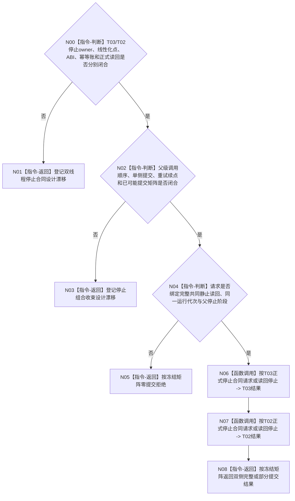

# BIZ-L4-001-14-04-01 按共同静止屏障请求任务管理与自我线程停止目标函数流程图 v0.2

更新时间：2026-08-28

## 依据

```text
0050、8100 v0.7、8110 v0.3；BIZ-L3-001-14-04 v0.3、BIZ-L3-001-14-03 v0.2；
BIZ-L1-T02 v0.6、BIZ-L1-T03 v0.5；当前发布源码中的 T03/T02停止控制代码。
```

## 身份与边界

正式目标治理图。本叶只负责在完整共同静止结果之后，分别请求T03和T02停止；不等待线程完成、不连接资源、不裁决业务排空。两线程拥有不同控制域，停止请求不是一个跨owner原子事务，父级必须保留单侧已提交事实并按正式续点重试。

旧v0.1指定了双线程停止请求/结果、停止原因、逐线程幂等身份和“锁存后唤醒”实现。发布源码只有T03局部停止入口与T02私有停止bool，正式规范未冻结两侧生产停止owner、公开ABI、线性化点、精确重复、正式读回或部分提交矩阵，因此这些字段和指令都不能作为施工合同。

## 函数合同

```text
根函数候选：按共同静止屏障请求任务管理与自我线程停止
归属模块 / 文件 / 目标分解深度：治理线程生命周期协调 / 物理文件待两线程停止owner裁决 / BIZ-L4
现有或待新增：发布源码无本组合函数或两个完整生产停止合同
完整签名：未冻结；旧治理双线程停止请求/结果不构成ABI
参数：未冻结；必须绑定正式共同静止屏障读回、两线程身份/运行代次、父停止阶段和两侧各自幂等身份
返回结果：未冻结；必须分账零提交、T03已提交、T02已提交、双侧完整、精确重复、冲突、资源/内部错误与已可能提交，并携带正式读回
被调函数流程图：无；T03/T02专属停止入口须由后继设计分别冻结
父图：BIZ-L3-001-14-04 v0.3
```

## 设计门禁与目标骨架



## 节点合同

| 节点 | 当前可确认合同 | 仍待冻结 | 验证边界 |
| --- | --- | --- | --- |
| N00/N01 | 两侧停止分别线性化、分别读回；共同键不产生跨owner原子性 | 两owner、请求/结果/状态、提交点、唤醒、幂等、截止和读回 | 首次、重复、同键异义、提交后读回失败 |
| N02/N03 | 已锁存停止的一侧不得补偿回开；重试只收敛缺失或未知侧 | 调用顺序、续点、部分提交、已可能提交、资源/内部矩阵 | T03先成、T02先成、永久失败、未知提交 |
| N04—N08 | 无完整共同静止资格时零停止；停止成功不等于线程完成 | 屏障绑定、父停止阶段、两侧成功公式和返回守恒 | 错代、错屏障、屏障读回漂移、部分成功 |

## 当前已发布代码对应（`0f4fa4b4`；相关源码自`f4f9c2d6`后未变）

- T03已有`请求停止并发送停止消息()`和若干局部停止/排空入口，但没有绑定共同静止屏障的生产停止owner、幂等账或正式读回。
- T02停止通过对象私有`停止已锁存_`及条件变量实现，未公开本叶所需的强类型生产停止请求/结果。
- 发布源码没有跨两控制域的部分提交收束；直接顺序调用现有bool/操作结果不能补造正式双侧停止见证。

## 具名偏差

1. `DRIFT-BIZ-T03-T02-STOP-REQUEST-OWNER-ABI-IDEMPOTENCY-READBACK-AND-PARTIAL-COMMIT-MATRIX-UNFROZEN`

## v0.2校正记录

- 撤销停止原因、逐线程幂等字段、双线程结果形状和具体加锁/唤醒顺序已经冻结的旧声明。
- 明确两侧停止是两个独立提交与读回，不得由共同屏障、共同键或顺序调用伪装成一个原子事务。
