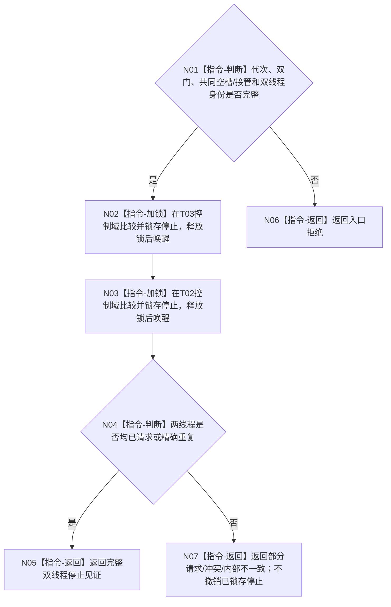

# BIZ-L4-001-14-04-01 请求任务管理与自我线程停止目标函数流程图 v0.1

更新时间：2026-08-26

## 依据

```text
0050、8100 v0.8、8110；BIZ-L3-001-14-04、BIZ-L3-001-14-01—03
```

## 身份与边界

正式目标函数设计图。共同空槽或完整接管见证成立后，分别在 T03/T02 控制域锁存停止并唤醒线程；不等待完成、不连接租约，也不向业务邮箱补造普通停止结果。

## 函数合同

```text
根函数：请求任务管理与自我线程停止
归属模块 / 文件 / 目标分解深度：治理线程生命周期协调 / 海中鱼巣/启动.治理共同排空.ixx / BIZ-L4
现有或待新增：待新增；适配两个线程现有停止锁存能力
完整签名：治理双线程停止请求结果 请求任务管理与自我线程停止(const 治理双线程停止请求& 请求) noexcept
参数：请求含运行代次、T03/T02逻辑身份、双门冻结见证、共同空槽/接管见证、停止原因和逐线程幂等身份
返回结果：不可变值式结果；含两线程已请求、精确重复、部分请求、前置拒绝、错代、冲突或内部错误，以及逐线程停止见证
被调函数流程图：无；两个线程控制域的停止锁存和唤醒作为本函数内穷尽适配指令
父图：BIZ-L3-001-14-04
```

## 流程图



## 关键边界

停止锁存没有补偿性撤销。T03 成功、T02 失败时保留 T03 停止并返回部分结果；同键重试只收敛缺失一侧。
