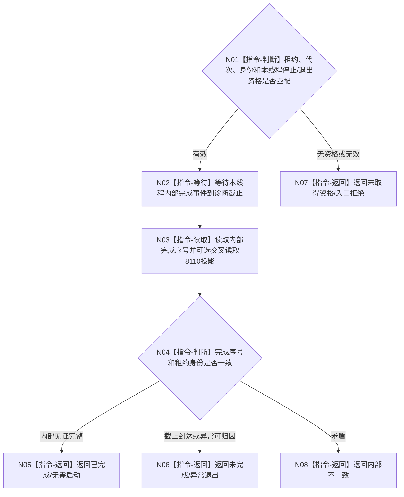

# BIZ-L4-001-14-04-02 等待一个已取得完成资格的治理或控制面板线程目标函数流程图 v0.1

更新时间：2026-08-27

## 依据

```text
0050、8110、8120；BIZ-L3-001-14-04、BIZ-L4-001-14-04-01、BIZ-L3-001-14-02
```

## 身份与边界

正式目标函数设计图。一次只等待一个已经取得停止或退出完成资格的 T03、T02 或 T05 租约，并读取该线程自己的内部完成见证。8110 生命周期投影只作诊断交叉核对；其它线程是否完成不影响本项结果。

## 函数合同

```text
根函数：等待一个已取得完成资格的治理或控制面板线程
归属模块 / 文件 / 目标分解深度：治理线程生命周期协调 / 海中鱼巣/启动.治理共同排空.ixx / BIZ-L4
现有或待新增：待新增
完整签名：单治理线程完成见证结果 等待一个已取得完成资格的治理或控制面板线程(const 治理线程租约& 线程租约, const 单治理线程完成等待请求& 请求) noexcept
参数：租约为调用期只读借用；请求含运行代次、线程类别/逻辑身份、对应停止或T05退出准备见证和诊断观察截止
返回结果：不可变值式结果；含已完成、无需启动、未取得资格、异常退出、未完成、错代或内部不一致，以及内部完成序号和可选8110诊断投影
被调函数流程图：无；单线程完成事件等待和内部见证读取为本函数内指令
父图：BIZ-L3-001-14-04
```

## 流程图



## 关键边界

线程投影“已退出”但内部完成见证缺失时只能报告不一致，不能直接 join；内部见证完整而投影迟到不阻断资源连接，但须保留诊断差异。
