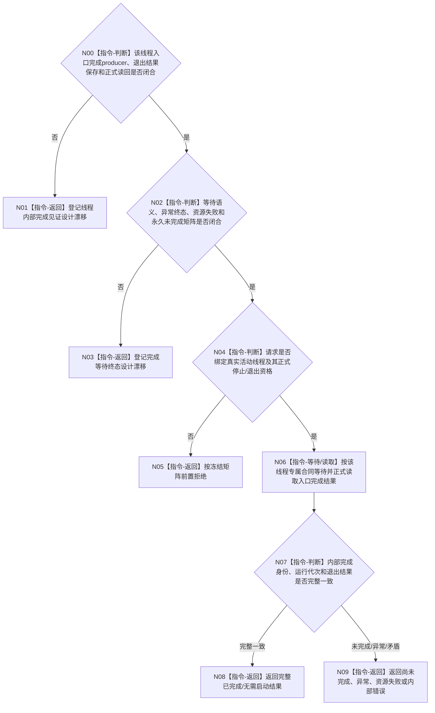

# BIZ-L4-001-14-04-02 等待一个已取得完成资格的治理或控制面板线程目标函数流程图 v0.2

更新时间：2026-08-28

## 依据

```text
0050、8110 v0.3、8120 v0.10；BIZ-L3-001-14-04 v0.2、BIZ-L4-001-14-04-01 v0.2；
BIZ-L1-T02 v0.6、BIZ-L1-T03 v0.5；HEAD线程入口、完成槽与连接代码。
```

## 身份与边界

正式目标治理图。本叶等待一个已经取得正式停止/退出资格的真实活动线程，并读取由该线程入口结束时形成的内部完成结果。8110生命周期投影只可诊断交叉核对；`joinable()`只表示线程对象仍关联执行线程；`join()`等待并回收资源，但两者都不证明入口以何结果结束。

旧v0.1冻结了统一租约借用、完成等待请求、诊断观察截止、内部完成序号和T03/T02/T05统一结果。HEAD中T03没有内部完成producer；T02只有私有`已完成_`且丢弃治理循环退出结果；T05不存在。正式规范也没有冻结生产收口等待是有界观察还是必须等待到终态、异常退出如何保存、结果如何正式读回，因此不能形成统一ABI。

## 函数合同

```text
根函数候选：等待一个已取得完成资格的治理或控制面板线程
归属模块 / 文件 / 目标分解深度：治理线程生命周期协调 / 物理文件待各线程完成owner裁决 / BIZ-L4
现有或待新增：HEAD无统一生产完成等待/读回函数；T02仅有启动失败回收私有路径
完整签名：未冻结；旧单治理线程完成等待请求/结果不构成ABI
参数：未冻结；必须绑定真实活动线程身份、运行代次、该线程正式停止/退出资格和内部完成读取键
返回结果：未冻结；必须区分已完成、无需启动、尚未完成、异常退出、前置拒绝、资源/内部错误及完整入口退出结果
被调函数流程图：无；各线程完成producer与读取入口须由后继设计冻结
父图：BIZ-L3-001-14-04 v0.2
```

## 设计门禁与目标骨架



## 节点合同

| 节点 | 当前可确认合同 | 仍待冻结 | 验证边界 |
| --- | --- | --- | --- |
| N00/N01 | 完成必须由线程入口末端形成并保存真实退出结果；外部不能从投影或线程对象状态反推 | producer、结果类型、身份/序号、发布点、内存序和正式读回 | 正常/异常返回、结果丢失、重复通知、错代 |
| N02/N03 | 诊断观察超时不能授权detach、强杀、析构joinable对象或伪造完成 | 有界观察/终态等待分工、取消、永久阻塞、资源与内部错误矩阵 | 迟到完成、永久未完成、通知丢失、异常传播 |
| N04—N09 | 停止资格只允许等待，不证明已完成；8110投影只诊断 | 停止见证绑定、成功公式、投影差异记录和非成功载荷 | 无资格、投影先到/迟到、身份矛盾、无需启动 |

## 当前代码对应（HEAD `f4f9c2d6`）

- T03没有可正式读取的线程入口完成结果；`收口等待()`直接`join()`后写局部状态。
- T02线程入口调用`运行治理循环()`后丢弃`退出结果`，再把私有`已完成_`置真；只有启动失败候选回收路径用`wait_for`观察该bool。
- 8110只定义线程生命周期投影，并明确投影不构成业务状态或完成依据；HEAD不存在T05完成producer。

## 具名偏差

1. `DRIFT-BIZ-T03-T02-INTERNAL-COMPLETION-WITNESS-PRODUCER-READBACK-AND-TERMINAL-MATRIX-UNFROZEN`
2. `DRIFT-BIZ-CONTROL-PANEL-EXECUTION-TOPOLOGY-WINDOW-OWNER-AND-THREAD-AFFINITY-UNFROZEN`

## v0.2校正记录

- 撤销统一租约借用、诊断截止、内部完成序号、统一三线程结果和“投影迟到不阻断连接”已经冻结的旧声明。
- 要求先保存并正式读回入口真实退出结果；`joinable()`、`join()`和8110投影均不得替代内部完成见证。
