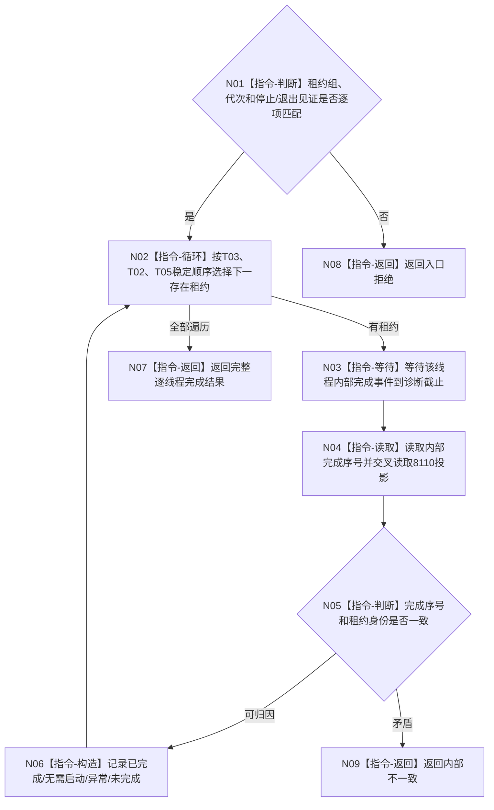

# BIZ-L4-001-14-04-02 等待治理与控制面板线程完成见证目标函数流程图 v0.1

更新时间：2026-08-26

## 依据

```text
0050、8110、8120；BIZ-L3-001-14-04、BIZ-L4-001-14-04-01、BIZ-L4-001-14-02-02
```

## 身份与边界

正式目标函数设计图。等待 T03/T02 和可选 T05 各自内部完成见证；8110 生命周期投影只作诊断交叉核对。诊断时限用于返回控制，不授权 detach、强杀或把未完成改写为完成。

## 函数合同

```text
根函数：等待治理与控制面板线程完成见证
归属模块 / 文件 / 目标分解深度：治理线程生命周期协调 / 海中鱼巣/启动.治理共同排空.ixx / BIZ-L4
现有或待新增：待新增
完整签名：治理线程完成见证结果 等待治理与控制面板线程完成见证(const 治理线程租约组& 线程租约组, const 治理线程完成等待请求& 请求) noexcept
参数：租约组为调用期只读借用；请求含运行代次、T03/T02停止见证、可选T05退出投递见证、完成等待策略和观察截止
返回结果：不可变值式结果；含逐线程已完成、无需启动、异常退出、未完成、错代或内部不一致，以及内部完成序号和只读生命周期投影
被调函数流程图：无；逐线程完成事件等待和内部见证读取为本函数内指令
父图：BIZ-L3-001-14-04
```

## 流程图



## 关键边界

线程投影“已退出”但内部完成见证缺失时只能报告不一致，不能直接 join；内部见证完整而投影迟到不阻断资源连接，但须保留诊断差异。
