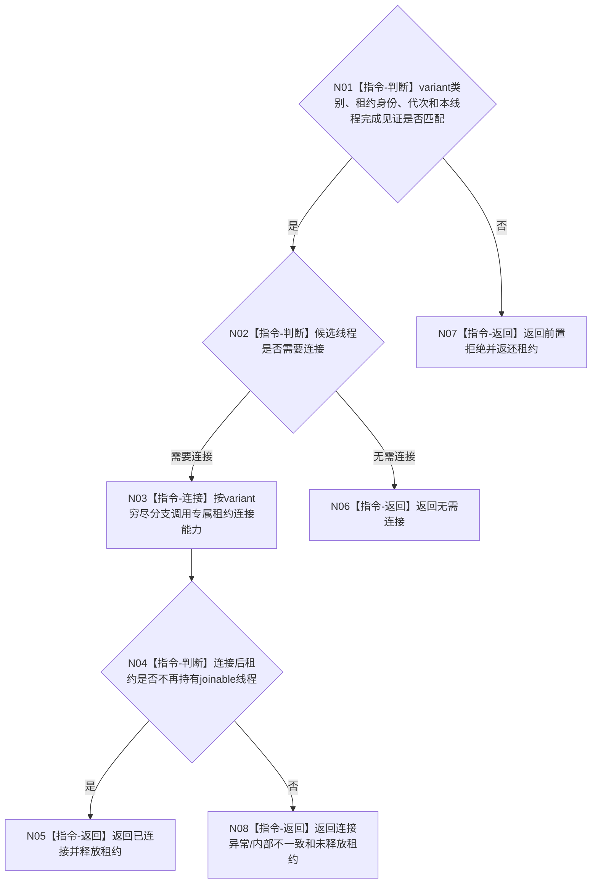

# BIZ-L4-001-14-04-03 连接一个已完成治理或控制面板线程目标函数流程图 v0.1

更新时间：2026-08-27

## 依据

```text
0050、8110、8120；BIZ-L3-001-14-04、BIZ-L4-001-14-04-02
```

## 身份与边界

正式目标函数设计图。穷尽 T03、T02、T05 强类型租约，在该线程内部完成见证成立后移动连接一个线程并返回租约释放结果；不要求其它线程同时完成，不解包裸 `std::thread` 给调用方，也不以 join 结果裁决业务排空。

## 函数合同

```text
根函数：连接一个已完成治理或控制面板线程
归属模块 / 文件 / 目标分解深度：治理线程生命周期协调 / 海中鱼巣/启动.治理共同排空.ixx / BIZ-L4
现有或待新增：待新增
完整签名：单治理线程连接结果 连接一个已完成治理或控制面板线程(治理线程租约&& 线程租约, const 单治理线程连接请求& 请求) noexcept
参数：移动租约为T03/T02/T05强类型variant；请求含运行代次、线程类别/逻辑身份、该线程内部完成见证和连接身份
返回结果：移动值式结果；含已连接、无需连接、错代、身份冲突、前置未完成、连接异常或内部不一致，以及可选未释放租约
被调函数流程图：无；variant穷尽、joinable复核、连接和租约清除为本函数内指令
父图：BIZ-L3-001-14-04
```

## 流程图



## 关键边界

析构只允许作为进程异常回收的最后 fallback，不是正常连接路径；未完成或连接失败的租约必须值式返还给上层。T05 已完成时可以先于尚未取得静止屏障的 T03/T02 连接。
