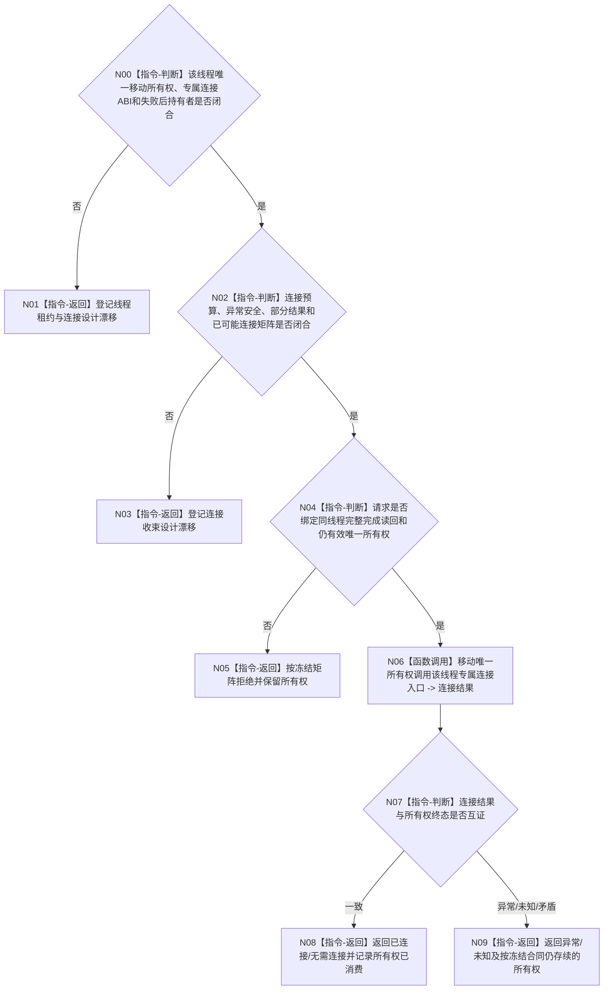

# BIZ-L4-001-14-04-03 连接一个已完成治理或控制面板线程目标函数流程图 v0.2

更新时间：2026-08-28

## 依据

```text
0050、8110 v0.3、8120 v0.10；BIZ-L3-001-14-04 v0.2、BIZ-L4-001-14-04-02 v0.2；
BIZ-L1-T01 v0.4、BIZ-L1-T02 v0.6、BIZ-L1-T03 v0.5；HEAD线程对象所有权与join代码。
```

## 身份与边界

正式目标治理图。本叶只在一个线程的正式内部完成见证完整后，消费该线程的唯一物理所有权并执行其专属连接/资源回收。连接不裁决业务静止、任务完成或线程入口结果；析构回收不是正常成功路径。

旧v0.1冻结了T03/T02/T05 variant、统一右值租约、连接身份、`joinable`复核和失败时值式返还租约。HEAD的T03由不可移动运行包内嵌对象持有，T02对象也明确不可移动；两者只有对象内部同步`join()`，没有可提取的统一租约或右值连接入口。C++ `std::thread::join()`也不以结构化结果返还“连接失败租约”。所有权形态、异常安全和失败后谁继续持有对象必须先正式设计。

## 函数合同

```text
根函数候选：连接一个已完成治理或控制面板线程
归属模块 / 文件 / 目标分解深度：治理线程资源回收 / 物理文件待线程租约owner裁决 / BIZ-L4
现有或待新增：HEAD无统一租约variant、右值连接函数或失败返还载体
完整签名：未冻结；旧单治理线程连接请求/结果不构成ABI
参数：未冻结；必须绑定线程专属唯一移动所有权、完整内部完成读回、运行代次、父停止阶段和连接预算
返回结果：未冻结；必须分账已连接、无需连接、前置拒绝、连接异常、资源/内部错误、已可能连接，并守恒失败时仍存续的所有权
被调函数流程图：无；每类线程专属连接入口与所有权转移须由后继设计冻结
父图：BIZ-L3-001-14-04 v0.2
```

## 设计门禁与目标骨架



## 节点合同

| 节点 | 当前可确认合同 | 仍待冻结 | 验证边界 |
| --- | --- | --- | --- |
| N00/N01 | 一个活动线程只能有一个物理所有者；主宿主控制面板没有T05租约 | 租约类型、owner、移动/借用规则、专属连接入口、失败后持有者 | 重复所有权、空租约、错线程、对象不可移动 |
| N02/N03 | 连接可能阻塞的预算属于父停止协调；超时不能detach或遗失所有权 | 总预算分配、异常安全、已可能连接、部分结果和恢复路径 | 预算耗尽、系统错误、异常、结果返回前已连接 |
| N04—N09 | 完成见证只授权连接；连接只回收物理资源 | 完成绑定、调用后置、所有权互证、成功公式与返还载体 | 错代、错完成见证、无需连接、连接后仍持有资源 |

## 当前代码对应（HEAD `f4f9c2d6`）

- `任务管理线程`与`自我线程`都删除移动构造/赋值，不能装入旧图假定的统一可移动variant。
- T03由`任务结果生产运行包`内嵌并在运行包收口中直接`收口等待()`；T02由普通应用上下文持有并在自身析构/启动失败回收中`join()`。
- HEAD没有线程租约稳定身份、连接身份、右值连接ABI、连接总预算、部分连接结果或失败时未连接所有权返还类型；T05线程同样不存在。

## 具名偏差

1. `DRIFT-BIZ-T03-T02-UNIQUE-MOVING-LEASE-AND-RIGHT-VALUE-CONNECTION-ABI-UNFROZEN`
2. `DRIFT-BIZ-T01-GOVERNANCE-THREAD-CONNECTION-TOTAL-BUDGET-PARTIAL-RESULT-AND-UNCONNECTED-LEASE-RETURN-MATRIX-UNFROZEN`
3. `DRIFT-BIZ-CONTROL-PANEL-EXECUTION-TOPOLOGY-WINDOW-OWNER-AND-THREAD-AFFINITY-UNFROZEN`

## v0.2校正记录

- 撤销统一T03/T02/T05 variant、右值租约签名、连接身份、连接后复核和失败租约值式返还已经冻结的旧声明。
- 将目标收窄为“完整内部完成见证后，按各线程专属所有权合同回收资源”；实际所有权布局和异常安全留待正式设计。
