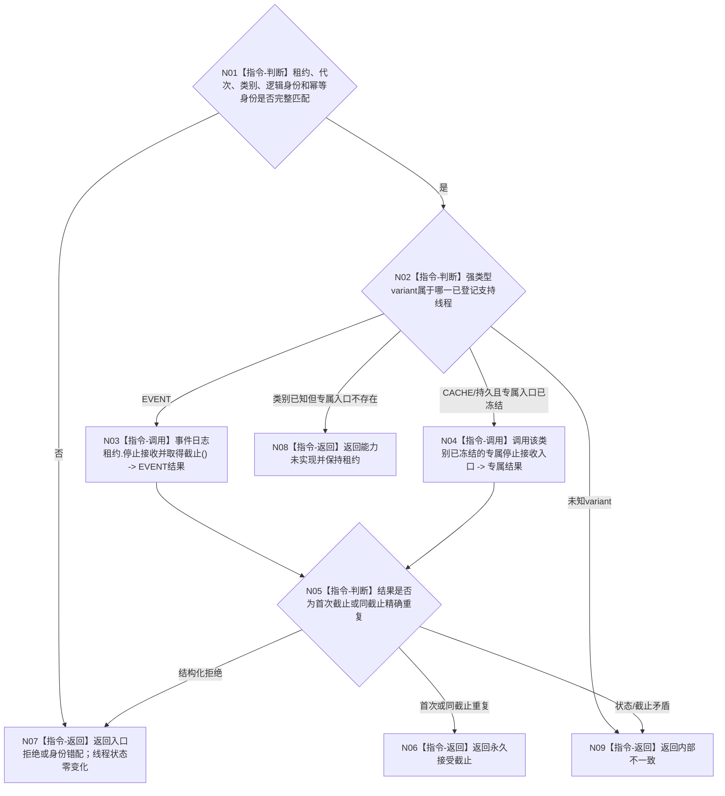

# BIZ-L4-001-15-01-01 停止接收并取得一个支持线程接受截止目标函数流程图 v0.2

更新时间：2026-08-27

## 依据

```text
0050、4060、8110 v0.3、8120、日志系统规范；
20260815 EVENT-LOG-THREAD-PRODUCTION-START；BIZ-L3-001-15-01 v0.2
```

## 身份与边界

正式目标函数设计图。一次只对一个强类型支持线程租约线性化关闭新提交并取得永久接受截止。该截止只界定本线程已经接受的非权威旁路材料，不是 L1 事实代次、业务事实截止或跨支持线程共同版本。

## 函数合同

```text
根函数：停止接收并取得一个支持线程接受截止
归属模块 / 文件 / 目标分解深度：支持线程收口 / 海中鱼巣/启动.支持线程收口.ixx / BIZ-L4
现有或待新增：待新增组合适配；EVENT 的 事件日志线程租约::停止接收并取得截止 已实现，CACHE 与持久证据专属入口未实现
完整签名：支持线程接受截止结果 停止接收并取得一个支持线程接受截止(支持线程租约& 线程租约, const 支持线程停止接收请求& 请求) noexcept
参数：线程租约为调用期可变借用的强类型 variant；请求含运行代次、线程类别/逻辑身份和停止接收幂等身份
返回结果：不可变值式结果；含已停止并取得截止、精确重复、入口拒绝、错代、身份错配、能力未实现或内部不一致，以及唯一接受截止
被调函数流程图：无；强类型 variant 穷尽和专属租约调用均为本函数内适配指令
父图：BIZ-L3-001-15-01 v0.2
```

## 流程图



## 节点合同

| 节点 | 类型 | 参数 / 输入绑定 | 结果 / 输出绑定 | 事实读写 | 后继条件 | 验证 |
| --- | --- | --- | --- | --- | --- | --- |
| N01/N02 | 指令-判断 | 租约和请求 | 准入 / variant | 无 | 先完整校验再调用 | 空租约、错代、错身份、未知 variant |
| N03/N04 | 指令-调用 | 专属租约 | 专属截止结果 | 线性化关闭本线程新提交 | 每类只调用自己的入口 | 并发提交、重复停收 |
| N05/N06 | 判断 / 返回 | 专属结果 | 唯一接受截止 | 无 | 截止非倒退 | 首次 / 精确重复同值 |
| N07—N09 | 返回 | 非成功 | 结构化结果 | 调用前拒绝零变化 | 唯一返回 | 能力缺失与内部矛盾分账 |

## 关键边界

- EVENT 不存在“刷新目标”字段；它通过停收线性化取得接受截止。目标流程不得复制旧图中的通用刷新控制域、跨线程幂等位置或裸 SUPPORT 状态。
- 当前只证明 EVENT 专属入口已实现。CACHE / 持久证据专属入口未冻结前返回能力未实现，不能把 EVENT 方法名、队列位置或 DTO 复用于其它类别。
