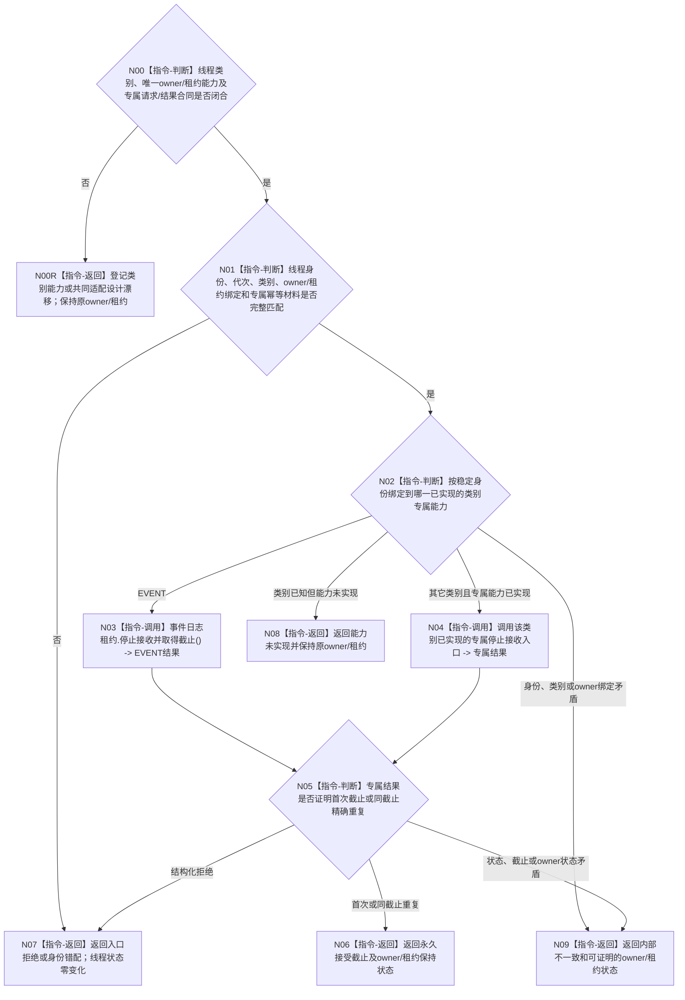

# BIZ-L4-001-15-01-01 停止接收并取得一个支持线程接受截止目标函数流程图 v0.3

更新时间：2026-08-28

## 依据

```text
0050、4060、8110 v0.3、8120、日志系统规范；
20260815 SUPPORT/EVENT/CACHE详细设计；BIZ-L3-001-15-01 v0.3
```

## 身份与边界

正式目标治理图。一次只对一个由稳定线程身份绑定到唯一生命周期 owner 或专属租约能力的支持线程，线性化关闭新提交并取得永久接受截止。该截止只界定本线程已经接受的非权威旁路材料，不是 L1 事实代次、业务事实截止或跨支持线程共同版本。

EVENT 已有专属停收入口；CACHE 的专属形态已在详细设计中冻结但代码尚不存在；持久证据支持线程没有已冻结生产与收口合同。旧图中的共同 `支持线程租约&` variant、共同请求和共同结果没有正式依据，本叶不能把 EVENT 单类接口提升成跨类别 ABI。

## 函数合同

```text
根函数候选：停止接收并取得一个支持线程接受截止
归属模块 / 文件 / 目标分解深度：支持线程收口 / 海中鱼巣/启动.支持线程收口.ixx / BIZ-L4
现有或待新增：待新增组合适配；EVENT 的 事件日志线程租约::停止接收并取得截止 已实现，CACHE 只有详细设计，持久证据类别合同未冻结
完整签名：未冻结；旧 `支持线程租约&` variant 与统一停止请求/结果不构成ABI
参数：未冻结；必须绑定稳定线程身份、类别、运行代次、唯一生命周期owner或专属租约能力及该类别专属幂等材料
返回结果：未冻结；必须保存专属原始状态、唯一接受截止、owner/租约保持状态，并区分首次、精确重复、入口拒绝、身份错配、能力未实现和内部不一致
被调函数流程图：无；逐类专属能力选择与结果映射均为本函数内指令
父图：BIZ-L3-001-15-01 v0.3
```

## 流程图



## 节点合同

| 节点 | 类型 | 参数 / 输入绑定 | 结果 / 输出绑定 | 事实读写 | 后继条件 | 验证 |
| --- | --- | --- | --- | --- | --- | --- |
| N00/N00R | 判断 / 返回 | 当前逐类正式合同 | 设计闭合资格或具名漂移 | 无 | EVENT单叶不扩张共同ABI | CACHE代码缺失、持久类别合同缺失 |
| N01/N02 | 判断 | 稳定身份、owner/租约和专属请求 | 准入 / 类别分派 | 无 | 先完整校验再调用 | 空owner、错代、错身份、未知类别 |
| N03/N04 | 调用 | 类别专属能力 | 专属截止结果 | 线性化关闭本线程新提交 | 每类只调用自己的入口 | 并发提交、重复停收 |
| N05/N06 | 判断 / 返回 | 专属结果 | 唯一接受截止 | 无 | 截止非倒退 | 首次 / 精确重复同值 |
| N07—N09 | 返回 | 非成功 | 结构化结果和owner/租约状态 | 调用前拒绝零变化 | 唯一返回 | 能力缺失与内部矛盾分账 |

## 关键边界

- EVENT 不存在“刷新目标”字段；它通过停收线性化取得接受截止。目标流程不得复制通用刷新控制域、跨线程幂等位置或裸 SUPPORT 状态。
- CACHE 专属 ABI 已由详细设计冻结但生产代码尚不存在；持久证据支持线程专属 ABI 未冻结。共同适配层不得把 EVENT 方法名、队列位置或 DTO 复用于其它类别。
- 能力缺失只允许保持原 owner / 租约并返回结构化非成功，不得用析构、裸线程 join 或空截止冒充正常收口。

## 当前已发布代码对应（`c989510b`）

- EVENT 的 `事件日志线程租约::停止接收并取得截止` 已实现但零生产调用。
- CACHE 生产文件与持久证据支持线程合同均不存在；共同活动组、共同请求/结果和本组合适配函数也不存在。

## 具名偏差

1. `DRIFT-BIZ-SUPPORT-CATEGORY-STOP-ACCEPTING-REQUEST-RESULT-AND-ADAPTER-UNFROZEN`
2. `DRIFT-BIZ-PERSISTENCE-SUPPORT-THREAD-PRODUCTION-MATERIAL-AND-CLOSURE-CONTRACT-UNFROZEN`

## v0.3校正记录

- 撤销共同 `支持线程租约&` variant 与统一请求/结果已经冻结的声明。
- 保留按稳定线程身份绑定唯一类别专属能力、取得永久接受截止及非成功保持原owner/租约的目标骨架。
