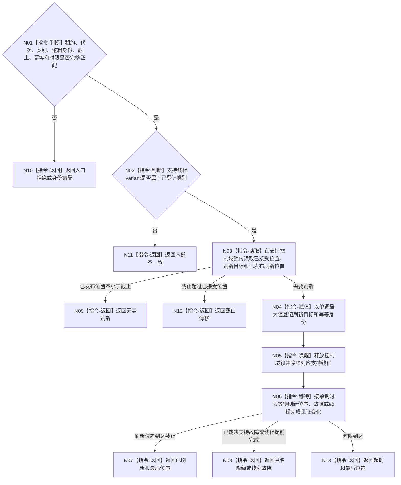

# BIZ-L4-001-15-01-01 请求一个支持线程刷新到接受截止目标函数流程图 v0.1

更新时间：2026-08-03

## 依据

```text
0050、4060、8110、8120、日志系统规范；BIZ-L3-001-15-01；BIZ-L4-001-04-00-01—03
```

## 身份与边界

正式目标函数设计图。向一个事件日志、缓存统计或持久证据支持线程登记刷新截止并等待其处理位置到达；只处理收口前已经接受的旁路材料。

## 函数合同

```text
根函数：请求一个支持线程刷新到接受截止
归属模块 / 文件 / 层级：支持线程收口 / 海中鱼巣/启动.支持线程收口.ixx / L4
现有或待新增：待新增；统一三类强类型支持线程租约的刷新请求与位置等待
完整签名：支持线程单项刷新结果 请求一个支持线程刷新到接受截止(const 支持线程租约& 线程租约, const 支持线程单项刷新请求& 请求)
参数：线程租约为调用期只读借用的事件日志、缓存统计或持久证据工作者强类型variant；请求为只读借用，含运行代次、线程类别/逻辑身份、接受截止身份、刷新幂等身份和非零单调最长等待
返回结果：不可变值式结果；含已刷新、无需刷新、降级、超时、错代、身份错配、线程故障或内部不一致，以及请求截止和最后已发布刷新位置
被调函数流程图：无；variant穷尽、刷新目标单调推进、唤醒、条件等待和位置读取均为本函数内指令
父图：BIZ-L3-001-15-01
```

## 流程图



## 节点合同

| 节点 | 类型 | 参数 / 输入绑定 | 结果 / 输出绑定 | 事实读写 | 后继条件 | 验证 |
| --- | --- | --- | --- | --- | --- | --- |
| N01/N02 | 指令-判断 | 租约和刷新请求 | 准入与variant类别 | 无 | 身份和代次完整 | 错代、未知variant、零时限 |
| N03/N04 | 指令 | 接受/刷新位置 | 单调刷新目标 | 只改支持控制域 | 目标不回退且不越过已接受位置 | 重复请求、较旧截止、迟到材料 |
| N05/N06 | 指令 | 刷新目标和时限 | 位置/故障/完成见证 | 不访问业务写入口 | 任一见证变化 | 虚假唤醒、超时、线程提前退出 |
| N07—N13 | 指令-返回 | 最后位置和见证 | 结构化单项结果 | 不改变业务事实 | 唯一返回 | 日志失败、缓存不可用、持久追写失败 |

## 关键边界

事件日志、缓存统计和发布后持久证据都是非权威旁路；刷新失败只产生支持降级。发布前准备型持久证据必须已由业务事务闭合，不得在本函数异步补造。
