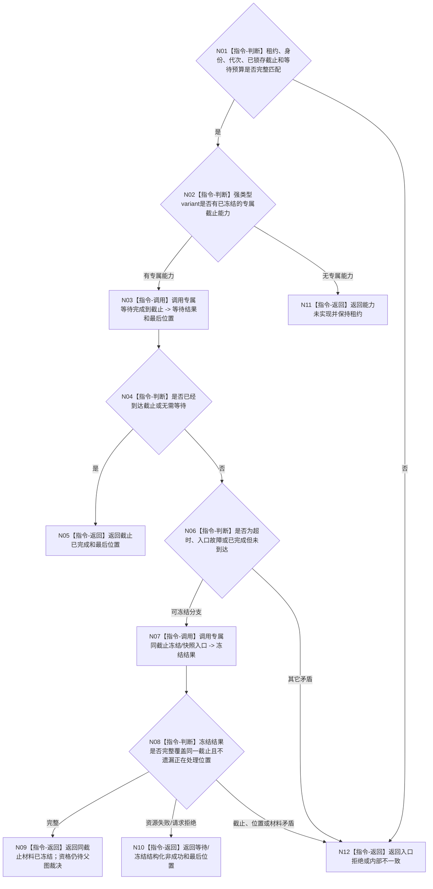

# BIZ-L4-001-15-01-02 等待或冻结一个支持线程截止材料目标函数流程图 v0.2

更新时间：2026-08-27

## 依据

```text
0050、4060、8110 v0.3、8120、日志系统规范；
20260815 EVENT-LOG-THREAD-PRODUCTION-START；BIZ-L3-001-15-01 v0.2、BIZ-L4-001-15-01-01 v0.2
```

## 身份与边界

正式目标函数设计图。等待一个已经停收的支持线程处理到同一接受截止；超时或入口故障时，只按该线程专属合同冻结并读取尚未处理的同截止材料。函数返回刷新证据，不裁决后继停止资格和 owner 收口。

## 函数合同

```text
根函数：等待或冻结一个支持线程截止材料
归属模块 / 文件 / 目标分解深度：支持线程收口 / 海中鱼巣/启动.支持线程收口.ixx / BIZ-L4
现有或待新增：待新增组合适配；EVENT 的等待完成到截止、读取处理位置、冻结并读取未取出快照已实现，CACHE / 持久证据专属能力未实现
完整签名：支持线程截止材料结果 等待或冻结一个支持线程截止材料(支持线程租约& 线程租约, const 支持线程截止材料请求& 请求) noexcept
参数：租约为调用期可变借用的强类型 variant；请求含运行代次、线程类别/逻辑身份、已锁存接受截止和非零单调等待预算
返回结果：不可变值式结果；含已到达、无需等待、同截止材料已冻结、等待超时且冻结失败、入口故障且冻结失败、入口拒绝、能力未实现、资源失败或内部不一致，以及最后位置和可选同截止材料
被调函数流程图：无；专属租约的等待、位置读取和冻结调用均为本函数内适配指令
父图：BIZ-L3-001-15-01 v0.2
```

## 流程图



## 节点合同

| 节点 | 类型 | 参数 / 输入绑定 | 结果 / 输出绑定 | 事实读写 | 后继条件 | 验证 |
| --- | --- | --- | --- | --- | --- | --- |
| N01/N02 | 指令-判断 | 租约、截止和预算 | 准入 | 无 | 截止已由前叶锁存 | 错代、异截止、零预算、能力缺失 |
| N03—N05 | 调用 / 判断 / 返回 | 专属等待请求 | 完成位置 | 只等待 / 只读线程私有位置 | 到达或无需等待 | 虚假唤醒、入口完成、零截止 |
| N06—N09 | 判断 / 调用 / 返回 | 超时 / 故障和同截止 | 冻结材料 | 只冻结本线程取出并复制值式材料 | 同截止完整 | 正在处理项不重复、冻结后零新取出 |
| N10—N12 | 返回 | 非成功 | 结构化结果 | 不补造 owner 见证 | 唯一返回 | 资源、拒绝、内部矛盾分账 |

## 关键边界

- EVENT 的未取出快照不含已经移到入口局部的正在处理项；该位置必须单独回显。快照成功不等于这些日志已经写入，也不等于后继 owner 已接收。
- 资源失败后原冻结队列和租约仍存在，允许同截止重试；不得以空材料、位置摘要或日志文本冒充成功快照。
- 本函数不把全空、可重建或快照存在直接改判为可停止；BIZ-L3-001-15-02 负责逐类材料资格。
