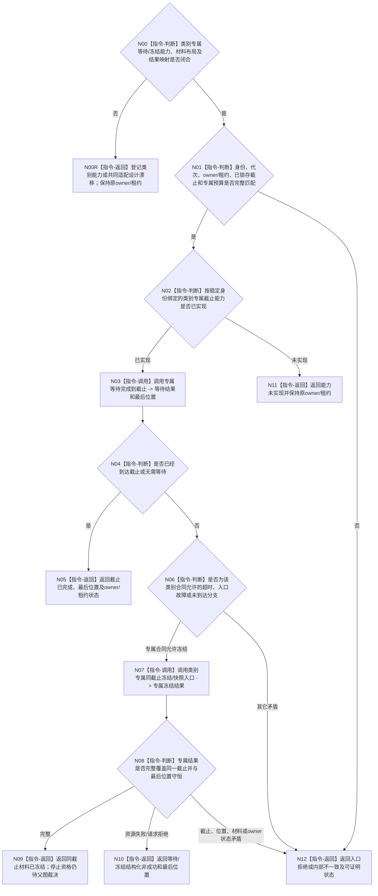

# BIZ-L4-001-15-01-02 等待或冻结一个支持线程截止材料目标函数流程图 v0.3

更新时间：2026-08-28

## 依据

```text
0050、4060、8110 v0.3、8120、日志系统规范；
20260815 SUPPORT/EVENT/CACHE详细设计；BIZ-L3-001-15-01 v0.3、BIZ-L4-001-15-01-01 v0.3
```

## 身份与边界

正式目标治理图。等待一个已经停收的支持线程处理到同一接受截止；超时或入口故障时，只按该类别专属合同冻结并读取尚未处理的同截止材料。函数返回逐类刷新证据，不裁决后继停止资格和 owner 收口。

EVENT 已实现等待、位置与同截止快照能力；CACHE 只有详细设计；持久证据类别尚无合同。旧共同 `支持线程租约&` variant 和统一截止材料请求/结果未冻结，不能把 EVENT 快照布局推广为其它类别的共同材料。

## 函数合同

```text
根函数候选：等待或冻结一个支持线程截止材料
归属模块 / 文件 / 目标分解深度：支持线程收口 / 海中鱼巣/启动.支持线程收口.ixx / BIZ-L4
现有或待新增：待新增组合适配；EVENT 的等待完成到截止、读取处理位置、冻结并读取未取出快照已实现，CACHE 只有详细设计，持久证据类别合同未冻结
完整签名：未冻结；旧 `支持线程租约&` variant 与统一截止材料请求/结果不构成ABI
参数：未冻结；必须绑定稳定线程身份、类别、运行代次、唯一owner/租约能力、已锁存接受截止和类别专属等待/冻结材料
返回结果：未冻结；必须保存专属原始状态、最后位置、可选同截止材料、owner/租约保持状态，并区分已到达、同截止冻结、结构化非成功和内部不一致
被调函数流程图：无；逐类等待、位置读取、冻结与结果映射均为本函数内指令
父图：BIZ-L3-001-15-01 v0.3
```

## 流程图



## 节点合同

| 节点 | 类型 | 参数 / 输入绑定 | 结果 / 输出绑定 | 事实读写 | 后继条件 | 验证 |
| --- | --- | --- | --- | --- | --- | --- |
| N00/N00R | 判断 / 返回 | 当前逐类等待/冻结合同 | 设计闭合资格或具名漂移 | 无 | EVENT快照不扩张共同材料ABI | CACHE代码缺失、持久类别合同缺失 |
| N01/N02 | 判断 | 身份、owner/租约、截止和预算 | 准入 | 无 | 截止已由前叶锁存 | 错代、异截止、能力缺失 |
| N03—N05 | 调用 / 判断 / 返回 | 类别专属等待请求 | 完成位置 | 只等待 / 只读线程私有位置 | 到达或无需等待 | 虚假唤醒、入口完成、零截止 |
| N06—N09 | 判断 / 调用 / 返回 | 类别允许的非到达状态和同截止 | 专属冻结材料 | 只冻结本线程材料 | 同截止完整 | 正在处理项、材料和位置守恒 |
| N10—N12 | 返回 | 非成功 | 结构化结果和owner/租约状态 | 不补造 owner 见证 | 唯一返回 | 资源、拒绝、能力缺失、矛盾分账 |

## 关键边界

- EVENT 的未取出快照不含已经移到入口局部的正在处理项；该位置必须单独回显。快照成功不等于日志已经写入，也不等于后继 owner 已接收。
- CACHE 只有详细设计、没有生产代码；持久证据类别没有专属合同。共同适配不得以 EVENT 快照、空材料或位置摘要补造其它类别成功。
- 资源失败后原材料和原owner/租约仍存在，允许同截止重试。本函数不把全空、可重建或快照存在直接改判为可停止；BIZ-L3-001-15-02 负责逐类材料资格。

## 当前已发布代码对应（`c989510b`）

- EVENT 的等待、处理位置和同截止未取出快照能力已实现但零生产调用。
- CACHE 生产文件、持久证据类别合同、共同材料DTO和本组合适配函数均不存在。

## 具名偏差

1. `DRIFT-BIZ-SUPPORT-CATEGORY-CUTOFF-WAIT-FREEZE-MATERIAL-AND-ADAPTER-UNFROZEN`
2. `DRIFT-BIZ-PERSISTENCE-SUPPORT-THREAD-PRODUCTION-MATERIAL-AND-CLOSURE-CONTRACT-UNFROZEN`

## v0.3校正记录

- 撤销共同 `支持线程租约&` variant 与统一截止材料请求/结果已经冻结的声明。
- 保留逐类等待同截止、合法非到达时调用专属冻结能力，以及所有非成功保持原owner/租约的目标骨架。
