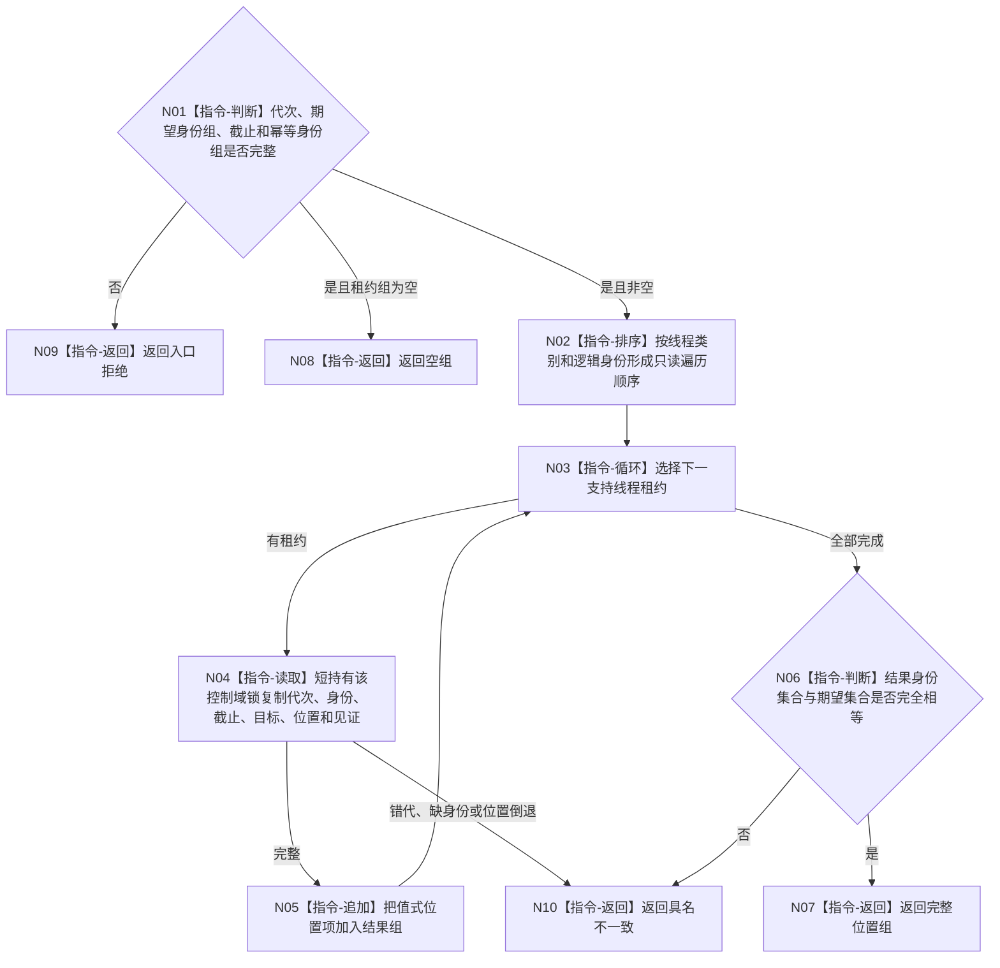

# BIZ-L4-001-15-01-02 读取支持线程刷新位置组目标函数流程图 v0.1

更新时间：2026-08-03

## 依据

```text
0050、4060、8110、8120、日志系统规范；BIZ-L3-001-15-01；BIZ-L4-001-15-01-01
```

## 身份与边界

正式目标函数设计图。按稳定线程身份读取本轮支持线程接受截止与已发布刷新位置，形成只读位置组；不触发刷新、不修补位置。

## 函数合同

```text
根函数：读取支持线程刷新位置组
归属模块 / 文件 / 层级：支持线程收口 / 海中鱼巣/启动.支持线程收口.ixx / L4
现有或待新增：待新增
完整签名：支持线程刷新位置组读取结果 读取支持线程刷新位置组(const 支持线程租约组& 线程租约组, const 支持线程刷新位置组读取请求& 请求)
参数：线程租约组为调用期只读借用；请求为只读借用，含运行代次、期望线程逻辑身份组、各接受截止身份、刷新请求幂等身份组和事实截止
返回结果：不可变值式结果；含完整位置组、空组、错代、身份缺失、位置倒退、截止漂移或内部不一致；每项含线程类别、逻辑身份、接受截止、刷新目标、已发布刷新位置和故障/完成见证
被调函数流程图：无；稳定排序、逐租约短锁读取、版本复核和结果构造均为本函数内指令
父图：BIZ-L3-001-15-01
```

## 流程图



## 节点合同

| 节点 | 类型 | 参数 / 输入绑定 | 结果 / 输出绑定 | 事实读写 | 后继条件 | 验证 |
| --- | --- | --- | --- | --- | --- | --- |
| N01/N02 | 指令 | 请求和租约组 | 准入与稳定顺序 | 无 | 输入完整 | 空组、重复身份、乱序容器 |
| N03—N05 | 指令 | 单线程租约 | 值式位置项 | 只读支持控制域 | 复制后立即释放锁 | 并发刷新、故障切换、位置倒退 |
| N06/N07 | 指令 | 期望/实际身份集合 | 完整位置组 | 无 | 集合相等 | 缺项、重复项、额外线程 |
| N08—N10 | 指令-返回 | 读取结论 | 结构化非成功 | 无 | 唯一返回 | 错代和内部矛盾分账 |

## 关键边界

刷新位置只证明旁路线程处理进度，不证明日志、缓存、SQL或持久副本成为业务事实；读取不得为了补齐结果重新触发刷新或取得业务仓库锁。
