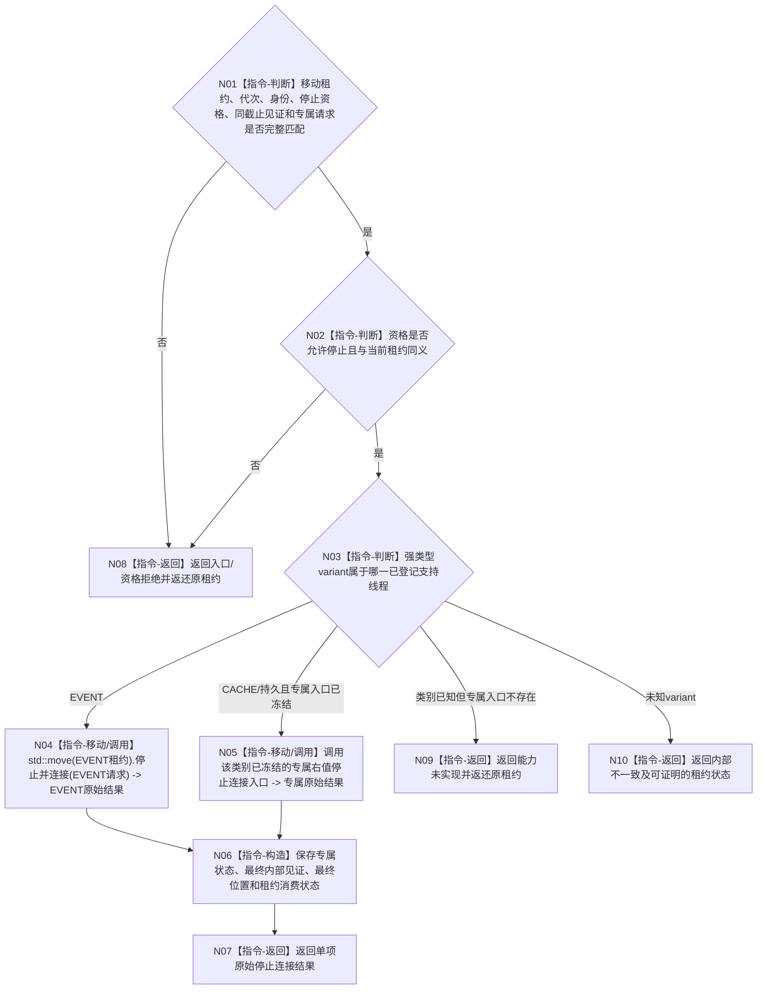

# BIZ-L4-001-15-03-01 停止并连接一个已取得资格的支持线程目标函数流程图 v0.2

更新时间：2026-08-27

## 依据

```text
0050、8110 v0.3、8120、日志系统规范；
20260815 EVENT-LOG-THREAD-PRODUCTION-START；BIZ-L3-001-15-02—03 v0.2
```

## 身份与边界

正式目标函数设计图。一次只移动消费一个已经取得正常或具名降级停止资格的强类型支持线程租约。所有可在移动前发现的资格、代次、身份和请求错误先行拒绝并返还原租约；进入专属右值停止连接后，以该专属结果证明资源回收，不拆解底层线程或 SUPPORT 租约。

## 函数合同

```text
根函数：停止并连接一个已取得资格的支持线程
归属模块 / 文件 / 目标分解深度：支持线程收口 / 海中鱼巣/启动.支持线程收口.ixx / BIZ-L4
现有或待新增：待新增组合适配；EVENT 的右值 事件日志线程租约::停止并连接 已实现，CACHE / 持久证据专属入口未实现
完整签名：支持线程单项停止连接结果 停止并连接一个已取得资格的支持线程(支持线程租约&& 线程租约, const 支持线程单项停止连接请求& 请求) noexcept
参数：移动租约为一个强类型 variant；请求含运行代次、线程类别/逻辑身份、完整停止资格、同截止材料见证和专属非零诊断预算
返回结果：移动值式结果；含专属原始状态、最终内部见证、最终位置、已消费租约、能力未实现或未连接原租约
被调函数流程图：无；variant 穷尽、专属右值调用和租约结果构造均为本函数内指令
父图：BIZ-L3-001-15-03 v0.2
```

## 流程图



## 节点合同

| 节点 | 类型 | 参数 / 输入绑定 | 结果 / 输出绑定 | 事实读写 | 后继条件 | 验证 |
| --- | --- | --- | --- | --- | --- | --- |
| N01/N02 | 判断 | 移动租约、资格和请求 | 移动前准入 | 只读资格 | 所有拒绝先于移动 | 无资格、错代、异截止、坏预算 |
| N03 | 判断 | variant | 专属分支 | 无 | 穷尽已登记类别 | 未知类别、能力未实现 |
| N04/N05 | 移动 / 调用 | 强类型租约 | 专属原始结果 | 请求停止、等待完成、连接并释放线程资源 | 专属 ABI | EVENT 前置未闭合仍安全连接 |
| N06/N07 | 构造 / 返回 | 原始结果 | 值式单项结果 | 无业务写入 | 结果和消费状态一致 | 最终见证 / 位置完整 |
| N08—N10 | 返回 | 非成功 | 原租约或可证状态 | 不丢失未移动租约 | 唯一返回 | 租约守恒 |

## 关键边界

- EVENT 没有单独公开的“请求停止”和“连接”两步；目标组合必须调用其现有右值 `停止并连接`，由 EVENT 内部继续持有队列状态、入口和 SUPPORT 租约直至 join 完成。
- EVENT 调用后即消费租约，即使返回 `请求拒绝但已安全连接` 或 `前置未闭合但已安全连接` 也不能返还原租约。因此所有上层可知错误必须在 N01/N02 前置拒绝。
- 本函数只返回原始停止连接结果；正常支持收口与异常资源回收由下一叶核对，不允许仅凭 `已连接=true` 判成功。
