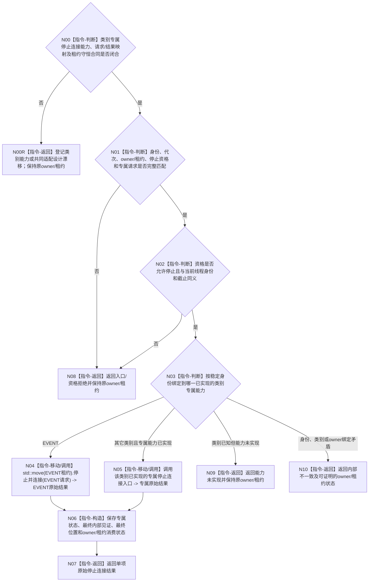

# BIZ-L4-001-15-03-01 停止并连接一个已取得资格的支持线程目标函数流程图 v0.3

更新时间：2026-08-28

## 依据

```text
0050、8110 v0.3、8120、日志系统规范；
20260815 SUPPORT/EVENT/CACHE详细设计；BIZ-L3-001-15-02—03 v0.3
```

## 身份与边界

正式目标治理图。一次只消费一个已经取得正常或具名降级停止资格、并由稳定线程身份绑定到唯一生命周期 owner 或专属可移动租约能力的支持线程。所有可在移动前发现的资格、代次、身份和请求错误先行拒绝并保持原 owner / 租约；进入类别专属停止连接后，以专属结果证明资源回收，不拆解底层线程或 SUPPORT 租约。

EVENT 的右值停止连接已经实现；CACHE 的专属右值形态已由详细设计冻结但代码不存在；持久证据支持线程没有已冻结生产与收口合同。旧共同 `支持线程租约&&` variant、共同请求和共同结果并未冻结，本叶只能表达逐类分派与资源守恒骨架。

## 函数合同

```text
根函数候选：停止并连接一个已取得资格的支持线程
归属模块 / 文件 / 目标分解深度：支持线程收口 / 海中鱼巣/启动.支持线程收口.ixx / BIZ-L4
现有或待新增：待新增组合适配；EVENT 的右值 事件日志线程租约::停止并连接 已实现，CACHE 只有详细设计，持久证据类别合同未冻结
完整签名：未冻结；旧 `支持线程租约&&` variant 与统一停止连接请求/结果不构成ABI
参数：未冻结；必须绑定稳定线程身份、类别、运行代次、唯一owner或专属可移动租约能力、完整停止资格和该类别专属停止连接材料
返回结果：未冻结；必须保存专属原始状态、最终内部见证、最终位置、租约消费/返还状态，并区分能力未实现、未连接和内部不一致
被调函数流程图：无；逐类专属能力选择、移动调用和结果构造均为本函数内指令
父图：BIZ-L3-001-15-03 v0.3
```

## 流程图



## 节点合同

| 节点 | 类型 | 参数 / 输入绑定 | 结果 / 输出绑定 | 事实读写 | 后继条件 | 验证 |
| --- | --- | --- | --- | --- | --- | --- |
| N00/N00R | 判断 / 返回 | 当前逐类停止连接合同 | 设计闭合资格或具名漂移 | 无 | 专属右值形态不扩张共同ABI | CACHE代码缺失、持久类别合同缺失 |
| N01/N02 | 判断 | owner/租约、资格和专属请求 | 移动前准入 | 只读资格 | 所有拒绝先于移动 | 无资格、错代、异截止、坏预算 |
| N03 | 判断 | 稳定线程身份和类别绑定 | 专属分支 | 无 | 只分派已实现能力 | 未知类别、能力未实现 |
| N04/N05 | 移动 / 调用 | 类别专属可移动租约能力 | 专属原始结果 | 请求停止、等待完成、连接并释放线程资源 | 专属 ABI | EVENT前置未闭合仍安全连接 |
| N06/N07 | 构造 / 返回 | 原始结果 | 值式单项结果 | 无业务写入 | 结果和消费状态一致 | 最终见证 / 位置完整 |
| N08—N10 | 返回 | 非成功 | 原owner/租约或可证状态 | 不丢失未移动资源 | 唯一返回 | owner/租约守恒 |

## 关键边界

- EVENT 没有单独公开的“请求停止”和“连接”两步；组合必须调用其现有右值 `停止并连接`，由 EVENT 内部继续持有队列状态、入口和 SUPPORT 租约直至 join 完成。
- EVENT 调用后即消费租约，即使返回 `请求拒绝但已安全连接` 或 `前置未闭合但已安全连接` 也不能返还原租约。因此所有上层可知错误必须在 N01/N02 前置拒绝。
- CACHE 只有详细设计、没有生产代码；持久证据类别没有合同。不得借 EVENT 右值租约或析构行为补造其它类别能力。
- 本函数只返回专属原始停止连接事实；正常支持收口与异常资源回收由下一叶核对，不能仅凭 `已连接=true` 判成功。

## 当前已发布代码对应（`c989510b`）

- EVENT 的右值 `事件日志线程租约::停止并连接` 已实现但零生产调用，并结构化区分普通安全连接、前置未闭合但已安全连接和请求拒绝但已安全连接。
- CACHE 生产文件、持久证据类别合同、共同停止连接DTO和本组合适配函数均不存在。

## 具名偏差

1. `DRIFT-BIZ-SUPPORT-CATEGORY-STOP-CONNECTION-REQUEST-RESULT-AND-ADAPTER-UNFROZEN`
2. `DRIFT-BIZ-PERSISTENCE-SUPPORT-THREAD-PRODUCTION-MATERIAL-AND-CLOSURE-CONTRACT-UNFROZEN`

## v0.3校正记录

- 撤销共同 `支持线程租约&&` variant 与统一停止连接请求/结果已经冻结的声明。
- 保留移动前完整拒绝、按稳定身份调用类别专属能力，以及调用后精确保存资源消费状态的目标骨架。
