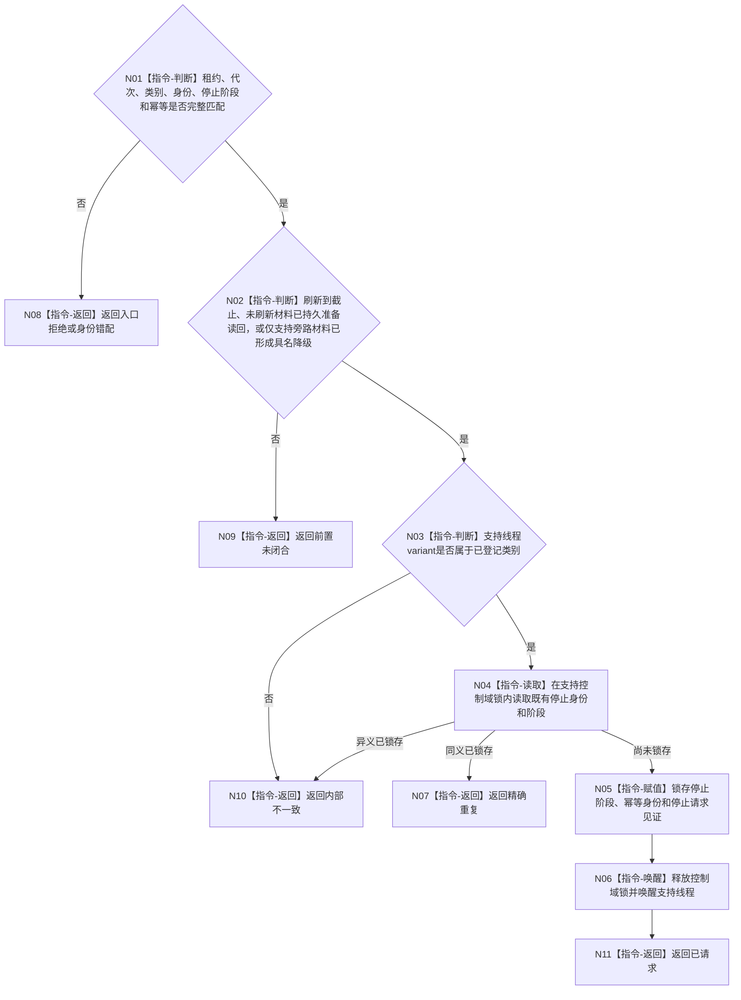

# BIZ-L4-001-15-03-01 请求一个支持线程停止目标函数流程图 v0.1

更新时间：2026-08-03

## 依据

```text
0050、8110、8120、日志系统规范；BIZ-L3-001-15-03；BIZ-L4-001-15-01-01—02；BIZ-L4-001-13-03-01—02
```

## 身份与边界

正式目标函数设计图。在刷新、未刷新材料持久接管已经读回，或剩余已被证明仅是可降级支持旁路材料后，对一个支持线程锁存停止并唤醒；不等待完成、不连接线程。

## 函数合同

```text
根函数：请求一个支持线程停止
归属模块 / 文件 / 层级：支持线程收口 / 海中鱼巣/启动.支持线程收口.ixx / L4
现有或待新增：待新增
完整签名：支持线程停止请求结果 请求一个支持线程停止(const 支持线程租约& 线程租约, const 支持线程停止请求& 请求) noexcept
参数：线程租约为调用期只读借用的强类型variant；请求为只读借用，含运行代次、线程类别/逻辑身份、刷新结果、可选剩余材料持久准备读回见证或已分类支持降级、停止阶段和停止幂等身份
返回结果：不可变值式结果；含已请求、精确重复、前置未闭合、错代、身份错配、未知类别或内部不一致，以及停止请求见证
被调函数流程图：无；variant穷尽、前置复核、停止锁存和唤醒均为本函数内指令
父图：BIZ-L3-001-15-03
```

## 流程图



## 节点合同

| 节点 | 类型 | 参数 / 输入绑定 | 结果 / 输出绑定 | 事实读写 | 后继条件 | 验证 |
| --- | --- | --- | --- | --- | --- | --- |
| N01—N03 | 指令-判断 | 租约、刷新/接管见证或已分类支持降级和停止请求 | 准入 | 无 | 前置完整且类别已登记 | 未分类材料、业务材料混入、错代 |
| N04/N05 | 指令 | 既有/新停止身份 | 停止锁存 | 只改支持控制域 | 同义幂等或首次锁存 | 异义重复、并发请求 |
| N06 | 指令 | 停止见证 | 唤醒 | 无业务写入 | 锁已释放 | 丢失唤醒和虚假唤醒 |
| N07—N11 | 指令-返回 | 停止结论 | 结构化结果 | 无 | 唯一返回 | 失败不改业务收口 |

## 关键边界

停止请求不等于线程完成，也不释放租约。日志写入、缓存重建或发布后持久追写失败不得阻止已成立业务结果；接管失败时必须先证明剩余仅属于非权威支持旁路并形成具名降级，任何业务事实或发布前准备材料混入都禁止停止。
