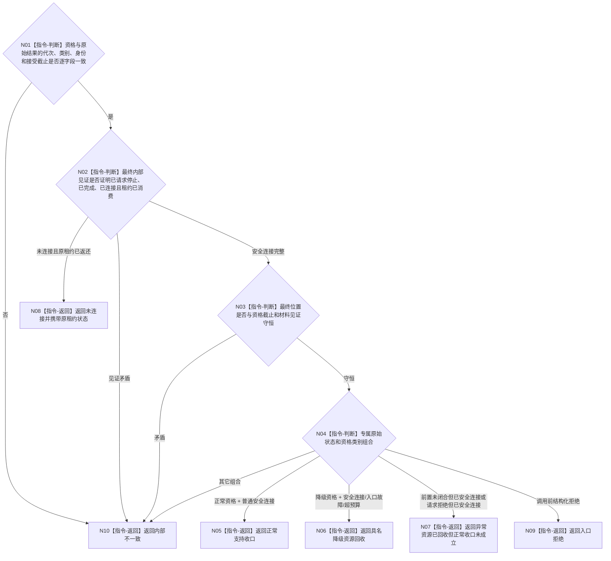

# BIZ-L4-001-15-03-02 核对一个支持线程停止连接结果目标函数流程图 v0.2

更新时间：2026-08-27

## 依据

```text
0050、8110 v0.3、8120、日志系统规范；
20260815 EVENT-LOG-THREAD-PRODUCTION-START；BIZ-L3-001-15-03 v0.2、BIZ-L4-001-15-03-01 v0.2
```

## 身份与边界

正式目标函数设计图。把一个支持线程的停止资格与专属停止连接原始结果逐字段互证，分别形成正常支持收口、具名降级资源回收、异常资源已回收但前置未闭合、未连接或内部不一致。该纯值核对不再次停止、等待或连接线程。

## 函数合同

```text
根函数：核对一个支持线程停止连接结果
归属模块 / 文件 / 目标分解深度：支持线程收口 / 海中鱼巣/启动.支持线程收口.ixx / BIZ-L4
现有或待新增：待新增；纯值适配现有 EVENT 停止连接状态
完整签名：支持线程单项收口分类结果 核对一个支持线程停止连接结果(const 支持线程单项停止资格& 资格, const 支持线程单项停止连接结果& 原始结果) noexcept
参数：两个参数均为只读值式材料；资格含线程身份、截止、正常 / 降级类别和材料见证；原始结果含专属状态、最终内部见证、最终位置及租约消费 / 返还状态
返回结果：不可变值式分类；含正常支持收口、具名降级资源回收、异常资源已回收但正常收口未成立、未连接、入口拒绝或内部不一致
被调函数流程图：无；逐字段比较和状态穷尽均为本函数内指令
父图：BIZ-L3-001-15-03 v0.2
```

## 流程图



## 节点合同

| 节点 | 类型 | 参数 / 输入绑定 | 结果 / 输出绑定 | 事实读写 | 后继条件 | 验证 |
| --- | --- | --- | --- | --- | --- | --- |
| N01—N03 | 判断 | 资格、原始结果、最终见证和位置 | 同一线程同一截止互证 | 无 | 身份 / 截止 / 租约守恒 | 错代、错身份、已连接但租约仍持有 |
| N04 | 判断 | 资格类别和专属状态 | 唯一分类 | 无 | 状态穷尽 | EVENT 七状态完整映射 |
| N05/N06 | 返回 | 正常或具名降级闭合形状 | 正常收口 / 降级回收 | 无 | 完整见证 | 日志丢失、入口故障、超预算 |
| N07 | 返回 | 防御性安全连接非成功 | 异常资源回收 | 无 | 不得升级正常 | 前置未闭合、坏请求 fallback |
| N08—N10 | 返回 | 未连接 / 拒绝 / 矛盾 | 原租约状态或内部不一致 | 无 | 唯一返回 | 租约守恒 |

## 关键边界

- `已安全连接` 是物理资源事实，不自动等于正常支持收口。只有正常资格、同截止材料见证、完整最终位置和普通安全连接同时成立，才能返回正常支持收口。
- `前置未闭合但已安全连接` 必须永久保留为异常资源回收分类；不得因线程已退出、8110 投影已退出、join 已返回或业务结果已完成而改写。
- 具名降级资源回收仍必须进入最终程序结果；它不回滚业务事实，也不能被省略为成功。
