# BIZ-L4-001-15-03-02 核对一个支持线程停止连接结果目标函数流程图 v0.3

更新时间：2026-08-28

## 依据

```text
0050、8110 v0.3、8120、日志系统规范；
20260815 SUPPORT/EVENT/CACHE详细设计；BIZ-L3-001-15-03 v0.3、BIZ-L4-001-15-03-01 v0.3
```

## 身份与边界

正式目标治理图。把一个支持线程的停止资格与该类别专属停止连接原始结果逐字段互证，分别形成正常支持收口、具名降级资源回收、异常资源已回收但前置未闭合、未连接或内部不一致。该纯值核对不再次停止、等待或连接线程。

各类别的原始结果和最终位置语义可以不同；共同单项资格、共同原始结果和统一分类 DTO 尚未冻结。旧图不能用 EVENT 七状态反推 CACHE 或持久证据类别的完整状态宇宙，只能要求每个类别先有专属穷尽映射，再投影到父层需要的结果分账。

## 函数合同

```text
根函数候选：核对一个支持线程停止连接结果
归属模块 / 文件 / 目标分解深度：支持线程收口 / 海中鱼巣/启动.支持线程收口.ixx / BIZ-L4
现有或待新增：待新增组合适配；仅EVENT专属停止连接状态已实现，CACHE只有详细设计，持久证据类别合同未冻结
完整签名：未冻结；旧共同停止资格、共同原始结果和统一分类结果不构成ABI
参数：未冻结；必须绑定稳定线程身份、类别、运行代次、该类别停止资格、专属原始结果及owner/租约消费或返还状态
返回结果：未冻结；必须表达正常支持收口、具名降级资源回收、异常资源已回收但正常收口未成立、未连接、入口拒绝或内部不一致
被调函数流程图：无；逐类状态穷尽、字段互证和父级分类投影均为本函数内指令
父图：BIZ-L3-001-15-03 v0.3
```

## 流程图

```mermaid
flowchart TD
    N00{"N00【指令-判断】该类别状态宇宙、字段互证和父级分类映射是否闭合"}
    N00R["N00R【指令-返回】登记类别结果或共同分类设计漂移"]
    N01{"N01【指令-判断】资格与专属结果的代次、类别、身份和接受截止是否逐字段一致"}
    N02{"N02【指令-判断】专属最终见证是否证明停止、完成、连接及owner/租约状态守恒"}
    N03{"N03【指令-判断】专属最终位置是否与资格截止和材料见证守恒"}
    N04{"N04【指令-判断】按该类别已冻结映射穷尽专属原始状态与资格组合"}
    N05["N05【指令-返回】返回正常支持收口"]
    N06["N06【指令-返回】返回具名降级资源回收"]
    N07["N07【指令-返回】返回异常资源已回收但正常收口未成立"]
    N08["N08【指令-返回】返回未连接及原owner/租约状态"]
    N09["N09【指令-返回】返回入口拒绝"]
    N10["N10【指令-返回】返回内部不一致"]

    N00 -->|否| N00R
    N00 -->|是| N01
    N01 -->|否| N10
    N01 -->|是| N02
    N02 -->|未连接且原owner/租约保持| N08
    N02 -->|见证矛盾| N10
    N02 -->|安全连接完整| N03
    N03 -->|矛盾| N10
    N03 -->|守恒| N04
    N04 -->|正常资格 + 类别普通安全连接| N05
    N04 -->|降级资格 + 类别允许的安全回收状态| N06
    N04 -->|前置未闭合或请求拒绝但已安全连接| N07
    N04 -->|调用前结构化拒绝| N09
    N04 -->|其它或未穷尽组合| N10
```



## 节点合同

| 节点 | 类型 | 参数 / 输入绑定 | 结果 / 输出绑定 | 事实读写 | 后继条件 | 验证 |
| --- | --- | --- | --- | --- | --- | --- |
| N00/N00R | 判断 / 返回 | 当前类别结果与映射合同 | 设计闭合资格或具名漂移 | 无 | EVENT状态不扩张其它类别 | CACHE代码缺失、持久类别与共同DTO缺失 |
| N01—N03 | 判断 | 资格、专属结果、最终见证和位置 | 同一线程同一截止互证 | 无 | 身份 / 截止 / owner/租约守恒 | 错代、错身份、已连接但租约仍持有 |
| N04 | 判断 | 类别专属状态和资格类别 | 唯一父级分类 | 无 | 先穷尽专属状态再投影 | EVENT状态完整映射、其它类别待闭合 |
| N05/N06 | 返回 | 正常或具名降级闭合形状 | 正常收口 / 降级回收 | 无 | 完整见证 | 材料丢失、入口故障、超预算 |
| N07 | 返回 | 防御性安全连接非成功 | 异常资源回收 | 无 | 不得升级正常 | 前置未闭合、坏请求fallback |
| N08—N10 | 返回 | 未连接 / 拒绝 / 矛盾 | owner/租约状态或内部不一致 | 无 | 唯一返回 | owner/租约守恒 |

## 关键边界

- `已安全连接` 是物理资源事实，不自动等于正常支持收口。只有正常资格、同截止材料见证、完整专属最终位置和该类别普通安全连接同时成立，才能返回正常支持收口。
- EVENT 的 `前置未闭合但已安全连接` 必须永久保留为异常资源回收分类；不得因线程已退出、8110 投影已退出、join 已返回或业务结果已完成而改写。
- EVENT 状态映射不能自动用于 CACHE 或持久证据类别。每个新类别必须先冻结并实现自己的原始状态、位置和owner/租约守恒合同。
- 具名降级资源回收仍必须进入最终程序结果；它不回滚业务事实，也不能被省略为成功。

## 当前已发布代码对应（`c989510b`）

- 当前只存在EVENT专属停止连接状态与最终见证，且零生产调用。
- CACHE 生产文件、持久证据类别合同、共同资格/原始结果/分类DTO和本组合适配函数均不存在。

## 具名偏差

1. `DRIFT-BIZ-SUPPORT-CATEGORY-STOP-CONNECTION-STATE-MAPPING-AND-COMMON-CLASSIFICATION-UNFROZEN`
2. `DRIFT-BIZ-PERSISTENCE-SUPPORT-THREAD-PRODUCTION-MATERIAL-AND-CLOSURE-CONTRACT-UNFROZEN`

## v0.3校正记录

- 撤销共同停止资格、共同原始结果和统一分类结果已经冻结的声明。
- 保留逐类别状态穷尽、身份/截止/资源守恒互证，以及正常/降级/异常回收/未连接分账的目标骨架。
