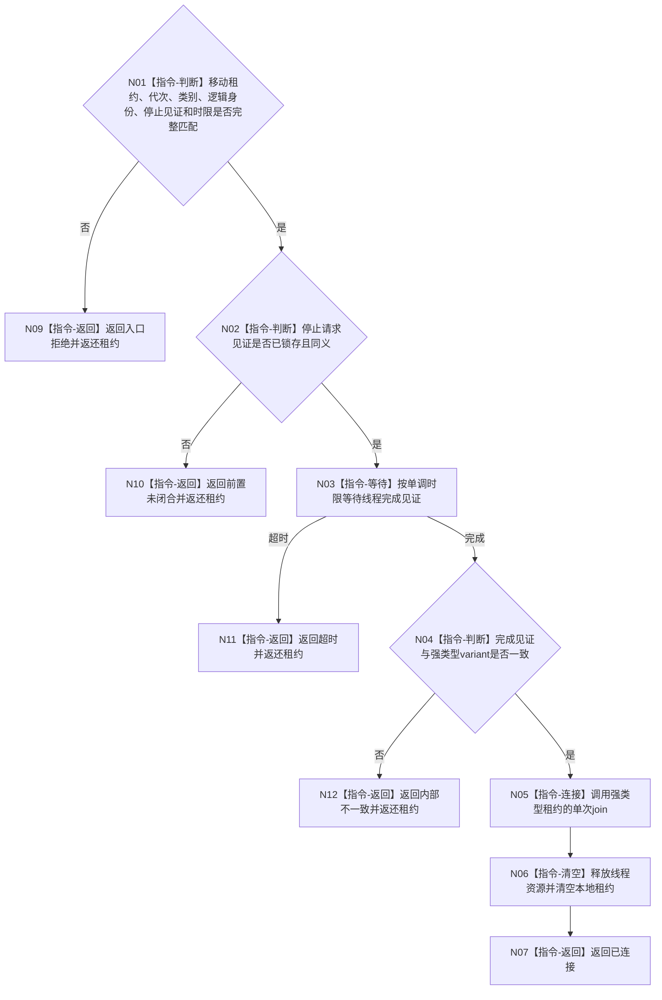

# BIZ-L4-001-15-03-02 连接一个支持线程目标函数流程图 v0.1

更新时间：2026-08-03

## 依据

```text
0050、8110、8120；BIZ-L3-001-15-03；BIZ-L4-001-15-03-01
```

## 身份与边界

正式目标函数设计图。等待一个已请求停止的支持线程形成完成见证后执行单次连接；任何未连接结果都返还唯一租约。

## 函数合同

```text
根函数：连接一个支持线程
归属模块 / 文件 / 层级：支持线程收口 / 海中鱼巣/启动.支持线程收口.ixx / L4
现有或待新增：待新增
完整签名：支持线程连接结果 连接一个支持线程(支持线程租约&& 线程租约, const 支持线程连接请求& 请求) noexcept
参数：线程租约为事件日志、缓存统计或持久证据工作者的唯一移动variant；请求为只读借用，含运行代次、线程类别/逻辑身份、停止请求见证和非零单调最长等待
返回结果：移动值式结果；含已连接、前置未闭合、等待超时、错代、身份错配、未知类别或内部不一致；未连接时返还原租约
被调函数流程图：无；variant穷尽、完成等待、单次join、租约清空和返还均为本函数内指令
父图：BIZ-L3-001-15-03
```

## 流程图



## 节点合同

| 节点 | 类型 | 参数 / 输入绑定 | 结果 / 输出绑定 | 事实读写 | 后继条件 | 验证 |
| --- | --- | --- | --- | --- | --- | --- |
| N01/N02 | 指令-判断 | 移动租约和停止见证 | 连接资格 | 无 | 身份、代次和前置完整 | 空租约、错代、异义见证 |
| N03/N04 | 指令 | 完成见证和时限 | 完成/超时裁决 | 只读线程控制域 | 完成后方可join | 虚假唤醒、异常退出、未知variant |
| N05/N06 | 指令 | 唯一租约 | 连接和释放见证 | 释放线程资源 | 单次join | 双join、detach、租约丢失 |
| N07/N09—N12 | 指令-返回 | 连接结论 | 移动值式结果 | 无业务写入 | 唯一返回 | 所有未连接分支返还租约 |

## 关键边界

线程完成、连接成功和资源释放都不是业务事实；不得用 `detach`、销毁可连接线程对象或丢弃租约掩盖超时。支持线程失败不得回滚已经发布的业务结果。

