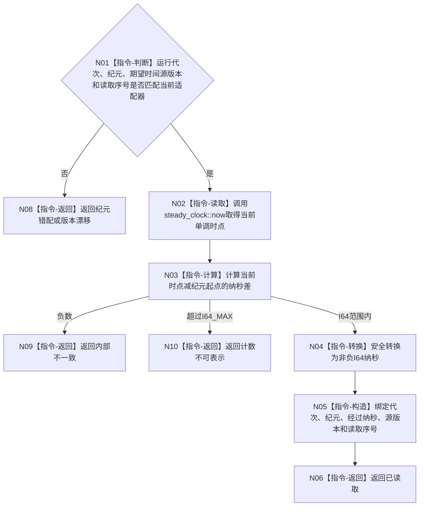

# BIZ-L4-002-01-02-01 读取可信单调时间证据目标函数流程图 v0.1

更新时间：2026-08-03

## 依据

```text
0050、6170、8200；BIZ-L3-002-01-02
```

## 身份与边界

正式目标函数设计图。从当前运行纪元绑定的单调时钟适配器读取非负经过时长证据；不读取墙钟，不接收调用方自报当前时间。

## 函数合同

```text
根函数：单调时钟适配器::读取可信单调时间证据
归属模块 / 文件 / 层级：运行期时间适配 / 海中鱼巣/适配/单调时钟适配器.ixx / L4
现有或待新增：待新增；封装std::chrono::steady_clock并冻结运行纪元与时间源版本
完整签名：单调时间证据读取结果 单调时钟适配器::读取可信单调时间证据(const 单调时间证据读取请求& 请求) const noexcept
参数：请求为只读借用；含运行代次、运行纪元身份、期望时间源版本和读取序号；适配器实例持有本纪元steady_clock起点并覆盖调用
返回结果：不可变值式结果；含已读取、纪元错配、时间源版本漂移、计数不可表示或内部不一致，以及运行代次、纪元、从纪元起点经过的非负I64纳秒、时间源版本和读取序号
被调函数流程图：无；steady_clock读取、差值、范围检查和值式构造为平台边界内指令
父图：BIZ-L3-002-01-02
```

## 流程图



## 节点合同

| 节点 | 类型 | 参数 / 输入绑定 | 结果 / 输出绑定 | 事实读写 | 后继条件 | 验证 |
| --- | --- | --- | --- | --- | --- | --- |
| N01 | 指令-判断 | 请求和适配器身份 | 准入 | 无 | 同代次同纪元同源版本 | 跨代次、旧适配器、零读取序号 |
| N02/N03 | 指令 | steady_clock时点和纪元起点 | 宽经过纳秒 | 只读平台时钟 | 非负 | 墙钟回拨不参与、伪时钟倒退 |
| N04—N06 | 指令 | 宽差值 | I64时间证据 | 无 | 可表示 | 0、1秒边界、I64_MAX边界 |
| N08—N10 | 指令-返回 | 失败分类 | 结构化非成功 | 无 | 唯一返回 | 漂移与内部不一致分账 |

## 关键边界

该结果只在当前运行代次和运行纪元内解释；恢复时没有连续时长证明就建立新纪元，不拼接墙钟或旧单调计数。读取次数、线程循环和消息数量均不是时间。
