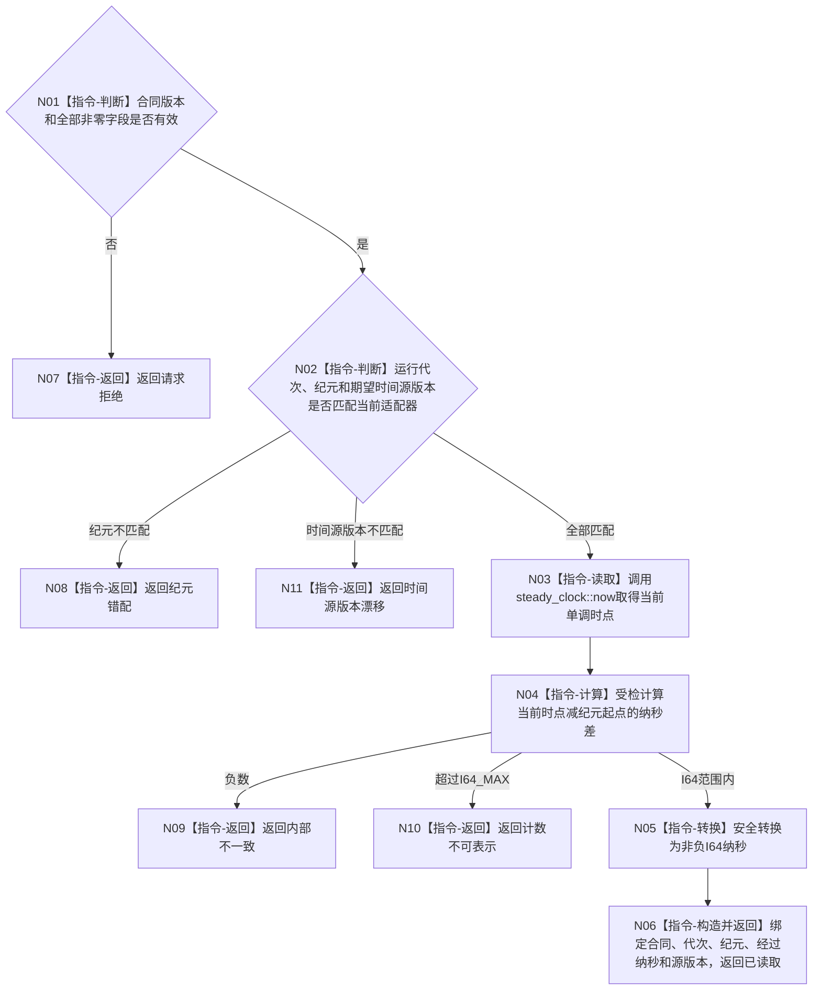

# BIZ-L4-002-01-02-01 读取可信单调时间证据目标函数流程图 v0.1

更新时间：2026-08-15

## 依据

```text
0050、6170、8200；BIZ-L3-002-01-02
```

## 身份与边界

正式目标函数设计图。从当前运行纪元绑定的单调时钟适配器读取非负经过时长证据；不读取墙钟，不接收调用方自报当前时间。运行代次和时间纪元身份由后继普通应用装配提供，适配器不签发身份；适配器只在构造时把二者绑定到本实例唯一持有的 `steady_clock` 起点。

## 函数合同

```text
根函数：单调时钟适配器::读取可信单调时间证据
归属模块 / 文件 / 层级：运行期时间适配 / 海中鱼巣/适配/适配器.单调时钟.ixx / L4
现有或待新增：待新增；封装std::chrono::steady_clock并冻结运行代次、运行纪元与模块固定时间源版本
完整签名：单调时间证据读取结果 单调时钟适配器::读取可信单调时间证据(const 单调时间证据读取请求& 请求) const noexcept
参数：请求为只读借用；含合同版本、运行代次、运行纪元身份和期望时间源版本；适配器实例及其steady_clock起点覆盖调用；请求不含当前时间或读取序号
返回结果：不可变值式结果；含已读取、请求拒绝、纪元错配、时间源版本漂移、计数不可表示或内部不一致，以及合同版本、运行代次、纪元、从纪元起点经过的非负I64纳秒和时间源版本
被调函数流程图：无；steady_clock读取、差值、范围检查和值式构造为平台边界内指令
父图：BIZ-L3-002-01-02
```

## 流程图



## 节点合同

| 节点 | 类型 | 参数 / 输入绑定 | 结果 / 输出绑定 | 事实读写 | 后继条件 | 验证 |
| --- | --- | --- | --- | --- | --- | --- |
| N01/N02 | 指令-判断 | 请求和适配器配置 | 准入或具名非成功 | 无 | 合同完整、同代次同纪元同源版本 | 零字段、跨代次、旧纪元、错源版本 |
| N03/N04 | 指令 | steady_clock时点和纪元起点 | 受检经过纳秒 | 只读平台时钟 | 非负且可表示 | 墙钟回拨不参与；负差和溢出分账 |
| N05/N06 | 指令 | 受检差值 | I64时间证据 | 无 | 可表示 | 0、连续读取、并发读取 |
| N07—N11 | 指令-返回 | 失败分类 | 结构化非成功 | 无 | 唯一返回 | 请求、纪元、源版本、计数与内部不一致分账 |

## 关键边界

该结果只在当前运行代次和运行纪元内解释；恢复时没有连续时长证明就由上层建立新纪元，不拼接墙钟或旧单调计数。模块固定 `steady_clock` 时间源版本 1；调用方只声明期望版本。读取次数、线程循环和消息数量均不是时间，因此请求和结果均不设置读取序号。
