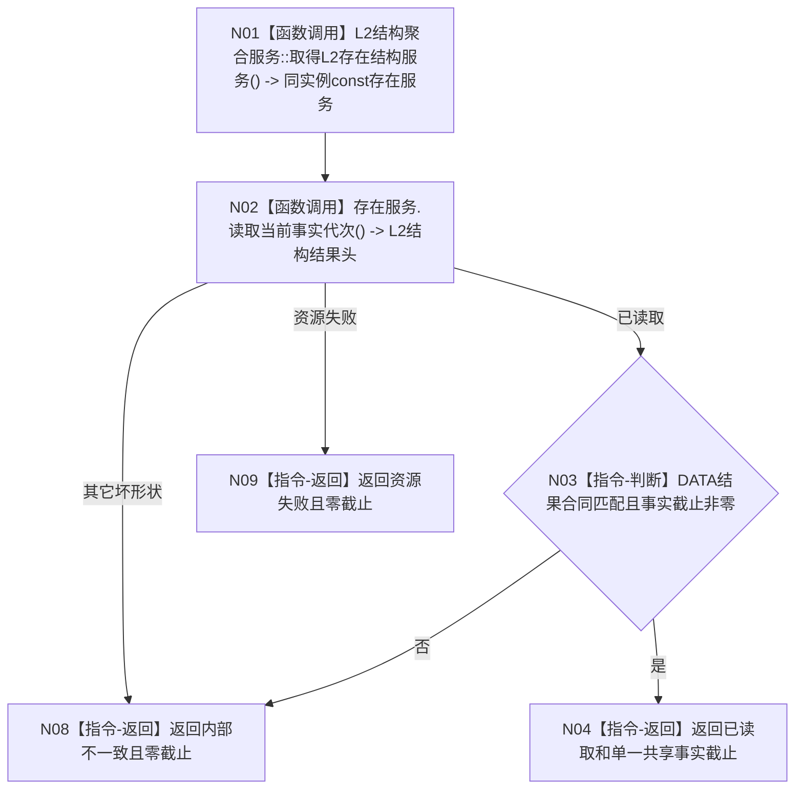

# BIZ-L4-002-01-03-01 读取当前共享事实截止目标函数流程图 v0.2

更新时间：2026-08-15

## 依据

```text
0050、4015、4030、4230；BIZ-L3-002-01-03 v0.2；DATA-EXT-02、DATA-EXT-07
```

## 身份与边界

正式目标函数设计图。经普通应用同一 `L2结构聚合服务`取得存在结构服务，并调用现有无对象读取入口取得同一 L1 运行包当前已发布的单一事实截止；不读取存在对象，不新增 DATA 服务。

## 函数合同

```text
根函数：L2存在结构服务::读取当前事实代次
归属模块 / 文件 / 层级：存在结构公开服务 / 海中鱼巣/领域/服务.L2存在结构.ixx / DATA-L2 公共入口
现有或待新增：当前已实现；由 BIZ `运行期事实版本服务`经同实例聚合 const getter 调用
完整签名：L2结构结果头 L2存在结构服务::读取当前事实代次() const
参数：无；不含 owner、运行代次、事实范围、幂等身份、provider 引用、读取截止或调用开始见证
返回结果：`L2结构结果头`；已读取时 `事实截止代次` 非零，资源失败或内部不一致时不得提供可消费截止
父图：BIZ-L3-002-01-03 v0.2
```

## 流程图



## 节点合同

| 节点 | 参数 / 输入绑定 | 结果 / 输出绑定 | 守恒与验证 |
| --- | --- | --- | --- |
| N01 | 同一 `L2结构聚合服务` const 引用 | 同实例存在服务 | getter 生命周期覆盖调用，不缓存第二引用 |
| N02 | 无业务参数 | 当前全局事实代次 | 不直达 L1、SQL、缓存、日志或第二 L1 实例 |
| N03/N04 | DATA 结构化结果 | 非零共享事实截止 | 事实截止本身即发布边界，不生成第二见证 |
| N08—N09 | 具名失败 | 零截止 | 不返回已读前缀、旧截止或部分材料 |

## 关键边界

存在服务在这里仅作为当前已发布公共桥，不取得全局版本的第二所有权。若 DATA 后继把同义能力提升到聚合服务，必须保持无对象、单一非零截止和同一 L1 语义，再由 BIZ 机械匹配；不得建立逐 owner 时钟、provider 组、全局版本缓存或第二事实 owner。
