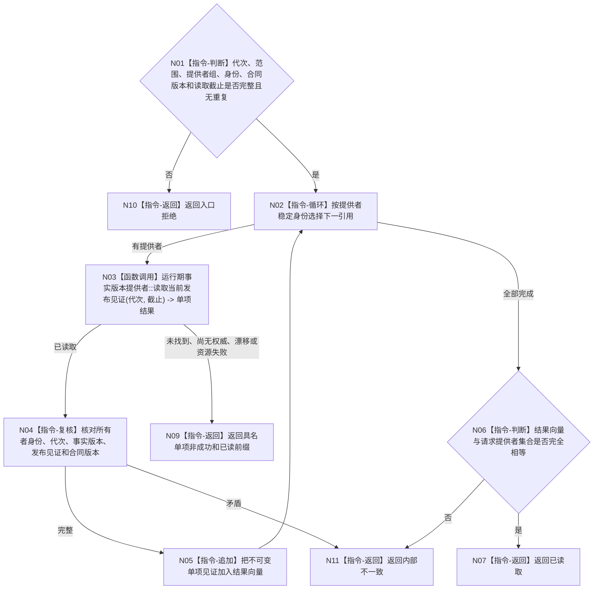

# BIZ-L4-002-01-03-01 读取当前发布见证向量目标函数流程图 v0.1

> 历史冻结：本版逐 owner 提供者组和独立发布见证与 4015、4230 的同一 L1 全局事实代次冲突。当前合同由 v0.2“读取当前共享事实截止”替代；提供者引用、已读前缀和调用方读取截止均不得恢复。

更新时间：2026-08-03

## 依据

```text
0050、4010、4030、4050、4190；BIZ-L3-002-01-03
当前代码：节点直接结构查询服务::读取当前事实代次已存在；其它事实所有者按各自正式读取合同接入同一提供者接口
```

## 身份与边界

正式目标函数设计图。按请求给出的已登记提供者稳定顺序逐项读取当前发布见证；基座只复核中性合同，不解释世界、安全、服务、需求或任务语义。

## 函数合同

```text
根函数：运行期事实版本提供者组::读取当前发布见证向量
归属模块 / 文件 / 层级：通用发布见证读取 / 海中鱼巣/核心/服务.运行期事实版本提供者组.ixx / L4
现有或待新增：待新增；以强类型提供者接口适配现有各事实代次读取
完整签名：当前发布见证向量结果 运行期事实版本提供者组::读取当前发布见证向量(const 当前发布见证向量请求& 请求) const
参数：请求为只读借用；含运行代次、事实范围版本、稳定排序的提供者引用组、每项提供者稳定身份/合同版本和读取截止；提供者组拥有引用生命周期并覆盖调用
返回结果：调用方拥有的不可变值式结果；含已读取、提供者未找到、尚无权威、合同漂移、资源失败、错代或内部不一致，以及逐所有者的稳定身份、运行代次、事实版本、发布见证和提供者合同版本
被调函数流程图：调用已登记中性接口 `运行期事实版本提供者::读取当前发布见证(const 当前发布见证请求&)`；具体提供者实现由对应事实所有者冻结，不在本函数解释业务语义
父图：BIZ-L3-002-01-03
```

## 流程图



## 节点合同

| 节点 | 类型 | 参数 / 输入绑定 | 结果 / 输出绑定 | 事实读写 | 后继条件 | 验证 |
| --- | --- | --- | --- | --- | --- | --- |
| N01/N02 | 指令 | 请求和提供者引用组 | 稳定遍历 | 无 | 集合完整无重复 | 空引用、悬空生命周期、重复身份 |
| N03 | 函数调用 | 中性见证请求 | 单项发布见证 | 只读对应所有者当前发布状态 | 已读取或具名非成功 | 提供者异常、资源失败、尚无权威 |
| N04/N05 | 指令 | 单项结果 | 向量项 | 无 | 身份/代次/版本完整 | 提供者返回错身份或零版本 |
| N06/N07 | 指令 | 请求/结果集合 | 完整向量 | 无 | 集合相等 | 缺项、额外项、顺序变化 |
| N09—N11 | 指令-返回 | 单项失败 | 结构化非成功 | 无 | 唯一分类 | 普通缺权威不升级内部错误 |

## 关键边界

提供者组不持有业务仓库写权，不把缓存或SQL版本当作事实版本。一个提供者读取成功不证明跨领域一致；一致性由上层用前后两次同范围向量和各子快照来源版本共同裁决。
