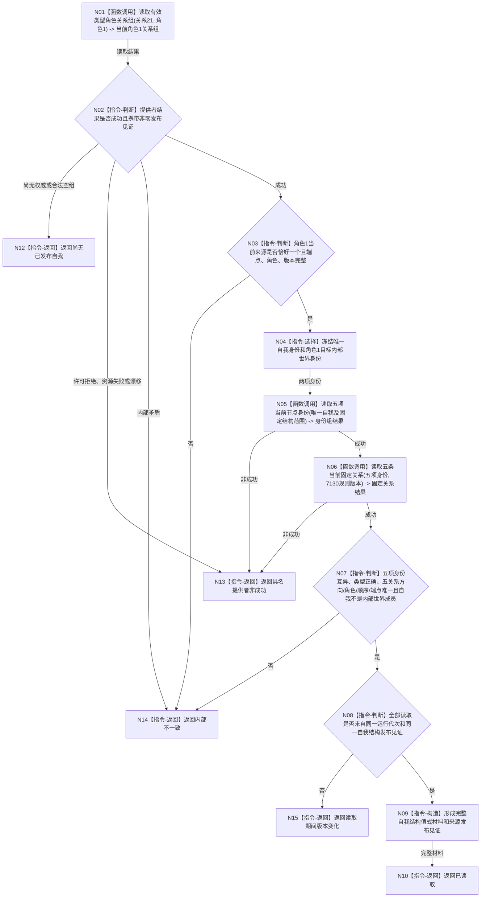

# BIZ-L4-002-02-01-01 读取唯一自我结构目标函数流程图 v0.1

> 历史冻结：7130 v0.9 已退出本图依赖的节点直接存在服务、关系21角色1、五身份五固定关系和世界根内部世界场景。当前 BIZ-L3-002-02-01 v0.2 直接组合 DATA-EXT-01/02/07 的正式整树、角色、存在、成员与宿主读回，不再建立同义 L4 自我权威入口。本文件不得用于施工。

更新时间：2026-08-03

## 依据

```text
0050、4010、4190、7130；BIZ-L3-002-02-01
正式详细设计：规范/详细设计/NODE-TYPED-MIGRATION_NT-P2C_自我内部世界与事实投影迁移详细设计.md
当前代码事实：海中鱼巣/领域/服务.节点直接存在.ixx 尚只有实际存在规格未实现骨架，没有唯一自我结构读取入口
```

## 身份与边界

正式目标函数设计图。函数从关系21角色1的全部当前有效来源确定唯一当前自我，再完整读回五项身份和五条固定关系。名称、系统角色清单、索引或初始化缓存只能帮助定位，不得单独裁决唯一自我。

## 函数合同

```text
根函数：节点直接存在服务::读取唯一自我结构
归属模块 / 文件 / 层级：节点直接存在领域服务 / 海中鱼巣/领域/服务.节点直接存在.ixx / L4
现有或待新增：待新增；按7130和NT-P2C目标合同补齐唯一自我读取，不复用旧初始化裸句柄
完整签名：自我结构读取结果 节点直接存在服务::读取唯一自我结构() const
参数：无；服务构造期持有覆盖调用的节点直接结构查询服务只读引用，不取得仓库、许可、会话或事务对象
返回结果：调用方拥有的不可变值式结果；包含已读取、尚无已发布自我、许可拒绝、资源失败、读取期间版本变化或内部不一致，以及完整自我结构值式材料和自我结构所有者发布见证；成功材料固定含世界根、世界根内部世界场景、自我所在场景、自我存在、自我内部世界场景五项身份及五条固定关系
被调函数流程图：关系21角色1当前来源枚举、五项节点身份读取和固定关系完整读取属于L1/L2既有提供者能力；若代码计划仍隐藏非平凡适配，再进入下一层目标函数图
父图：BIZ-L3-002-02-01
```

## 流程图



## 节点合同

| 节点 | 类型 | 参数 / 输入绑定 | 结果 / 输出绑定 | 事实读写 | 后继条件 | 验证 |
| --- | --- | --- | --- | --- | --- | --- |
| N01—N04 | 函数调用 / 判断 / 选择 | 关系21、角色1 | 唯一自我和内部世界候选 | 只读当前关系 | 恰好一个来源 | 零个为尚无权威，多个或坏端点为内部不一致 |
| N05 | 函数调用 | 五项固定身份范围 | 五项当前节点身份 | 只读节点身份 | 全部存在且类型、版本合法 | 场景/存在类型和稳定主键互异 |
| N06 | 函数调用 | 五项身份、7130规则版本 | 五条固定关系 | 只读当前关系 | 五条全部唯一 | 三条普通父子、一条归属、一条关系21角色1 |
| N07—N09 | 判断 / 构造 | 身份组、关系组、发布见证 | 完整自我结构值式材料 | 无写入 | 静态结构和版本一致 | 自我非成员、无名称/缓存补判、来源见证非零 |
| N10/N12—N15 | 指令-返回 | 分类和证据 | 结构化结果 | 无写入 | 唯一分类 | 合法未形成与内部矛盾分账 |

## 关键边界

- 本函数不创建、修复、迁移或退役自我结构；任何缺项或竞争当前自我都不会在读取路径补写。
- 关系21角色1当前来源枚举是唯一性必要证据。系统角色键、索引命中、启动回执和初始化缓存均不能替代完整读回。
- 返回值不得暴露节点句柄、关系句柄、仓库编号、读取许可或内部容器引用；所有材料和发布见证由调用方拥有。
- 本函数只证明7130完整自我结构；跨领域治理一致性仍由父图比较读取前后事实截止向量与本结果来源见证。
