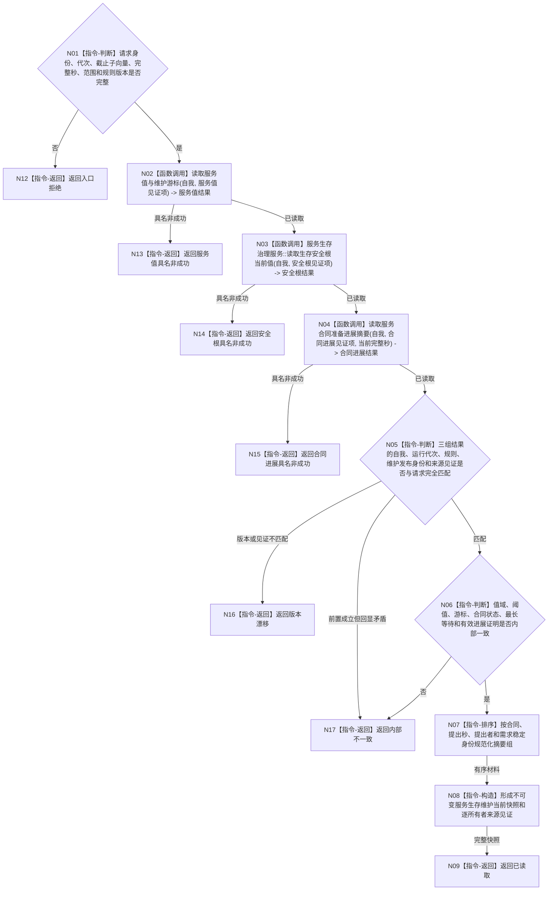

# BIZ-L4-002-02-02-01 读取当前服务生存维护快照目标函数流程图 v0.1

更新时间：2026-08-03

## 依据

```text
0050、6120、6160、6170；BIZ-L3-002-02-02
当前代码事实：目标服务生存治理模块和完整读取签名尚不存在；现有系统角色清单和初始化材料不是运行期权威
```

## 身份与边界

正式目标函数设计图。函数从服务值、生存安全根、服务合同/准备/进展和时间维护账的正式所有者读取当前值式材料，验证它们属于同一6170维护发布结果或兼容的已发布初始状态，不执行任何结算。

## 函数合同

```text
根函数：服务生存治理服务::读取当前服务生存维护快照
归属模块 / 文件 / 层级：服务生存治理 / 海中鱼巣/领域/服务.服务生存治理.ixx / L4
现有或待新增：待新增；作为6170维护事务的唯一公开当前读取入口
完整签名：服务生存维护快照读取结果 服务生存治理服务::读取当前服务生存维护快照(const 服务生存维护快照读取请求& 请求) const
参数：请求为只读借用；含自我稳定身份、运行代次、生存安全/服务事实截止子向量、完整秒边界、服务合同/时间/生存安全规则版本和读取范围版本；服务持有各正式提供者只读引用并覆盖调用
返回结果：调用方拥有的不可变值式结果；含已读取、尚无权威、材料缺失、版本漂移、许可拒绝、资源失败或内部不一致，以及服务值、生存安全根与阈值、控制态、当前有效合同/准备/进展摘要、最长未满足来源、到期未满足事件、时间纪元、上一已结算完整秒、维护发布身份和逐所有者发布见证
被调函数流程图：复用BIZ-L4-002-05-01-01 服务生存治理服务::读取生存安全根当前值；服务值与维护游标、服务合同/准备/进展摘要读取若在代码计划中仍隐藏非平凡过程，再进入下一层目标函数图
父图：BIZ-L3-002-02-02
```

## 流程图



## 节点合同

| 节点 | 类型 | 参数 / 输入绑定 | 结果 / 输出绑定 | 事实读写 | 后继条件 | 验证 |
| --- | --- | --- | --- | --- | --- | --- |
| N02 | 函数调用 | 自我、服务值见证项 | 服务值、时间纪元和上一已结算完整秒 | 只读服务值/维护账 | 已读取或具名非成功 | `0..I64_MAX`、游标单调且不越过请求完整秒 |
| N03 | 函数调用 | 自我、安全根见证项 | 生存安全根、L/H和控制态来源 | 只读安全根事实 | 已读取或具名非成功 | `0..I64_MAX`、`1<L<H`、A与控制态匹配 |
| N04 | 函数调用 | 自我、合同进展见证项、完整秒 | 合同/准备/进展、最长未满足和到期事件摘要 | 只读6160事实 | 已读取或具名非成功 | 完成/取消/到期/终止退出有效集，最长等待不按数量叠加 |
| N05/N06 | 指令-判断 | 三组结果和请求 | 一致性结论 | 无 | 版本、发布身份、值域和业务不变量全部成立 | 初始态与维护态分账，内部矛盾不降格缺失 |
| N07—N09 | 指令 | 已复核材料 | 稳定不可变快照 | 无 | 排序和构造完成 | 容器顺序变化不改变结果 |
| N12—N17 | 指令-返回 | 失败分类与证据 | 结构化非成功 | 无 | 唯一分类 | 许可、资源、漂移、缺失和内部不一致分账 |

## 关键边界

- 系统角色清单、初始化回执、SQL、缓存、控制面板、线程状态和日志都不是服务值或生存安全根当前事实来源。
- 当前有效服务活动必须具备合同/准备、门禁、方法执行、当前窗口新进展和未阻塞五项正式证据；状态标签或线程运行不成立。
- 合同数量不放大衰减；数值只使用最长未满足等待，且本读取函数不提前计算下一秒衰减。
- 本函数不读取6140分层安全维护族，不形成6150五级权限，也不因读取推进维护游标或改变控制态。
