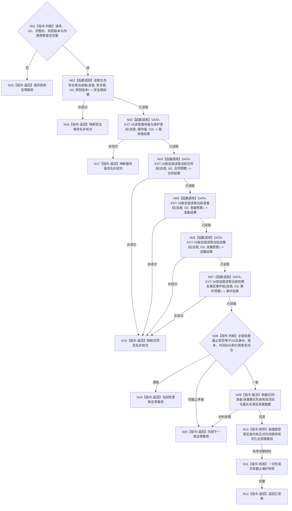

# BIZ-L4-002-02-02-01 读取当前服务生存维护快照目标函数流程图 v0.2

更新时间：2026-08-15

## 依据

```text
0050、4015、4030、6120、6160、6170
父图：BIZ-L3-002-02-02 v0.2
数据服务：DATA-EXT-15、DATA-EXT-16
替代关系：v0.2 正式替代 v0.1 的截止子向量、逐所有者发布见证和维护发布身份一致性判据
```

## 身份与边界

正式目标函数设计图。函数把父级一个非零共享截止 `G0`原样传给安全治理事实服务和服务合同事实服务，读取安全根、服务值/游标及有界当前合同、准备、进展、到期事件事实组；DATA 只提供事实，BIZ 负责派生控制态、裁决有效服务活动、规范化摘要和验证 6160/6170 不变量。全程只读。

## 函数合同

```text
根函数：服务生存治理服务::读取当前服务生存维护快照
归属模块 / 文件 / 层级：服务生存治理 / 海中鱼巣/领域/服务.服务生存治理.ixx / BIZ-L4
现有或待新增：待新增；DATA 精确 C++ ABI 发布前保持预冻结语义合同
完整签名：服务生存维护共享截止读取结果 服务生存治理服务::读取当前服务生存维护快照(const 服务生存维护共享截止读取请求& 请求) const noexcept
参数：唯一自我、运行代次、事实范围版本、G0、完整秒边界、安全根和服务值强类型选择、合同/维护/时间/安全回归规则版本、四类当前事实组非零数量预算
返回结果：已读取时携带完整服务生存维护共享截止材料和 G0；请求拒绝、尚无权威、材料缺失、当前性漂移、提供者拒绝、数量预算不足、资源失败或内部不一致均零载荷
被调函数流程图：BIZ-L4-002-05-01-01 v0.2 读取生存安全根当前值；DATA-EXT-16 的服务值/游标与四类有界事实组读取为基础数据公开终端
```

## 流程图



## 节点合同

| 节点 | 输入 | 输出 | 事实读写 | 验证 |
| --- | --- | --- | --- | --- |
| N02 | 自我、安全根、G0、定义/维护/回归版本 | A、L/H、派生控制态和安全根来源事实 | 只读 DATA-EXT-15 | 结果截止等于 G0；控制态不持久化 |
| N03 | 自我、服务值、G0 | 服务值、时间纪元、上一已结算完整秒及维护事实 | 只读 DATA-EXT-16 | `0..I64_MAX`；游标不晚于请求完整秒 |
| N04—N07 | 自我、同一 G0、各自非零预算 | 完整有序合同/准备/进展/到期事实组 | 只读 DATA-EXT-16 | 合法空组成功；超预算结构化拒绝，不截断 |
| N08—N10 | 全部 DATA 结果 | 有效活动、最长未满足来源和规范化摘要 | 无写入 | 完成/取消/终止退出有效合同；进展必须绑定当前合同或准备；不按数量放大时间 |
| N11/N12 | 已复核值式材料 | 完整读取结果 | 无写入 | 只在全部事实闭合后一次构造 |

## 关键边界

- DATA 服务不裁决法规、合同业务有效性、有效活动、控制态或下一秒维护结果；这些均由 BIZ 依据正式规则形成可重算投影。
- 空组不补造默认合同/准备/进展/事件；半结构、重复唯一键、悬空引用或同截止矛盾是内部不一致。
- 本函数不调用 6160/6170 写入口，不推进完整秒，不改变服务值、安全根、合同、准备或进展。
- 任一 DATA 漂移整体失败；禁止只重读失败组后与旧组拼装。
