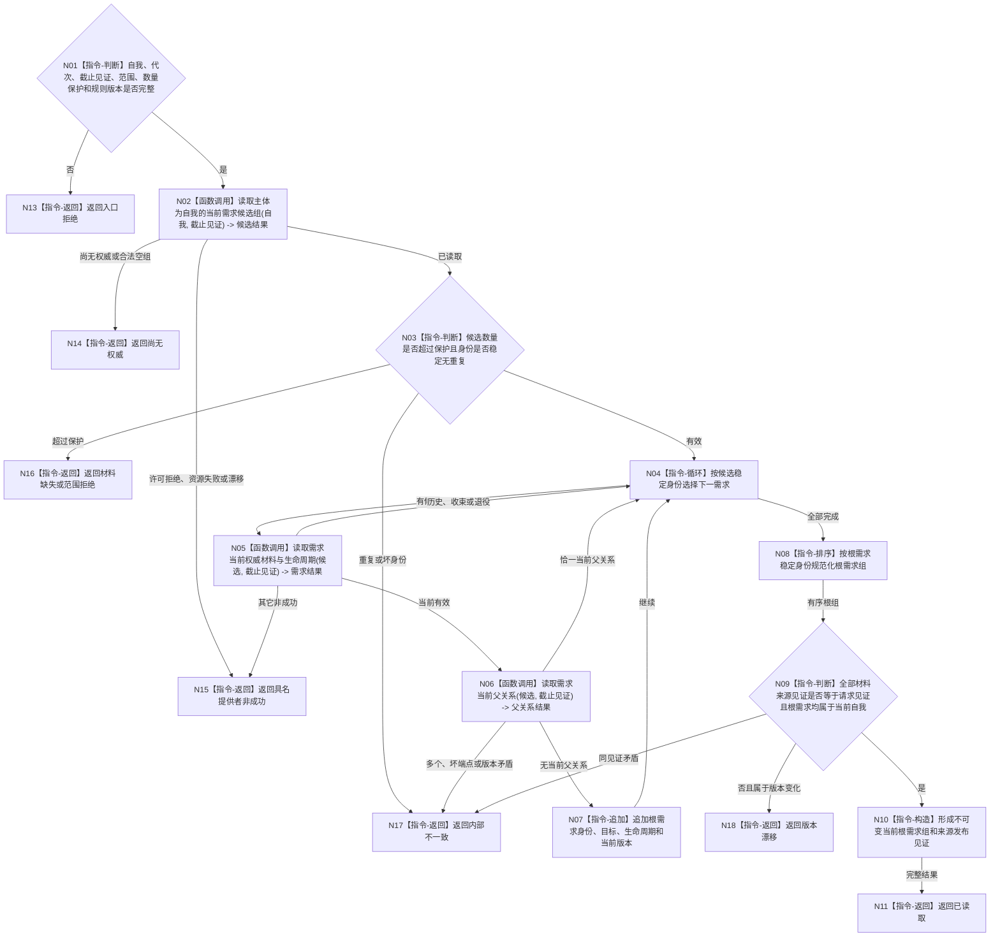

# BIZ-L4-002-02-03-01 读取自我当前根需求组目标函数流程图 v0.1

更新时间：2026-08-03

## 依据

```text
0050、3100、5090—5120、5160、6180；BIZ-L3-002-02-03
当前代码事实：需求业务服务已有单需求权威材料读取和父关系能力，尚无稳定身份化的当前自我根需求组公开读取
```

## 身份与边界

正式目标函数设计图。函数从需求正式所有者读取主体为当前自我的需求候选，逐项复核生命周期和当前父关系，只返回当前、未退役且无当前父需求的根需求。固定名称、系统角色清单和初始化缓存都不能单独决定根集合。

## 函数合同

```text
根函数：需求业务服务::读取自我当前根需求组
归属模块 / 文件 / 层级：需求领域服务 / 海中鱼巣/领域/服务.需求.ixx / L4
现有或待新增：待新增；复用单需求权威读取、主体关系反向候选和当前父关系读取
完整签名：自我根需求组读取结果 需求业务服务::读取自我当前根需求组(const 自我根需求组读取请求& 请求) const
参数：请求为只读借用；含自我稳定身份、运行代次、需求所有者截止见证项、需求范围版本、最大根数量和读取规则版本；服务拥有需求事实提供者只读引用并覆盖调用
返回结果：调用方拥有的不可变值式结果；含已读取、尚无权威、材料缺失、版本漂移、许可拒绝、资源失败或内部不一致，以及稳定排序的根需求身份/目标/生命周期/当前版本组和需求所有者发布见证
被调函数流程图：主体需求候选读取、单需求权威材料读取和当前父关系读取若在代码计划中仍隐藏非平凡适配，再进入下一层目标函数图
父图：BIZ-L3-002-02-03
```

## 流程图



## 节点合同

| 节点 | 类型 | 参数 / 输入绑定 | 结果 / 输出绑定 | 事实读写 | 后继条件 | 验证 |
| --- | --- | --- | --- | --- | --- | --- |
| N02/N03 | 函数调用 / 判断 | 自我、截止见证和数量保护 | 主体需求候选组 | 只读需求主体关系 | 候选合法或具名非成功 | 候选稳定无重复，空组不补造固定根 |
| N04—N07 | 循环 / 函数调用 / 追加 | 单候选和截止见证 | 当前根需求候选 | 只读需求权威材料、生命周期和父关系 | 当前且无父才追加 | 历史/退役隔离、当前父唯一、主体回显 |
| N08—N11 | 排序 / 判断 / 构造 / 返回 | 根候选组 | 稳定不可变根需求组 | 无写入 | 全部见证和自我一致 | 容器顺序、名称和系统角色缓存不参与排序或裁决 |
| N13—N18 | 指令-返回 | 失败分类与证据 | 结构化非成功 | 无写入 | 唯一分类 | 空权威、许可、资源、范围、漂移和内部矛盾分账 |

## 关键边界

- 根需求只由“当前有效需求且无当前父关系”成立；安全根、服务根等用途名称不是根资格。
- 一个自我可以有多个当前根需求；本函数稳定排序后全部返回，不选择主需求、不分配权重、不创建任务。
- 已收束、取消、退役或历史父关系下的需求不得进入当前根组；恢复有效必须先由需求领域正式发布当前性。
- 本函数不读取任务、不建立活动路径、不形成需求执行权限；这些由父图复用的正式函数完成。
