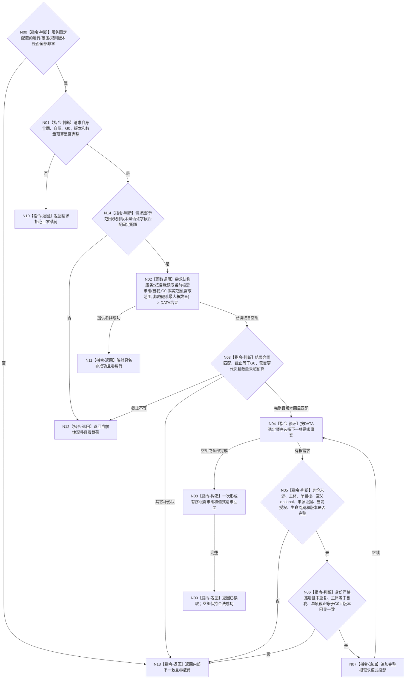

# BIZ-L4-002-02-03-01 读取自我当前根需求组目标函数流程图 v0.2

更新时间：2026-08-15

## 依据

```text
0050、3100、5100—5120、5160、4015；BIZ-L3-002-02-03；数据服务最终需求清单 DATA-EXT-12
```

## 身份与边界

正式目标函数替代图。函数经公开需求结构服务，在父级给出的同一非零共享事实截止 `G0` 下，一次有界读取指定自我的完整当前根需求结构组；DATA 只返回权威结构事实，BIZ 复核主体、单目标、生命周期、无当前父关系、目标引用和稳定顺序后形成值式结果。根需求组为空是合法成功，不补造安全根、服务根或其它固定需求。

## 函数合同

```text
根函数：需求业务服务::读取自我当前根需求组
归属模块 / 文件 / 层级：需求业务服务 / 海中鱼巣/领域/服务.需求.ixx / L4
现有或待新增：待新增；只消费 DATA-EXT-12 正式公开强类型读取
完整签名：自我根需求组读取结果 需求业务服务::读取自我当前根需求组(const 自我根需求组读取请求& 请求) const noexcept
参数：合同版本、运行代次、事实范围版本、唯一自我强类型身份、非零 G0、需求范围版本、读取规则版本和非零最大根数量；运行/范围/规则版本必须匹配服务固定配置
返回结果：已读取时携带完整有序根需求值式组和 G0；空组仍为已读取；其它状态零载荷
被调函数流程图：DATA-EXT-12 公开需求结构服务的“按自我和非零截止有界读取当前根需求组”操作
父图：BIZ-L3-002-02-03；父图 v0.1 的逐 owner 截止子向量和空组材料缺失语义待后继原位重基线
```

## 流程图



## 节点合同

| 节点 | 类型 | 参数 / 输入绑定 | 结果 / 输出绑定 | 事实读写 | 后继条件 | 验证 |
| --- | --- | --- | --- | --- | --- | --- |
| N00/N01/N14 | 判断 | 服务固定配置；调用请求；两者版本绑定 | 写前分类 | 无写入 | 固定配置坏为内部不一致；请求自身坏为请求拒绝；合法请求版本不等为当前性漂移 | 三类均零 DATA 调用 |
| N02 | 函数调用 | 自我、G0、固定配置匹配的运行/范围/规则版本、数量预算 | DATA 当前根需求组结果 | 只读 DATA-EXT-12 | 已读取或具名非成功 | 事实范围/需求范围/读取规则版本进入 DATA 请求；请求不含 owner、L1、发布见证或“读取最新”开关 |
| N03 | 判断 | DATA 结果头和组 | 同截止完整组 | 无写入 | 截止、三个版本回显匹配且零变更 | 只接受结果截止恰等于 G0 |
| N04—N07 | 循环 / 判断 / 追加 | 单项完整需求结构事实 | 根需求值式投影 | 无写入 | 全部单项闭合 | 当前父 optional 为空、主体一致、单目标三引用、来源证据、当前授权、生命周期、各版本和单项 G0 完整，稳定身份无重复 |
| N08/N09 | 构造 / 返回 | 完整有序组和请求回显 | 已读取结果 | 无写入 | 候选完整 | 空组与非空组使用同一成功状态 |
| N10—N13 | 返回 | 失败分类 | 零载荷非成功 | 无写入 | 唯一映射 | 漂移、提供者拒绝、预算、资源和内部矛盾分账 |

## 关键边界

- 根资格只表示“指定自我的当前需求结构且在 `G0` 无当前父需求关系”；名称、固定角色、缓存、创建顺序和显示位置都不是根资格。
- 空父关系必须来自 DATA-EXT-12 在 G0 下的完整父关系枚举并以 optional 空值回显，不能由“没读到一条关系”、缓存或 BIZ 过滤推导。
- 目标宿主、目标特征和目标状态合同必须是三个正式强类型引用；目标状态合同现行预冻结名为 `L2目标状态合同身份`，由唯一 `L2状态结构服务`权威完整读回。该 DATA 计划尚待实现，真实接线须机械匹配最终 ABI；禁止用实例状态身份、裸值、字符串或默认目标代替。
- 本函数不判断目标当前是否满足，不选择主需求，不形成活动路径、权重、权限、任务或结算。
- 旧 v0.1 的逐所有者截止见证、候选逐项多次读回、第二发布见证和“空根组即材料缺失”语义全部退出本函数合同。
