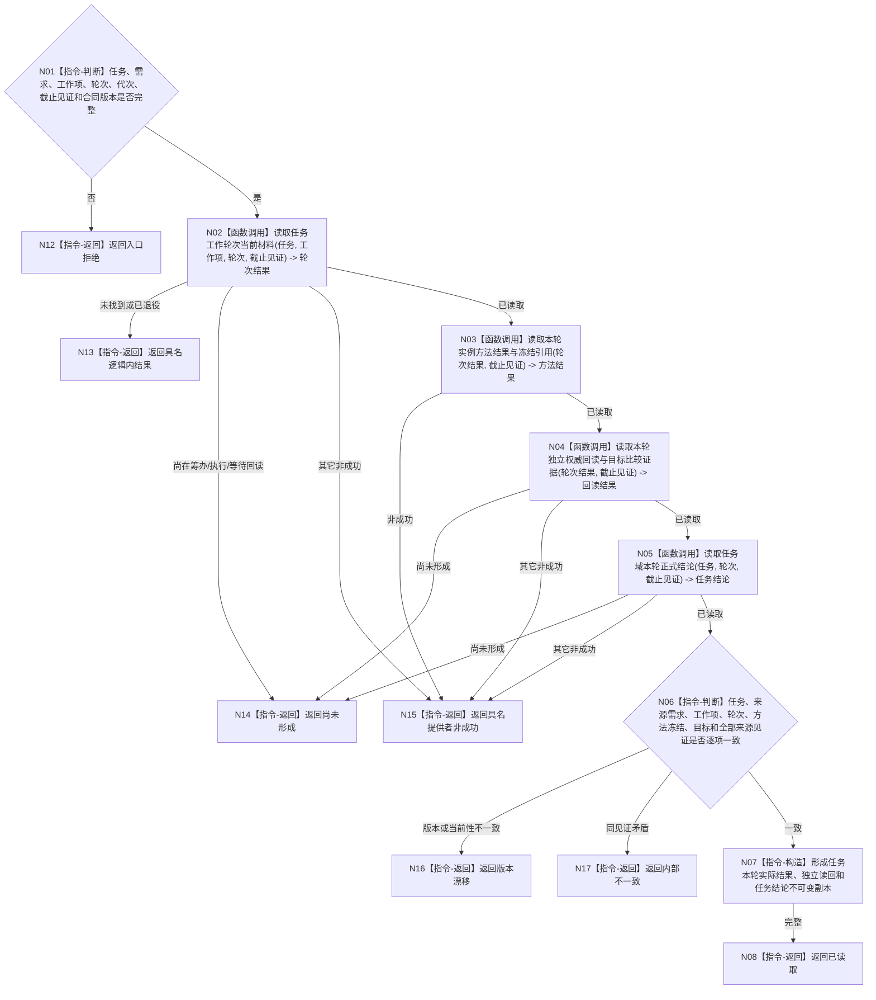

# BIZ-L4-002-04-01-01 读取任务本轮实际结果与独立读回目标函数流程图 v0.1

更新时间：2026-08-03

## 依据

```text
0050、3200、5090、5210、5230、8100；BIZ-L3-002-04-01
当前能力裁决：现行能力证据目录未登记一个同时冻结任务轮次结果、独立权威回读和任务结论的公开完整读取入口，按适配扩展设计
```

## 身份与边界

正式目标函数设计图。函数只从任务领域当前已发布事实读取指定任务和工作轮次的实例方法结果材料、独立权威回读及任务域结论；方法返回、工作线程回执和日志均不能替代独立回读，也不能由本函数推导需求满足。

## 函数合同

```text
根函数：任务业务服务::读取任务本轮实际结果与独立读回
归属模块 / 文件 / 层级：任务领域服务 / 海中鱼巣/领域/服务.任务.ixx / L4
现有或待新增：适配扩展；组合任务轮次、实例方法结果、独立回读和任务结论的正式读取
完整签名：任务本轮实际结果读取结果 任务业务服务::读取任务本轮实际结果与独立读回(const 任务本轮实际结果读取请求& 请求) const
参数：请求为只读借用；含任务稳定身份、来源需求稳定身份、工作项稳定身份、执行尝试轮次、运行代次、任务事实截止见证项、任务合同版本和读取范围版本；服务拥有任务事实提供者只读引用并覆盖调用
返回结果：调用方拥有的不可变值式结果；含已读取、尚未形成、未找到、已退役、材料缺失、版本漂移、许可拒绝、资源失败或内部不一致，以及任务/需求/工作项/轮次回显、冻结实例方法结果引用、独立回读事实与比较证据、任务域结论、任务状态版本和来源发布见证
被调函数流程图：任务轮次材料、独立回读和任务正式结论的底层提供者若在实施设计中仍隐藏非平凡组合，再进入下一层；本图不把三者压成一个原始仓库读取
父图：BIZ-L3-002-04-01
```

## 流程图



## 节点合同

| 节点 | 类型 | 参数 / 输入绑定 | 结果 / 输出绑定 | 事实读写 | 后继条件 | 验证 |
| --- | --- | --- | --- | --- | --- | --- |
| N02/N03 | 函数调用 | 任务、工作项、轮次和截止见证 | 轮次材料与实例方法结果 | 只读任务正式事实 | 当前轮次完整或具名非成功 | 工作线程回执不充当任务事实；实例方法版本与冻结一致 |
| N04/N05 | 函数调用 | 轮次材料和截止见证 | 独立回读、比较证据和任务结论 | 只读任务结果/状态事实 | 同轮次材料完整 | 方法成功不自证实际结果；任务结论由任务域拥有 |
| N06—N08 | 判断 / 构造 / 返回 | 三组正式材料 | 不可变任务本轮结果 | 无写入 | 全部回显和见证一致 | 不跨轮次、代次或截止拼接 |
| N12—N17 | 指令-返回 | 失败分类与证据 | 结构化非成功 | 无写入 | 唯一分类 | 等待、缺失、漂移、许可/资源和内部矛盾分账 |

## 关键边界

- 本函数不执行方法、不推进任务状态、不发布任务完成，也不读取或写入需求正式结论。
- 方法返回值、任务工作回执、线程退出、日志和控制面板都不能替代独立权威回读。
- 任务域可以返回完成、仍未完成、合法等待或具名失败结论；任何任务结论都不自动等于需求满足。
