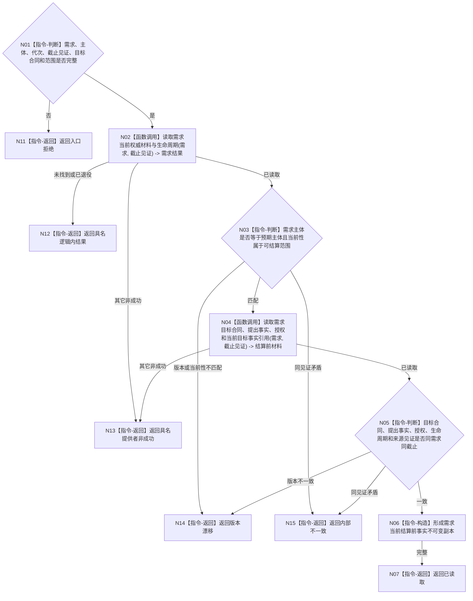

# BIZ-L4-002-04-01-02 读取来源需求当前结算前事实目标函数流程图 v0.1

更新时间：2026-08-04

## 依据

```text
0050、3100、5090、5160、8100；BIZ-L3-002-04-01；确认稿第23、39项
```

## 身份与边界

正式目标函数设计图。函数只从需求领域读取指定来源需求在结算前的当前生命周期、目标合同、来源提出事实、授权和当前目标事实引用，不读取或推导需求满足结论。

## 函数合同

```text
根函数：需求业务服务::读取来源需求当前结算前事实
归属模块 / 文件 / 层级：需求领域服务 / 海中鱼巣/领域/服务.需求.ixx / L4
现有或待新增：适配扩展；组合需求当前生命周期、目标合同、来源事实和结算资格的正式读取
完整签名：需求当前结算前事实读取结果 需求业务服务::读取来源需求当前结算前事实(const 需求当前结算前事实读取请求& 请求) const
参数：请求为只读借用；含需求稳定身份、预期主体稳定身份、运行代次、需求事实截止见证项、目标合同版本和读取范围版本
返回结果：调用方拥有的不可变值式结果；含已读取、未找到、已退役、材料缺失、版本漂移、许可拒绝、资源失败或内部不一致，以及需求/主体回显、当前生命周期、目标合同、提出事实、授权、当前目标事实引用和来源发布见证
被调函数流程图：需求当前材料、目标合同和授权底层读取若在实施设计中仍隐藏非平凡组合，再进入下一层
父图：BIZ-L3-002-04-01
```

## 流程图



## 节点合同

| 节点 | 类型 | 参数 / 输入绑定 | 结果 / 输出绑定 | 事实读写 | 后继条件 | 验证 |
| --- | --- | --- | --- | --- | --- | --- |
| N02/N03 | 函数调用 / 判断 | 需求、主体和截止见证 | 当前需求材料与生命周期 | 只读需求正式事实 | 主体和当前性匹配 | 名称、权重、任务引用不决定需求当前性 |
| N04—N07 | 函数调用 / 判断 / 构造 / 返回 | 当前需求和固定截止 | 目标合同、提出事实、授权和当前目标事实引用 | 只读需求事实，无写入 | 同需求同截止且引用闭合 | 不读取既有需求满足结论 |
| N11—N15 | 指令-返回 | 失败分类与证据 | 结构化非成功 | 无写入 | 唯一分类 | 缺失不伪造成未满足或失败 |

## 关键边界

本函数只读取结算前事实，不重新比较目标，也不创建、改变或结算需求。任务完成、工作线程回执、方法返回成功和历史满足记录都不能成为当前需求结论；需求结论只能由后继需求结算入口正式发布。
