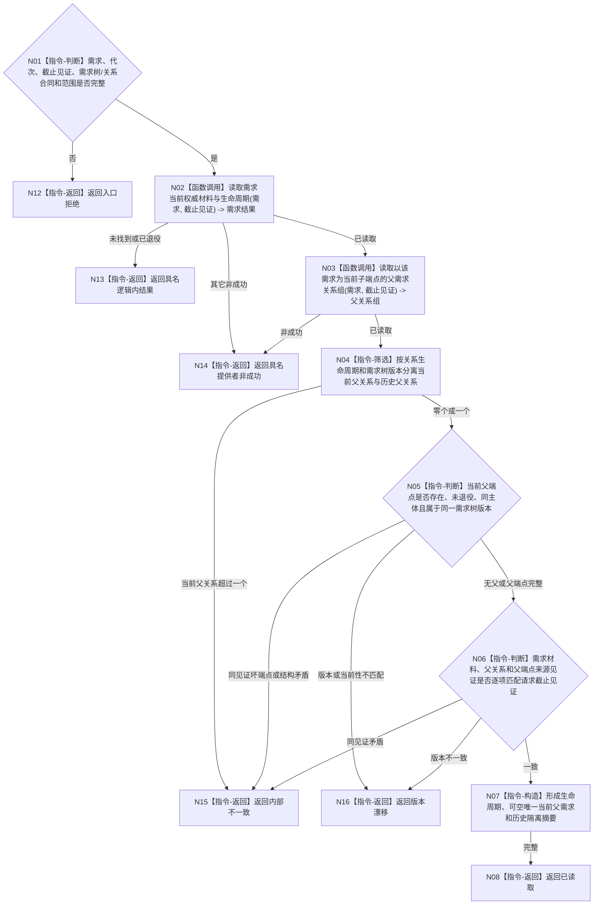

# BIZ-L4-002-04-02-01 读取需求当前父关系与生命周期目标函数流程图 v0.1

更新时间：2026-08-03

## 依据

```text
0050、3100、5100、5110、5160；BIZ-L3-002-04-02
旧鱼巢可吸收：从当前需求沿唯一父关系逐级回查；排除按列表位置、权重或旧普通父子结构猜测父需求
当前能力裁决：现行能力证据目录未登记需求领域公开的同截止生命周期与当前父关系完整读取入口，按适配扩展设计
```

## 身份与边界

正式目标函数设计图。函数读取一个需求的当前权威材料、生命周期和至多一个当前父需求关系，历史父关系只作隔离证据；不读取活动子链、不选择主需求、不改变需求结构。

## 函数合同

```text
根函数：需求业务服务::读取需求当前父关系与生命周期
归属模块 / 文件 / 层级：需求领域服务 / 海中鱼巣/领域/服务.需求.ixx / L4
现有或待新增：适配扩展；组合需求当前权威材料、生命周期和当前父需求关系读取
完整签名：需求当前父关系生命周期读取结果 需求业务服务::读取需求当前父关系与生命周期(const 需求当前父关系生命周期读取请求& 请求) const
参数：请求为只读借用；含需求稳定身份、运行代次、需求事实截止见证项、需求树版本、父关系合同版本和读取范围版本；服务拥有需求事实与关系提供者只读引用并覆盖调用
返回结果：调用方拥有的不可变值式结果；含已读取、未找到、已退役、材料缺失、版本漂移、许可拒绝、资源失败或内部不一致，以及需求身份/主体/目标/生命周期/当前版本、可空唯一当前父需求、父关系版本、历史关系隔离摘要和来源发布见证
被调函数流程图：单需求权威材料和父需求关系底层提供者若在实施设计中仍隐藏非平凡适配，再进入下一层
父图：BIZ-L3-002-04-02；亦被BIZ-L4-002-02-03-01的根需求筛选语义复用
```

## 流程图



## 节点合同

| 节点 | 类型 | 参数 / 输入绑定 | 结果 / 输出绑定 | 事实读写 | 后继条件 | 验证 |
| --- | --- | --- | --- | --- | --- | --- |
| N02 | 函数调用 | 需求身份和截止见证 | 当前权威材料与生命周期 | 只读需求正式事实 | 当前、退役或具名非成功 | 名称、权重和缓存不建立当前性 |
| N03—N05 | 函数调用 / 筛选 / 判断 | 当前需求、树版本和截止见证 | 可空唯一当前父需求及历史摘要 | 只读需求关系 | 当前父至多一个且端点闭合 | 历史关系不冒充当前父；同主体同树版本 |
| N06—N08 | 判断 / 构造 / 返回 | 需求和父关系材料 | 不可变父关系生命周期结果 | 无写入 | 来源见证逐项匹配 | 不跨截止拼接，不泄漏关系仓库对象 |
| N12—N16 | 指令-返回 | 失败分类与证据 | 结构化非成功 | 无写入 | 唯一分类 | 漂移、退役、许可/资源和内部矛盾分账 |

## 关键边界

- “无当前父关系”是合法根候选材料，不等于已经成为当前主需求。
- 当前父关系至多一个；多个当前父、坏端点、同见证跨主体或环前兆属于内部不一致，不能选一个继续。
- 本函数不读取活动子关系、不计算路径权重、不重判需求活动性，也不发布任何需求事实。
