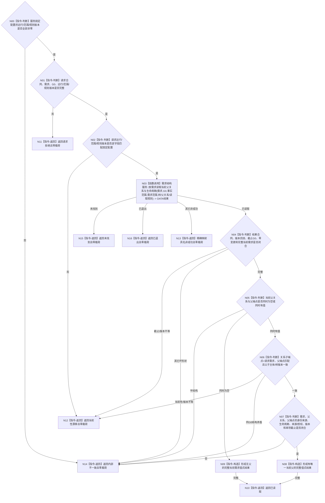

# BIZ-L4-002-04-02-01 读取需求当前父关系与生命周期目标函数流程图 v0.2

更新时间：2026-08-15

## 依据

```text
0050、3100、5100、5110、5160、4015；BIZ-L3-002-04-02；数据服务最终需求清单 DATA-EXT-12
```

## 身份与边界

正式目标函数替代图。函数经公开需求结构服务，在父级给出的非零共享事实截止 `G0` 下，一次读取指定需求的完整当前结构、生命周期和可空唯一当前父关系；有父时同时取得完整父端点当前材料。无父是合法成功，只表示当前结构根，不表示主需求、活动需求或可任务化。

## 函数合同

```text
根函数：需求业务服务::读取需求当前父关系与生命周期
归属模块 / 文件 / 层级：需求业务服务 / 海中鱼巣/领域/服务.需求.ixx / L4
现有或待新增：待新增；只消费 DATA-EXT-12 正式公开强类型读取
完整签名：需求当前父关系生命周期读取结果 需求业务服务::读取需求当前父关系与生命周期(const 需求当前父关系生命周期读取请求& 请求) const noexcept
参数：合同版本、运行代次、事实范围版本、需求范围版本、需求树规则版本、父关系规则版本、读取规则版本、需求身份和非零 G0；运行/范围/规则版本必须匹配服务固定配置
返回结果：已读取时携带完整当前需求、可空唯一当前父关系、与关系同现的父端点和 G0；未找到、已退出或其它非成功均零业务载荷
被调函数流程图：DATA-EXT-12 公开需求结构服务的“按需求和非零截止读取当前父关系与生命周期”操作
父图：BIZ-L3-002-04-02；不再被根需求组 v0.2 复用
```

## 流程图



## 节点合同

| 节点 | 类型 | 参数 / 输入绑定 | 结果 / 输出绑定 | 事实读写 | 后继条件 | 验证 |
| --- | --- | --- | --- | --- | --- | --- |
| N00—N03 | 判断 / 函数调用 | 固定配置、请求、需求身份、G0 | DATA 当前父关系生命周期结果 | 只读 DATA-EXT-12 | 已读取或具名非成功 | 固定配置坏、请求坏、请求版本不等分别映射内部不一致、请求拒绝、当前性漂移；均零 DATA 调用 |
| N04 | 判断 | DATA 结果头和当前需求 | 同截止完整当前需求 | 无写入 | 截止与全部版本匹配 | 只接受结果截止和单项截止恰等于 G0，变更代次为空 |
| N05—N07 | 判断 | 可空父关系与父端点 | 零个或一个完整当前父 | 无写入 | 两个 optional 同形且端点闭合 | 不从未找到、缓存或历史摘要推导无父；不选择多个父中的一个 |
| N08—N10 | 构造 / 返回 | 完整当前需求和可空父 | 调用方拥有的不可变值式结果 | 无写入 | 候选完整 | 无父和有父使用同一已读取状态 |
| N11—N16 | 返回 | 失败分类 | 零业务载荷非成功 | 无写入 | 唯一映射 | 未找到、已退出、漂移、许可、资源和内部矛盾分账 |

## 关键边界

- 当前父关系至多一个。DATA 成功必须返回零或一个；多个当前父、关系与父端点半结构、错端点或同 G0 跨主体属于内部不一致。
- 无父是 DATA-EXT-12 在 G0 下完整当前父关系读取的权威空结果，不是“没有读到”、缓存未命中或历史关系隔离摘要。
- 本函数不读取活动子关系、路径角色、权重、满足、结算或任务，不重判需求活动性，也不发布任何事实。
- 旧 v0.1 的 owner 截止见证、来源发布见证、分两次读取需求与父关系、历史摘要混入当前结果及“根组筛选复用”全部退出。
