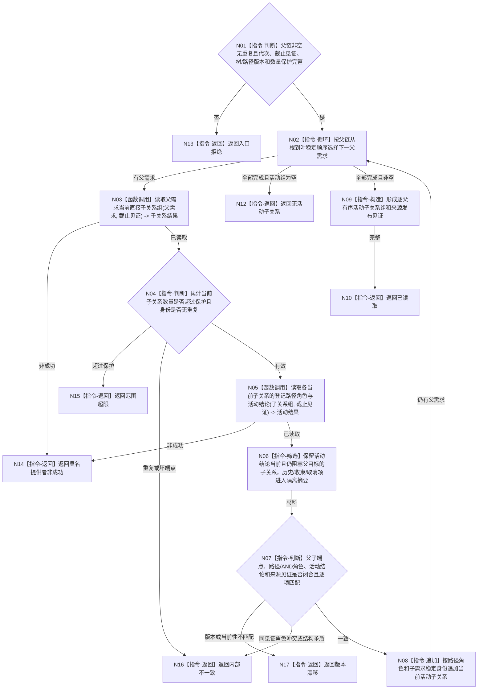

# BIZ-L4-002-04-02-02 读取父链各节点当前活动子关系目标函数流程图 v0.1

更新时间：2026-08-03

## 依据

```text
0050、3100、5100、5110、5160、5090；BIZ-L3-002-04-02
旧鱼巢可吸收：父链重判后只沿当前活动子路径继续治理；排除用权重非零、容器顺序或历史子项替代活动关系
当前能力裁决：现行能力证据目录未登记按已冻结父链同截止返回全部活动子关系和路径角色的公开入口，按适配扩展设计
```

## 身份与边界

正式目标函数设计图。函数对已冻结的有序父链逐项读取当前直接子需求关系、登记路径角色和活动结论，返回父到活动子的关系组；不裁决新的活动路径，不重新分配权重。

## 函数合同

```text
根函数：需求业务服务::读取父链各节点当前活动子关系
归属模块 / 文件 / 层级：需求领域服务 / 海中鱼巣/领域/服务.需求.ixx / L4
现有或待新增：适配扩展；组合直接子需求关系、路径角色和当前活动结论读取
完整签名：需求活动子关系组读取结果 需求业务服务::读取父链各节点当前活动子关系(const 需求活动子关系组读取请求& 请求) const
参数：请求为只读借用；含同截止有序父链、运行代次、需求事实截止见证项、需求树版本、路径规则版本、最大子关系数量和读取范围版本；服务拥有需求事实与关系提供者只读引用并覆盖调用
返回结果：调用方拥有的不可变值式结果；含已读取、无活动子关系、材料缺失、范围超限、版本漂移、许可拒绝、资源失败或内部不一致，以及逐父需求稳定排序的当前直接子关系、路径/AND组角色、活动结论、权重引用、阻塞来源和来源发布见证
被调函数流程图：直接子关系、路径角色和活动结论底层提供者若在实施设计中仍隐藏非平凡适配，再进入下一层
父图：BIZ-L3-002-04-02
```

## 流程图



## 节点合同

| 节点 | 类型 | 参数 / 输入绑定 | 结果 / 输出绑定 | 事实读写 | 后继条件 | 验证 |
| --- | --- | --- | --- | --- | --- | --- |
| N02—N04 | 循环 / 函数调用 / 判断 | 有序父链、截止见证和数量保护 | 当前直接子关系组 | 只读需求关系 | 全父遍历且范围有界 | 父链身份无重复，子端点属于指定父 |
| N05/N06 | 函数调用 / 筛选 | 当前子关系组和路径版本 | 路径角色、活动结论及隔离摘要 | 只读需求路径/结论 | 只保留当前活动阻塞关系 | 权重非零不等于活动；历史、收束、取消分离 |
| N07—N10 | 判断 / 追加 / 构造 / 返回 | 全部活动关系材料 | 不可变逐父活动子关系组 | 无写入 | 端点、角色、见证闭合 | OR路径与AND成员角色不由数量推断 |
| N12—N17 | 指令-返回 | 空组或失败分类 | 结构化结果 | 无写入 | 唯一分类 | 合法空、超限、漂移和内部矛盾分账 |

## 关键边界

- 本函数只读取已经发布的活动结论；真正的活动子链裁决由 `BIZ-L3-002-06-03` 完成，禁止在读取阶段二次裁决。
- 权重、列表位置、创建时间、任务状态和缓存命中都不能建立父子关系或活动资格。
- “无活动子关系”是合法结果，父目标是否已满足仍须走正式目标比较和需求结论路径。
