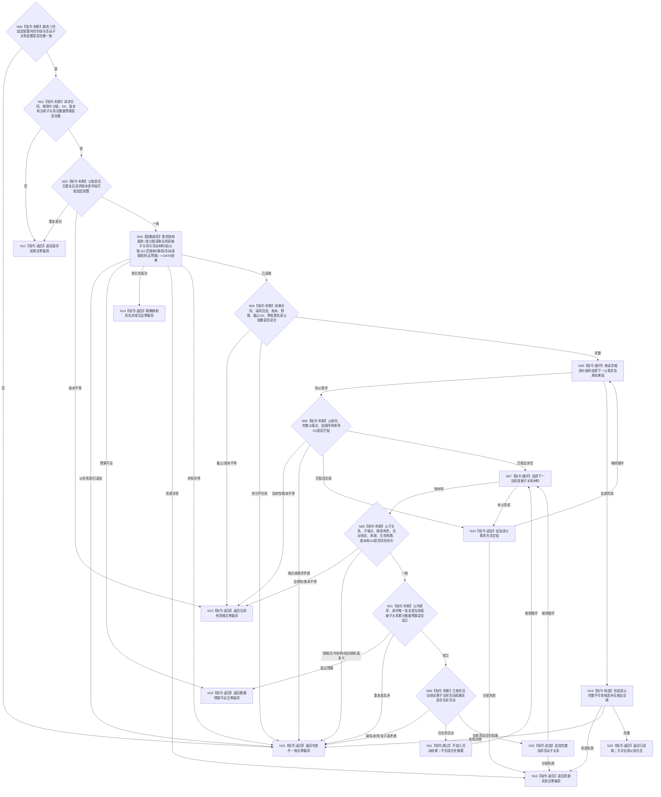

# BIZ-L4-002-04-02-02 读取父链各节点当前活动子关系目标函数流程图 v0.2

更新时间：2026-08-16

## 依据

```text
0050、3100、5100、5110、5160、4015；BIZ-L3-002-04-02；数据服务最终需求清单 DATA-EXT-12
```

## 身份与边界

正式目标函数替代图。函数经公开需求结构服务，在父级给出的同一非零共享事实截止 `G0` 下，一次有界读取根到叶需求身份链中每个父需求的全部当前直接子关系、当前路径角色、已发布活动结论和完整端点，再只按正式活动结论形成活动子关系结果。每父空组以及全链空组都是合法成功。本函数不重新计算活动性，不读取历史隔离摘要，不按权重、任务状态、创建时间或列表位置推断。

## 函数合同

```text
根函数：需求业务服务::读取父链各节点当前活动子关系
归属模块 / 文件 / 层级：需求业务服务 / 海中鱼巣/领域/服务.需求.ixx / L4
现有或待新增：待新增；只消费 DATA-EXT-12 正式公开强类型组读
完整签名：需求活动子关系组读取结果 需求业务服务::读取父链各节点当前活动子关系(const 需求活动子关系组读取请求& 请求) const noexcept
参数：合同版本、运行代次、事实范围版本、需求范围版本、需求树规则版本、路径规则版本、活动规则版本、读取规则版本、根到叶非空无重复需求身份链、非零 G0和非零当前子关系总数量预算；运行/范围/规则版本必须匹配服务固定配置
返回结果：已读取时按请求父链顺序逐父返回完整父端点和按显式路径角色 / 顺序及稳定身份排序的当前活动子关系组，回显全部版本、预算和 G0；任一父可为空组。数量预算不足或其它非成功均零业务载荷；同 G0 已冻结父链中的父缺失 / 已退出映射内部不一致
被调函数流程图：DATA-EXT-12 公开需求结构服务的“按父链和非零截止有界读取当前直接子关系与活动材料组”操作
父图：BIZ-L3-002-04-02
```

## 流程图



## 节点合同

| 节点 | 类型 | 参数 / 输入绑定 | 结果 / 输出绑定 | 事实读写 | 后继条件 | 验证 |
| --- | --- | --- | --- | --- | --- | --- |
| N00—N03 | 判断 / 函数调用 | 固定配置、请求、父链、G0、总预算 | DATA 当前直接子关系与活动材料组结果 | 只读 DATA-EXT-12 | 已读取或具名非成功 | 固定配置坏、请求坏、请求版本不等分别映射内部不一致、请求拒绝、当前性漂移；均零 DATA 调用 |
| N04—N06 | 判断 / 循环 | DATA 结果头、逐父组和完整父端点 | 与请求父链一一对应的结果组 | 无写入 | 组数、顺序、身份、版本和 G0 闭合 | 每个请求父必须恰有一个结果组；空组不是缺组 |
| N07—N11、N21/N22 | 循环 / 判断 / 追加 | 全部当前父子关系、子端点、路径角色、已发布活动结论 | 经正式结论选择的当前活动子关系 | 无写入 | 同父、同子、同关系、同截止 | DATA 不筛选活动；BIZ 只解释正式结论，不从权重、任务状态或列表位置重算；不选择截断组 |
| N12—N20 | 返回 / 构造 | 失败分类或完整候选 | 零载荷非成功或不可变成功值 | 无写入 | 唯一映射 | 全链空组与部分父空组均使用同一已读取状态 |

## 关键边界

- DATA 成功必须对请求父链中的每个父需求返回恰一结果组；组内包含全部当前直接子关系及其完整路径 / 活动材料。DATA 只保存和读取事实；BIZ 只按已发布活动结论选择结果，不重新比较目标或生成活动事实。
- 输出活动子关系空组必须来自完整组读：DATA 返回零条当前直接子关系，或 DATA 完整返回的成员全部具有合法非活动结论；它不是未找到、缓存未命中、历史隔离摘要或材料缺失。
- 本函数不读取权重值、任务、满足、结算或历史关系，不发布活动事实，也不重排请求父链。
- 旧 v0.1 的逐父多次读取、关系后再读角色 / 活动、owner 截止见证、来源发布见证、历史隔离摘要和独立“无活动子关系”状态全部退出。
