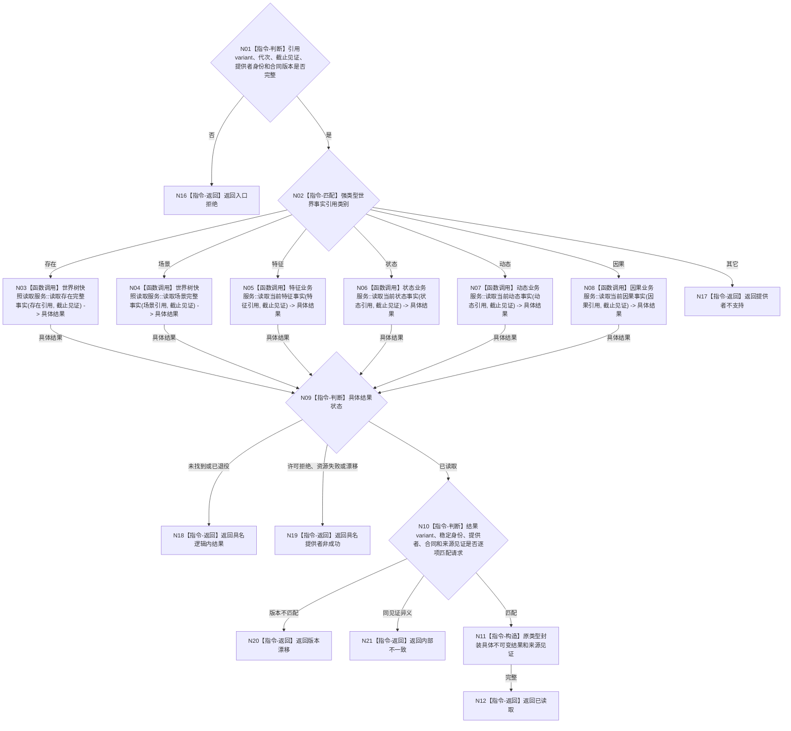

# BIZ-L4-002-04-03-01 读取白名单世界事实当前版本目标函数流程图 v0.1

更新时间：2026-08-03

## 依据

```text
0050、4190、4200、4210、5090、8100；BIZ-L3-002-04-03
旧鱼巢可吸收：世界事实发生变化后以稳定引用唤醒治理并重新读回；排除消息复制事实、万能句柄和按旧缓存补判
当前能力裁决：现行世界树读取服务可复用，特征/状态/动态/因果单事实读取需由各唯一领域所有者适配；统一白名单路由尚不存在
```

## 身份与边界

正式目标函数设计图。函数只接受版本1封闭强类型variant：存在事实引用、场景事实引用、特征事实引用、状态事实引用、动态事实引用、因果事实引用。它把引用直达唯一领域所有者并返回原类型不可变结果，不解释或合并事实。

## 函数合同

```text
根函数：治理世界事实提供者组::读取白名单世界事实当前版本
归属模块 / 文件 / 层级：治理世界事实组合读取 / 海中鱼巣/领域/组合.治理世界事实提供者组.ixx / L4
现有或待新增：待新增；封闭六类世界事实强类型读取路由
完整签名：治理白名单世界事实读取结果 治理世界事实提供者组::读取白名单世界事实当前版本(const 治理白名单世界事实读取请求& 请求) const
参数：请求为只读借用；含六类之一的强类型事实引用、运行代次、引用所属提供者事实截止见证项、预期提供者稳定身份、白名单合同版本1和结果合同版本；对象持有六个具名服务只读引用并覆盖调用
返回结果：调用方拥有的封闭强类型variant；含已读取、未找到、已退役、提供者不支持、版本漂移、许可拒绝、资源失败或内部不一致，并保留具体事实完整值式结果、提供者身份、结果合同版本和来源发布见证
被调函数流程图：存在/场景复用4200世界树完整事实读取；特征、状态、动态、因果读取由各领域目标服务拥有，进入其业务设计时分别展开，不在本路由复制内部算法
父图：BIZ-L3-002-04-03
```

## 流程图



## 节点合同

| 节点 | 类型 | 参数 / 输入绑定 | 结果 / 输出绑定 | 事实读写 | 后继条件 | 验证 |
| --- | --- | --- | --- | --- | --- | --- |
| N02—N08 | 匹配 / 函数调用 | 六类强类型引用和各自截止见证 | 唯一领域具体结果 | 只读对应领域 | 恰一分支或不支持 | 不用字符串、整数标签、万能句柄或JSON选择提供者 |
| N09/N10 | 判断 | 具体结果和请求 | 状态、类型及见证一致性 | 无写入 | 具名非成功或完整匹配 | 提供者回显与variant联合校验 |
| N11/N12 | 构造 / 返回 | 具体结果 | 原类型封闭variant结果 | 无写入 | 值式封装完整 | 不重新解释事实、不跨域合并 |
| N16—N21 | 指令-返回 | 拒绝或失败分类 | 结构化非成功 | 无写入 | 唯一分类 | 未登记类别、漂移和内部异义分账 |

## 关键边界

- v1白名单仅含存在、场景、特征、状态、动态、因果；需求父链、任务结果、6340承接和安全/服务维护使用父图相邻专用入口。
- 消息只携带强类型稳定引用和版本，不能携带事实副本并自证当前性；路由必须重新调用唯一事实所有者。
- 新类别必须先有正式所有者、公开强类型请求/结果和版本合同，再发布新的白名单合同版本；不得添加万能兜底分支。
