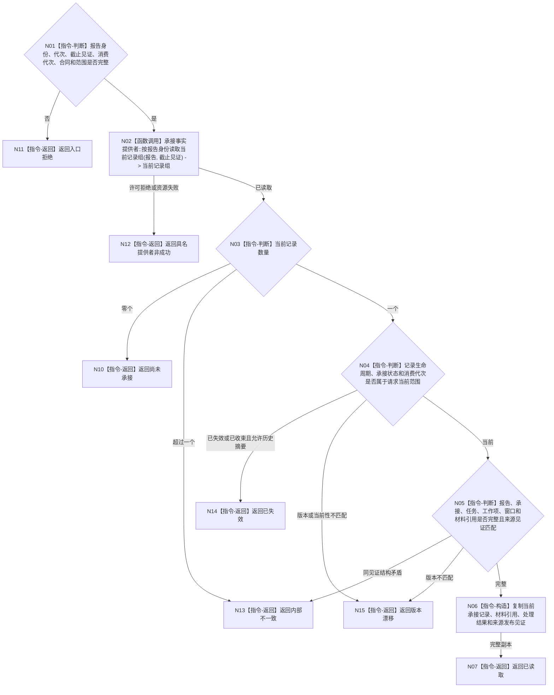

# BIZ-L4-002-04-04-01 按报告稳定身份读取当前承接事实目标函数流程图 v0.1

更新时间：2026-08-03

## 依据

```text
0050、3200、5090、6340、8100；BIZ-L3-002-04-04
旧鱼巢可吸收：外设材料先由任务域承接、绑定工作项后再供治理读取；排除自我线程直接消费外设队列或把报告到达当作世界事实
当前能力裁决：现行能力证据目录未登记按报告稳定身份读取任务域当前承接事实的公开数据操作入口，按待新增设计
```

## 身份与边界

正式目标函数设计图。函数以报告稳定身份为唯一定位键，从任务域当前已发布事实读取零个或一个当前承接记录；物理报告队列、分类索引、材料文件、缓存、SQL和日志均不得补判承接状态。

## 函数合同

```text
根函数：任务外设材料承接数据操作::按报告稳定身份读取当前承接事实
归属模块 / 文件 / 层级：任务外设材料承接数据操作 / 海中鱼巣/领域/数据操作.任务外设材料承接.ixx / L4
现有或待新增：待新增；任务域承接事实的稳定身份化值式读取
完整签名：外设当前承接事实读取结果 任务外设材料承接数据操作::按报告稳定身份读取当前承接事实(const 外设当前承接事实读取请求& 请求) const
参数：请求为只读借用；含报告稳定身份、运行代次、任务承接事实截止见证项、消费代次、承接合同版本和读取范围版本；对象拥有承接事实提供者只读引用并覆盖调用
返回结果：调用方拥有的不可变值式结果；含已读取、尚未承接、已失效、材料缺失、版本漂移、许可拒绝、资源失败或内部不一致，以及报告/承接/任务/工作项/消费窗口身份、承接状态与版本、生产/消费代次、材料引用、处理结果、生命周期和来源发布见证
被调函数流程图：无；底层当前记录枚举属于承接事实提供者内部实现，公开合同不得泄漏仓库、索引或队列对象
父图：BIZ-L3-002-04-04
```

## 流程图



## 节点合同

| 节点 | 类型 | 参数 / 输入绑定 | 结果 / 输出绑定 | 事实读写 | 后继条件 | 验证 |
| --- | --- | --- | --- | --- | --- | --- |
| N02/N03 | 函数调用 / 判断 | 报告身份和截止见证 | 当前承接记录组 | 只读任务域承接事实 | 零个或恰一当前记录 | 报告身份是跨窗口/任务/代次唯一竞争键 |
| N04/N05 | 判断 | 唯一记录和请求范围 | 当前性及完整性结论 | 无写入 | 生命周期、代次、绑定和见证全部成立 | 消费窗口不能放宽一次承接唯一性 |
| N06/N07 | 构造 / 返回 | 已复核记录 | 调用方拥有的不可变承接事实 | 无写入 | 值式副本完整 | 不泄漏队列位置、锁、缓存或仓库对象 |
| N10—N15 | 指令-返回 | 空组或失败分类 | 结构化非成功 | 无写入 | 唯一分类 | 尚未承接、失效、漂移和内部矛盾分账 |

## 关键边界

- 读取到当前承接只证明任务域已经绑定该报告材料，不证明世界事实、任务结果、需求满足或因果已经形成。
- 同一报告在全部窗口、任务和恢复代次中至多形成一次正式承接；多个当前记录属于内部不一致。
- 物理队列和分类索引只是传递/定位结构，材料引用只是受控材料；任何一项都不能反向裁决承接事实。
