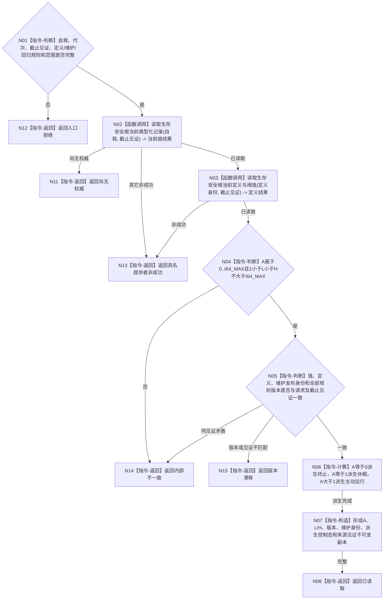

# BIZ-L4-002-05-01-01 读取生存安全根当前值目标函数流程图 v0.1

更新时间：2026-08-03

## 依据

```text
0050、6120、6170、8100；BIZ-L3-002-05-01、BIZ-L4-002-02-02-01
旧鱼巢可吸收：以单一生存安全根裁决休眠/主动运行门；排除线程状态、服务值或消息标签成为第二控制态
当前能力裁决：目标服务生存治理公开读取入口尚未实现，按共享待新增读取合同设计
```

## 身份与边界

正式目标函数设计图。函数读取自我当前已发布的生存安全根值、定义阈值、维护身份与版本，并按A唯一派生控制态供调用方互证；控制态只是值式投影，不形成第二份当前事实。

## 函数合同

```text
根函数：服务生存治理服务::读取生存安全根当前值
归属模块 / 文件 / 层级：服务生存治理 / 海中鱼巣/领域/服务.服务生存治理.ixx / L4
现有或待新增：待新增共享读取；由服务生存治理服务唯一公开A/L/H与维护发布见证
完整签名：生存安全根当前值读取结果 服务生存治理服务::读取生存安全根当前值(const 生存安全根当前值读取请求& 请求) const
参数：请求为只读借用；含自我稳定身份、运行代次、生存安全事实截止见证项、安全根定义版本、生存安全回归规则版本、服务维护规则版本和读取范围版本；服务拥有安全根定义/当前值提供者只读引用并覆盖调用
返回结果：调用方拥有的不可变值式结果；含已读取、尚无权威、材料缺失、版本漂移、许可拒绝、资源失败或内部不一致，以及自我回显、A、L、H、定义/规则/维护版本、维护发布身份、由A派生的终止/休眠/主动运行控制态和来源发布见证
被调函数流程图：无；底层安全根定义和值读取是服务内部提供者适配，不对调用方泄漏原始记录或仓库对象
父图：BIZ-L3-002-05-01；被BIZ-L4-002-02-02-01复用
```

## 流程图



## 节点合同

| 节点 | 类型 | 参数 / 输入绑定 | 结果 / 输出绑定 | 事实读写 | 后继条件 | 验证 |
| --- | --- | --- | --- | --- | --- | --- |
| N02/N03 | 函数调用 | 自我、定义身份和截止见证 | 安全根当前值与定义阈值 | 只读6170正式事实 | 两组材料完整或具名非成功 | 当前值与定义身份/版本绑定，不由配置补齐阈值 |
| N04/N05 | 判断 | A、L/H、维护和规则版本 | 值域及一致性结论 | 无写入 | `0<=A<=I64_MAX`、`1<L<H<=I64_MAX`且见证匹配 | 漂移与同见证矛盾分账 |
| N06—N08 | 计算 / 构造 / 返回 | 已复核A与版本 | 派生控制态和不可变当前值结果 | 无写入 | 0/1/>1唯一分支 | 控制态不另存、不回写 |
| N11—N15 | 指令-返回 | 缺权威或失败分类 | 结构化非成功 | 无写入 | 唯一分类 | 缺失、许可/资源、漂移和内部不一致分账 |

## 关键边界

- `A=0/1/>1` 分别唯一派生终止、休眠、主动运行；线程、消息、服务值、任务标签和UI不能覆盖该派生。
- 本函数不推进完整秒、不执行服务衰减或安全回归、不计算任务权限，也不修改A、L/H或维护游标。
- 6140分层安全维护族不等于6170生存安全根；本函数不得枚举或聚合分层安全值。
