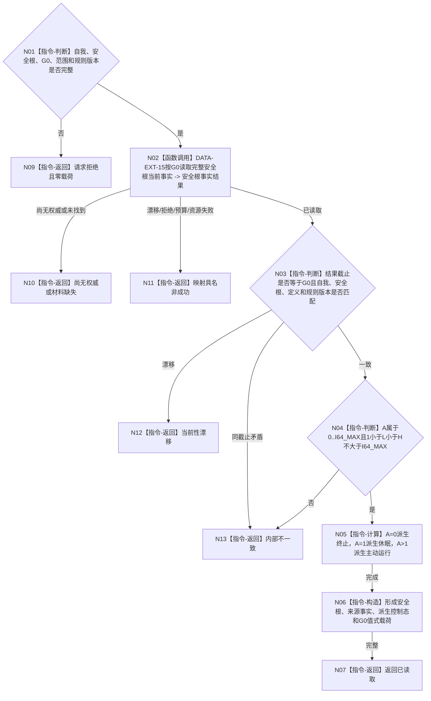

# BIZ-L4-002-05-01-01 读取生存安全根当前值目标函数流程图 v0.2

更新时间：2026-08-15

## 依据

```text
0050、4015、4030、6120、6170、8100
父图：BIZ-L3-002-05-01；被 BIZ-L4-002-02-02-01 v0.2 复用
数据服务：DATA-EXT-15
替代关系：v0.2 正式替代 v0.1 的事实截止见证项与维护发布身份合同
```

## 身份与边界

正式目标函数设计图。函数只按自我、安全根强类型身份和父级一个非零共享事实截止 `G0`读取完整安全根定义、当前值及维护来源事实，再由 `A=0/1/>1`唯一派生控制态。共享事实截止是唯一一致性边界；控制态不另存，维护记录身份只作为普通业务事实互证材料而不是第二发布见证。

## 函数合同

```text
根函数：服务生存治理服务::读取生存安全根当前值
归属模块 / 文件 / 层级：服务生存治理 / 海中鱼巣/领域/服务.服务生存治理.ixx / BIZ-L4
现有或待新增：待新增共享读取；DATA-EXT-15 精确 C++ ABI 发布前保持预冻结语义合同
完整签名：生存安全根共享截止读取结果 服务生存治理服务::读取生存安全根当前值(const 生存安全根共享截止读取请求& 请求) const noexcept
参数：唯一自我、运行代次、事实范围版本、安全根强类型身份、一个非零 G0、安全根定义版本、生存安全回归规则版本和服务维护规则版本
返回结果：已读取时携带自我、安全根、A、L/H、定义/规则版本、维护来源事实、派生控制态和 G0；其它状态零载荷
基础数据调用：DATA-EXT-15 按自我与安全根身份在 G0 读取完整安全根当前事实
```

## 流程图



## 节点合同

| 节点 | 输入 | 输出 | 事实读写 | 验证 |
| --- | --- | --- | --- | --- |
| N02 | 自我、安全根、G0 和规则版本 | 完整定义、A、L/H、维护来源事实 | 只读 DATA-EXT-15 | DATA 只回显事实，不派生控制态 |
| N03/N04 | DATA 结果与请求 | 当前性和值域结论 | 无 | 截止精确等于 G0；`0<=A<=I64_MAX`、`1<L<H<=I64_MAX` |
| N05—N07 | 已复核 A 与事实 | 派生控制态和不可变载荷 | 无 | 0/1/>1 唯一分支；控制态不另存、不回写 |
| N09—N13 | 非成功来源 | 结构化非成功 | 无 | 缺失、漂移、提供者拒绝、预算、资源和内部不一致分账 |

## 关键边界

- 6140 分层安全值不属于本读取，不得枚举、聚合或冒充生存安全根。
- 服务值、线程状态、消息、日志、缓存和 UI 不得覆盖 A 派生的控制态。
- 本函数不推进完整秒，不执行服务衰减或安全回归，不计算任务权限，也不写任何安全事实。
