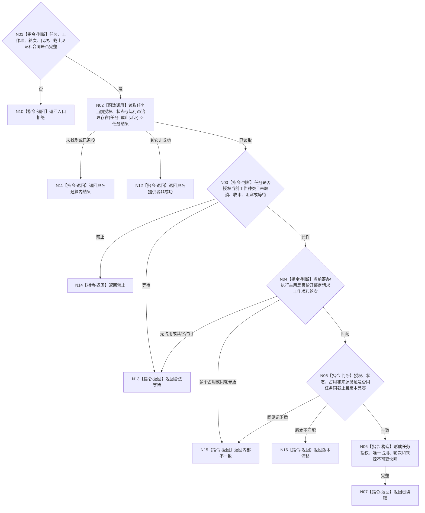

# BIZ-L4-002-05-02-01 读取任务授权与当前工作项占用目标函数流程图 v0.1

更新时间：2026-08-03

## 依据

```text
0050、3200、5090、5210、5230、6170、8100；BIZ-L3-002-05-02
旧鱼巢可吸收：派发前复核任务当前授权和同任务唯一工作占用；排除以线程号、队列位置或任务状态标签代替占用事实
```

## 身份与边界

正式目标函数设计图。函数同截止读取任务当前授权、任务状态合同和唯一筹办/执行工作占用，裁决指定工作项是否仍是当前合法占用者；不读取方法冻结、不申请执行许可。

## 函数合同

```text
根函数：任务执行许可服务::读取任务授权与当前工作项占用
归属模块 / 文件 / 层级：任务执行许可 / 海中鱼巣/领域/服务.任务执行许可.ixx / L4
现有或待新增：适配扩展；组合任务授权、状态和运行态治理存在读取
完整签名：任务授权工作项占用读取结果 任务执行许可服务::读取任务授权与当前工作项占用(const 任务授权工作项占用读取请求& 请求) const
参数：请求为只读借用；含任务/工作项稳定身份、尝试轮次、运行代次、任务事实截止见证项、任务授权/状态/占用合同版本和范围版本；服务拥有任务事实提供者只读引用并覆盖调用
返回结果：调用方拥有的不可变值式结果；含已读取、合法等待、禁止、未找到、已退役、版本漂移、许可拒绝、资源失败或内部不一致，以及任务授权、状态、唯一当前占用、工作种类、轮次、来源需求组和发布见证
被调函数流程图：无；底层任务完整材料与运行态治理存在读取不得泄漏可变仓库对象
父图：BIZ-L3-002-05-02
```

## 流程图



## 节点合同

| 节点 | 类型 | 参数 / 输入绑定 | 结果 / 输出绑定 | 事实读写 | 后继条件 | 验证 |
| --- | --- | --- | --- | --- | --- | --- |
| N02/N03 | 函数调用 / 判断 | 任务、工作项种类和截止见证 | 授权、状态、治理存在 | 只读任务事实 | 允许、等待或禁止 | 状态标签不替代授权和治理存在 |
| N04/N05 | 判断 | 当前占用和请求轮次 | 唯一占用一致性 | 无写入 | 同任务同工作项同轮次同截止 | 同一任务同时至多一个筹办或执行工作 |
| N06/N07 | 构造 / 返回 | 已复核材料 | 不可变授权占用快照 | 无写入 | 材料完整 | 不泄漏锁、线程号或调度队列位置 |
| N10—N16 | 指令-返回 | 逻辑内或失败分类 | 结构化非成功 | 无写入 | 唯一分类 | 等待、禁止、漂移和内部矛盾分账 |

## 关键边界

任务授权不等于执行许可，当前占用不等于动作已经开始；本函数不改变任务状态、占用或调度权。线程号、工作线程运行状态和队列位置均不是占用身份。
