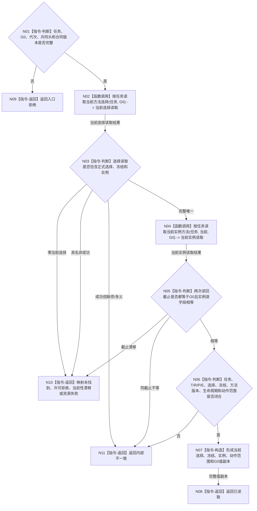

# BIZ-L4-002-05-02-02 按任务读取当前执行冻结与实例方法目标函数流程图 v0.2

更新时间：2026-08-26

## 依据

```text
0050、3200、4230、4260、5090、5230、5300、8100；BIZ-L3-002-05-02 v0.2
当前发布能力：L2任务结构服务::按任务读取当前方法选择、按任务读取当前实例方法
替代关系：v0.2退出工作项 / 尝试轮次和任务执行许可服务的旧读法
```

## 身份与边界

正式目标函数设计图。函数在同一 `G0` 按任务独立读取当前正式选择及其完整冻结 / 实例，再按任务独立读取当前实例方法并逐字段互证。它只组合任务owner的现有强类型读回，不增加第二当前索引，不从需求身份组、工作项、旧请求或缓存补造冻结。

## 函数合同

```text
根函数：任务执行事实提供者::按任务读取当前执行冻结与实例方法
归属模块 / 文件 / 目标分解深度：任务执行事实提供者 / 海中鱼巣/领域/提供者.任务执行事实.ixx / BIZ-L4
现有或待新增：待新增只读组合器；两个底层公开读取已发布
完整签名：当前执行冻结实例方法读取结果 任务执行事实提供者::按任务读取当前执行冻结与实例方法(const 当前执行冻结实例方法读取请求& 请求) const noexcept
参数：`请求`，类型 `const 当前执行冻结实例方法读取请求&`，输入、只读借用且仅在调用期间有效；字段为L2任务身份、G0、运行代次、共同L2请求头和组合合同版本；任务无效、G0 / 代次 / 版本为零或共同头不匹配均非法
返回结果：`当前执行冻结实例方法读取结果`，按值交给调用方；已读取时携带当前正式选择、执行绑定冻结材料、当前实例方法、完整有序动作范围和截止G0；0项当前选择 / 实例为未找到或材料不足；其它状态零载荷
基础数据调用：L2任务结构服务::按任务读取当前方法选择；L2任务结构服务::按任务读取当前实例方法
父图：BIZ-L3-002-05-02 v0.2
```

## 流程图



## 节点合同

| 节点 | 类型 | 参数 / 输入绑定 | 结果 / 输出绑定 | 事实读写 | 后继条件 | 验证 |
| --- | --- | --- | --- | --- | --- | --- |
| N01 | 指令-判断 | 完整读取请求 | 准入结论 | 无写入 | 合法或入口拒绝 | 任务、G0、代次、共同头、合同版本 |
| N02/N03 | 函数调用 / 判断 | 任务、G0 -> 当前选择请求 | 正式选择、冻结、实例 | 只读L2任务当前方法选择；无写入 | 恰一完整或具名非成功 | 零 / 一 / 多与成功形状分账 |
| N04/N05 | 函数调用 / 判断 | 任务、G0 -> 当前实例请求 | 独立当前实例 | 只读L2任务当前实例方法；无写入 | 同G0相等或非成功 | 两次截止和实例逐字段相等 |
| N06—N08 | 判断 / 构造 / 返回 | 两次正式读回 | 当前执行快照 | 无写入 | 已读取 | T/R/P/E、冻结、方法版本、生命周期、动作范围闭合 |
| N09—N11 | 返回 | 非成功来源 | 结构化非成功 | 无写入 | 返回父图 | 非成功零载荷 |

## 关键边界

- 来源顺序、工作项身份、线程编号和调用方缓存不参与当前选择裁决。
- 当前方法选择读回已经携带正式选择、冻结和实例；第二次按任务读取当前实例方法用于独立互证，不建立新权威。
- 本函数不读取或形成自我现实执行授权、调度资格、技术许可、安全硬否决或旧许可账。
