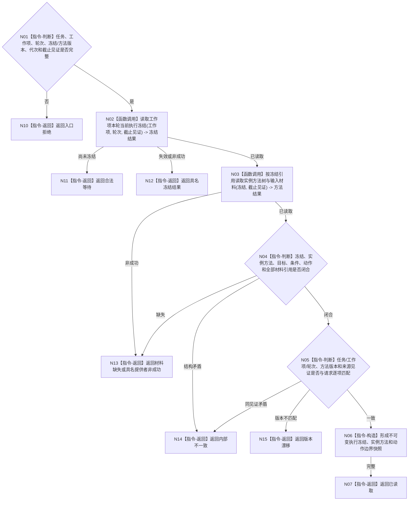

# BIZ-L4-002-05-02-02 读取执行冻结与实例方法快照目标函数流程图 v0.1

更新时间：2026-08-03

## 依据

```text
0050、3200、3300、5090、5230、5300、8100；BIZ-L3-002-05-02
旧鱼巢可吸收：执行前复核被冻结的方法和输入材料；排除执行期临时补方法结构或改用较新方法版本
```

## 身份与边界

正式目标函数设计图。函数读取工作项本轮不可变执行冻结、实例方法树、输入材料和真实动作边界；执行期不得用方法登记表的新版本替换冻结，也不得补齐冻结前已存在的结构缺口。

## 函数合同

```text
根函数：任务执行许可服务::读取执行冻结与实例方法快照
归属模块 / 文件 / 层级：任务执行许可 / 海中鱼巣/领域/服务.任务执行许可.ixx / L4
现有或待新增：适配扩展；组合执行冻结、实例方法和输入材料完整读取
完整签名：执行冻结实例方法读取结果 任务执行许可服务::读取执行冻结与实例方法快照(const 执行冻结实例方法读取请求& 请求) const
参数：请求为只读借用；含任务/工作项身份、尝试轮次、预期执行冻结版本、实例方法版本、运行代次、事实截止见证项和合同版本；服务拥有任务/方法提供者只读引用并覆盖调用
返回结果：调用方拥有的不可变值式结果；含已读取、合法等待、材料缺失、冻结失效、版本漂移、许可拒绝、资源失败或内部不一致，以及冻结身份/版本、实例方法树、目标/条件/动作、输入材料引用、允许误差、外部动作分类和来源见证
被调函数流程图：无；任务与方法提供者内部读取不对调用方暴露可变对象
父图：BIZ-L3-002-05-02
```

## 流程图



## 节点合同

| 节点 | 类型 | 参数 / 输入绑定 | 结果 / 输出绑定 | 事实读写 | 后继条件 | 验证 |
| --- | --- | --- | --- | --- | --- | --- |
| N02 | 函数调用 | 工作项、轮次和截止见证 | 当前执行冻结 | 只读任务事实 | 未冻结、失效或已读取 | 冻结身份/版本唯一 |
| N03/N04 | 函数调用 / 判断 | 冻结引用 | 实例方法树和输入材料 | 只读方法/材料事实 | 引用闭合 | 不从方法登记表替换冻结版本 |
| N05—N07 | 判断 / 构造 / 返回 | 全部冻结材料 | 不可变执行快照 | 无写入 | 同轮次同截止 | 外部动作边界显式，纯筹办不伪装动作 |
| N10—N15 | 指令-返回 | 等待或失败分类 | 结构化非成功 | 无写入 | 唯一分类 | 执行期结构缺口归内部设计/筹办问题 |

## 关键边界

本函数不执行方法、不申请许可、不修改冻结。执行只能消费本轮冻结；较新抽象方法版本不得反向改变已实例化方法，冻结前已有而漏检的结构缺口不得在执行期临时补造。
