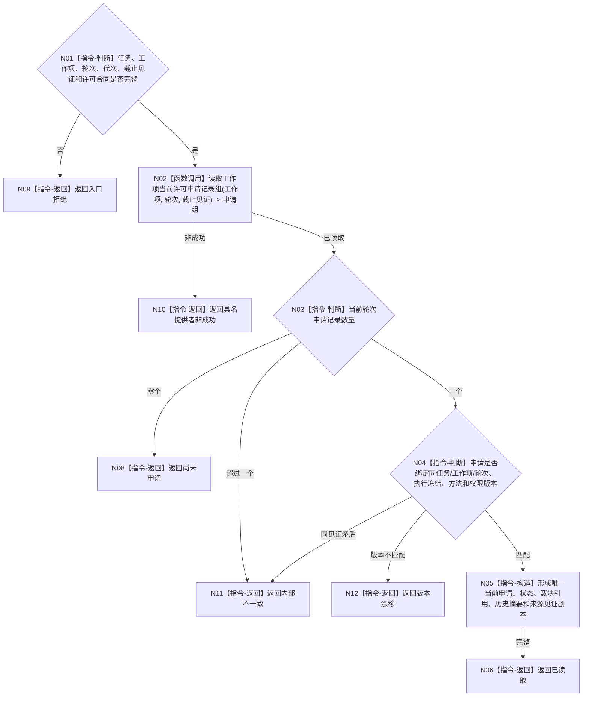

# BIZ-L4-002-05-02-03 读取工作项许可申请账目标函数流程图 v0.1

更新时间：2026-08-03

## 依据

```text
0050、3200、5230、6170、8100；BIZ-L3-002-05-02
旧鱼巢可吸收：真实外部动作派发前同一工作项只申请一次；排除用线程本地标志或消息去重代替正式申请账
```

## 身份与边界

正式目标函数设计图。函数只读指定工作项和尝试轮次的当前许可申请账，区分尚未申请、已申请待裁决、已裁决和历史轮次；不创建申请、不发放或撤销许可。

## 函数合同

```text
根函数：任务执行许可服务::读取工作项许可申请账
归属模块 / 文件 / 层级：任务执行许可 / 海中鱼巣/领域/服务.任务执行许可.ixx / L4
现有或待新增：待新增；工作项执行许可申请的稳定身份化值式读取
完整签名：工作项许可申请账读取结果 任务执行许可服务::读取工作项许可申请账(const 工作项许可申请账读取请求& 请求) const
参数：请求为只读借用；含任务/工作项身份、尝试轮次、运行代次、许可事实截止见证项、许可合同版本和范围版本；服务拥有许可申请事实提供者只读引用并覆盖调用
返回结果：调用方拥有的不可变值式结果；含尚未申请、已读取、版本漂移、许可拒绝、资源失败或内部不一致，以及可空唯一当前申请身份、申请状态、绑定冻结/方法/权限版本、裁决引用、历史轮次摘要和来源见证
被调函数流程图：无；底层申请记录读取不得泄漏队列、线程标志或可变账对象
父图：BIZ-L3-002-05-02
```

## 流程图



## 节点合同

| 节点 | 类型 | 参数 / 输入绑定 | 结果 / 输出绑定 | 事实读写 | 后继条件 | 验证 |
| --- | --- | --- | --- | --- | --- | --- |
| N02/N03 | 函数调用 / 判断 | 工作项、轮次和截止见证 | 当前申请记录组 | 只读许可申请事实 | 零个或恰一当前申请 | 同一工作项未结束前不得重复申请 |
| N04—N06 | 判断 / 构造 / 返回 | 唯一申请与绑定版本 | 不可变申请账快照 | 无写入 | 全绑定一致 | 历史轮次不冒充当前申请 |
| N08—N12 | 指令-返回 | 空组或失败分类 | 结构化结果 | 无写入 | 唯一分类 | 尚未申请、漂移和内部矛盾分账 |

## 关键边界

申请账只证明许可流程是否已进入及其当前裁决引用，不证明任务授权、执行冻结或权限仍当前。线程本地布尔值、邮箱消息和队列去重不能替代正式申请账。
