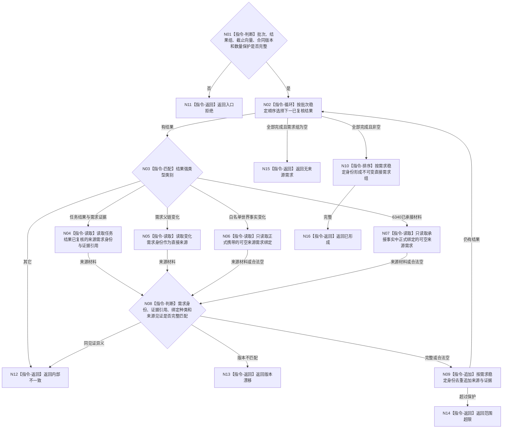

# BIZ-L4-002-06-01-01 读取批次结果绑定的来源需求组目标函数流程图 v0.1

更新时间：2026-08-03

## 依据

```text
0050、3100、5090、5120、5160、6340、8100；BIZ-L3-002-06-01
旧鱼巢可吸收：任务结果和事实变化完成复核后沿正式来源需求向上触发重判；排除从任务名、消息文本、日志或世界对象反向猜测需求
```

## 身份与边界

正式目标函数设计图。纯值函数从已复核治理批次结果的封闭强类型variant读取正式来源需求绑定，去重并稳定排序；不访问仓库，不把没有需求来源的世界事实变化补造为需求。

## 函数合同

```text
根函数：治理批次来源需求解析器::读取批次结果绑定的来源需求组
归属模块 / 文件 / 层级：自我治理纯值算法 / 海中鱼巣/线程/算法.治理批次来源需求解析.ixx / L4
现有或待新增：待新增纯值函数；统一四类已复核结果的来源需求提取
完整签名：批次来源需求组解析结果 治理批次来源需求解析器::读取批次结果绑定的来源需求组(const 批次来源需求组解析请求& 请求) const noexcept
参数：请求为只读借用；含治理批次稳定身份、已复核结果有序组（任务结果与需求证据、需求父链变化、白名单世界事实变化、6340已承接材料之一）、事实截止见证向量、来源绑定合同版本和最大直接需求数量；对象无外部可变依赖
返回结果：调用方拥有的不可变值式结果；含已形成、无来源需求、材料缺失、范围超限、版本漂移或内部不一致，以及稳定排序的直接需求身份组、逐需求来源结果/证据引用、来源绑定种类和截止见证向量
被调函数流程图：无；本函数只执行封闭variant匹配、字段复核、去重和排序
父图：BIZ-L3-002-06-01
```

## 流程图



## 节点合同

| 节点 | 类型 | 参数 / 输入绑定 | 结果 / 输出绑定 | 事实读写 | 后继条件 | 验证 |
| --- | --- | --- | --- | --- | --- | --- |
| N02—N07 | 循环 / 匹配 / 读取 | 已复核结果variant | 可空来源需求绑定 | 只读请求值 | 四类封闭分支 | 不从名称、目标相似或世界对象猜测需求 |
| N08/N09 | 判断 / 追加 | 来源身份、证据和截止见证 | 去重直接需求组 | 无外部读写 | 完整、合法空或具名非成功 | 同一需求保留全部来源引用，不按数量放大权重 |
| N10/N16 | 排序 / 返回 | 去重需求组 | 稳定不可变结果 | 无 | 排序完成 | 容器顺序不影响结果 |
| N11—N15 | 指令-返回 | 拒绝、空组或失败分类 | 结构化非成功 | 无 | 唯一分类 | 无来源需求是合法结果，不补造根需求 |

## 关键边界

- 只有结果中已经存在的正式需求绑定才能进入直接需求组；任务名称、方法名称、世界对象、日志、消息文本和相似目标均不能生成绑定。
- 白名单世界事实变化和6340承接材料可以合法没有来源需求；此时不触发需求闭包，但其它治理后继仍可独立处理。
- 本函数不读取需求当前性、不沿父链扩展、不计算权重或活动路径；这些由父图和复用的需求正式读取完成。
