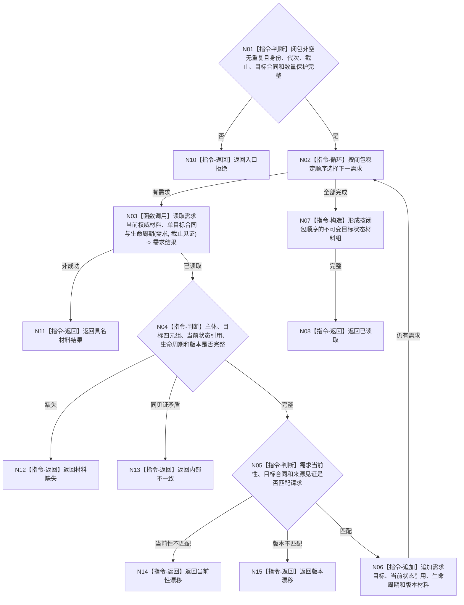

# BIZ-L4-002-06-02-01 读取闭包需求目标与当前状态材料目标函数流程图 v0.1

更新时间：2026-08-03

## 依据

```text
0050、3100、5100、5110、5160；BIZ-L3-002-06-02
旧鱼巢可吸收：需求活动重判前批量读回目标与当前材料；排除线程内缓存、历史满足或默认值补齐
```

## 身份与边界

正式目标函数设计图。函数对受影响闭包逐项读取需求单目标合同、生命周期、当前状态引用与目标版本，形成同截止有序值式组；不比较目标，不读取路径权重。

## 函数合同

```text
根函数：需求业务服务::读取闭包需求目标与当前状态材料
归属模块 / 文件 / 层级：需求领域服务 / 海中鱼巣/领域/服务.需求.ixx / L4
现有或待新增：适配扩展；批量组合单需求目标与当前材料读取
完整签名：闭包需求目标状态读取结果 需求业务服务::读取闭包需求目标与当前状态材料(const 闭包需求目标状态读取请求& 请求) const
参数：请求为只读借用；含非空有序需求闭包、唯一自我、运行代次、需求事实截止见证项、目标合同版本、最大闭包数量和读取范围版本；服务持有需求事实提供者只读引用并覆盖调用
返回结果：调用方拥有的不可变值式结果；含已读取、材料缺失、当前性漂移、版本漂移、许可拒绝、资源失败或内部不一致，以及逐需求主体、目标宿主/场景/特征/目标状态、当前状态引用、生命周期、目标/当前版本和来源见证
被调函数流程图：单需求权威材料读取在需要实施时复用需求服务内部公开合同，不在本图比较裸值
父图：BIZ-L3-002-06-02
```

## 流程图



## 节点合同

| 节点 | 类型 | 参数 / 输入绑定 | 结果 / 输出绑定 | 事实读写 | 后继条件 | 验证 |
| --- | --- | --- | --- | --- | --- | --- |
| N02/N03 | 循环 / 函数调用 | 闭包需求和截止见证 | 单需求权威材料 | 只读需求事实 | 全闭包读取或具名非成功 | 每需求恰一目标合同 |
| N04/N05 | 判断 | 目标、当前引用、生命周期和版本 | 完整性/当前性结论 | 无写入 | 完整匹配 | 历史满足和默认值不补齐当前材料 |
| N06—N08 | 追加 / 构造 / 返回 | 逐需求材料 | 有序不可变材料组 | 无写入 | 全部完成 | 容器顺序不改变闭包稳定顺序 |
| N10—N15 | 指令-返回 | 失败分类 | 结构化非成功 | 无写入 | 唯一分类 | 缺失、当前性、版本和内部矛盾分账 |

## 关键边界

本函数不读取世界当前实际状态本体、不执行目标比较、不推断路径角色；它只返回需求域已经绑定的目标和当前状态引用，后继必须经正式状态/判断收束服务使用。
