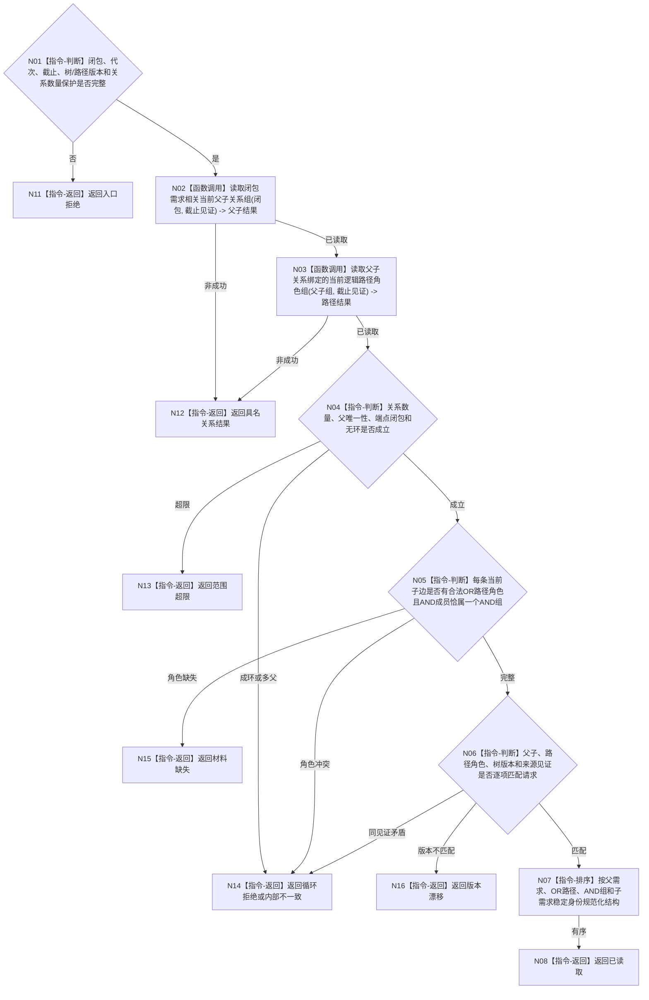

# BIZ-L4-002-06-02-02 读取闭包父子与逻辑路径当前关系目标函数流程图 v0.1

更新时间：2026-08-03

## 依据

```text
0050、3100、5100、5110；BIZ-L3-002-06-02
旧鱼巢可吸收：活动重判前一次读回完整父子和OR/AND路径；排除按子数量、权重或显示层级推断路径角色
```

## 身份与边界

正式目标函数设计图。函数读取闭包端点之间的当前父子关系和已登记逻辑路径关系，明确OR路径、AND组及成员角色；历史关系另存隔离摘要，不参与当前结构。

## 函数合同

```text
根函数：需求业务服务::读取闭包父子与逻辑路径当前关系
归属模块 / 文件 / 层级：需求领域服务 / 海中鱼巣/领域/服务.需求.ixx / L4
现有或待新增：适配扩展；批量组合需求父子与路径角色关系读取
完整签名：闭包需求路径结构读取结果 需求业务服务::读取闭包父子与逻辑路径当前关系(const 闭包需求路径结构读取请求& 请求) const
参数：请求为只读借用；含有序需求闭包、运行代次、需求事实截止见证项、需求树版本、路径规则版本、最大关系数量和范围版本；服务持有需求关系提供者只读引用并覆盖调用
返回结果：调用方拥有的不可变值式结果；含已读取、材料缺失、循环拒绝、范围超限、版本漂移、许可拒绝、资源失败或内部不一致，以及当前父子边、OR路径、AND组/成员角色、历史隔离摘要、结构版本和来源见证
被调函数流程图：可复用BIZ-L4-004-11-03-01/02的单需求父关系与活动子关系底层能力；本图增加闭包端点和路径角色全量闭合
父图：BIZ-L3-002-06-02
```

## 流程图



## 节点合同

| 节点 | 类型 | 参数 / 输入绑定 | 结果 / 输出绑定 | 事实读写 | 后继条件 | 验证 |
| --- | --- | --- | --- | --- | --- | --- |
| N02/N03 | 函数调用 | 闭包与截止见证 | 父子关系和路径角色 | 只读需求关系 | 两组完整 | 历史关系隔离，端点限于闭包或其已声明边界父 |
| N04/N05 | 判断 | 当前结构 | 单父无环与角色完整结论 | 无写入 | 全部不变量成立 | OR/AND不由数量或权重推断 |
| N06—N08 | 判断 / 排序 / 返回 | 完整结构 | 有序不可变路径结构 | 无写入 | 版本见证匹配 | 关系稳定身份排序 |
| N11—N16 | 指令-返回 | 失败分类 | 结构化非成功 | 无写入 | 唯一分类 | 超限、循环、缺失、漂移和内部矛盾分账 |

## 关键边界

父子关系只表达展开，路径角色必须另有正式关系或类型化事实。历史边、权重非零、列表位置、子节点数量和UI树形结构都不能建立当前OR/AND角色。
