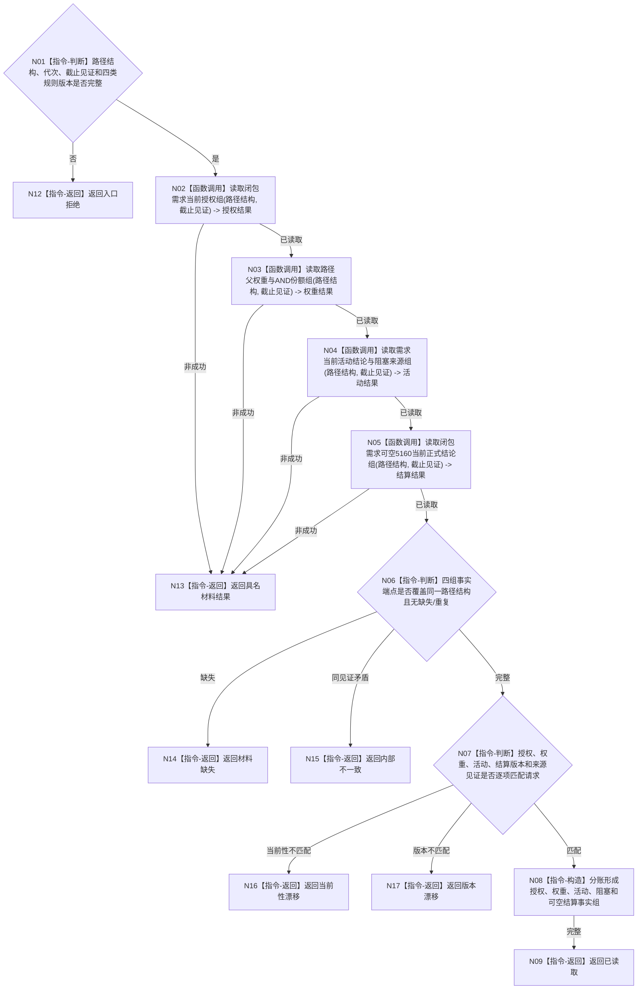

# BIZ-L4-002-06-02-03 读取路径治理当前事实目标函数流程图 v0.1

更新时间：2026-08-03

## 依据

```text
0050、3100、5110、5160、5090、6150；BIZ-L3-002-06-02
旧鱼巢可吸收：活动路径重判同时读取授权、权重、活动与结算；排除把四类机器量合并成一个总分或状态标签
```

## 身份与边界

正式目标函数设计图。函数按已复核路径结构读取逐需求授权、需求路径权重、当前活动结论和5160正式结算结论，四类事实分账返回；不计算任务执行权限，不重判活动性。

## 函数合同

```text
根函数：需求业务服务::读取路径治理当前事实
归属模块 / 文件 / 层级：需求领域服务 / 海中鱼巣/领域/服务.需求.ixx / L4
现有或待新增：适配扩展；组合需求授权、路径权重、活动和结算当前读取
完整签名：需求路径治理事实读取结果 需求业务服务::读取路径治理当前事实(const 需求路径治理事实读取请求& 请求) const
参数：请求为只读借用；含闭包路径结构、运行代次、需求事实截止见证项、授权/权重/活动/结算规则版本和范围版本；服务持有需求治理事实提供者只读引用并覆盖调用
返回结果：调用方拥有的不可变值式结果；含已读取、材料缺失、当前性漂移、版本漂移、许可拒绝、资源失败或内部不一致，以及逐需求授权、父权重、路径/AND份额、当前活动结论、阻塞来源、可空5160结算结论和逐项来源见证
被调函数流程图：需求授权、权重、活动和结算内部读取各自保持独立；5160结论可复用BIZ-L4-002-04-01-02
父图：BIZ-L3-002-06-02
```

## 流程图



## 节点合同

| 节点 | 类型 | 参数 / 输入绑定 | 结果 / 输出绑定 | 事实读写 | 后继条件 | 验证 |
| --- | --- | --- | --- | --- | --- | --- |
| N02—N05 | 函数调用 | 路径结构和截止见证 | 四组治理事实 | 只读需求领域 | 全部读取完成 | 授权、权重、活动、结算独立来源 |
| N06/N07 | 判断 | 四组事实和结构 | 完整性/一致性结论 | 无写入 | 端点覆盖且见证匹配 | 历史结算不冒充当前活动，零权限不删除需求 |
| N08/N09 | 构造 / 返回 | 已复核四组事实 | 分账不可变治理事实组 | 无写入 | 构造完成 | 不形成不可审计总分 |
| N12—N17 | 指令-返回 | 失败分类 | 结构化非成功 | 无写入 | 唯一分类 | 缺失、当前性、版本和内部矛盾分账 |

## 关键边界

需求权重、冻结结算预算、任务基础优先级和安全执行权限是不同机器量；本函数只读取需求域授权/权重/活动/结算，不计算6150权限，不因结算记录存在永久判定当前满足。
